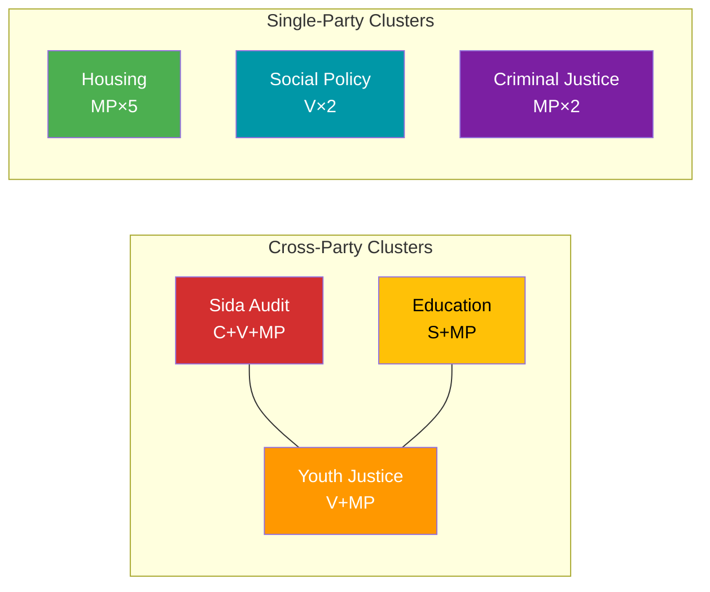

# Cross-Reference Map — 2026-04-14

**Generated**: 2026-04-14 07:19 UTC
**Data Sources**: get_motioner (rm=2025/26)
**Documents Analyzed**: 30
**Confidence**: HIGH
**Produced By**: news-motions workflow (AI-enriched)

---

## Summary

Detected **6** cross-document relationship clusters across 30 opposition motions.

## Cross-Reference Clusters

### Cluster 1: Sida Humanitarian Aid Audit (skr. 2025/26:226)
- **HD024070** — C: Administrative efficiency demands (Anna Lasses, Kerstin Lundgren)
- **HD024071** — V: No migration conditions on aid (Lotta Johnsson Fornarve)
- **HD024072** — MP: Systematic reform demands (Janine Alm Ericson)
- **Pattern**: Tripartisan response — same government document, three different policy angles

### Cluster 2: Young Offender Investigation (prop. 2025/26:227)
- **HD024073** — V: Gudrun Nordborg — demands government revisit proposal
- **HD024074** — MP: Ulrika Westerlund — rejects specific law amendments
- **Pattern**: Left-green parallel opposition in JuU

### Cluster 3: Education Reform Package (prop. 194, 196, 197)
- **HD024022** — S: New curricula (Ygeman)
- **HD024023** — S: Teacher time funding (Ygeman)
- **HD024025** — S: Equitable grading (Ygeman)
- **HD024058** — MP: Grading system risks (Hansén)
- **HD024066** — MP: Teacher qualifications (Hansén)
- **Pattern**: S+MP parallel tracks on education — S broader reform package, MP targeted concerns

### Cluster 4: Social Policy Resistance (prop. 201, 207, 229)
- **HD024027** — V: Reject activity requirements (Karlsson)
- **HD024028** — V: Reject reformed income support (Karlsson)
- **HD024076** — med anledning av prop. 2025/26:229 En ny mottagandelag
- **Pattern**: V double rejection of social security tightening; cross-reference with reception law reform

### Cluster 5: MP Housing Policy Bloc (prop. 180, 187, 188, 209, 212)
- **HD024059, HD024060, HD024064, HD024065, HD024067** — All MP (Amanda Palmstierna)
- **Pattern**: One MP spokesperson systematically opposes entire housing reform package

### Cluster 6: MP Criminal Justice Bloc (prop. 181, 185)
- **HD024062, HD024063** — Both MP (Ulrika Westerlund)
- **Pattern**: Systematic opposition to government's law-and-order agenda

## Cross-Reference Network

## Data Quality Notes

Cross-references based on shared proposition targets and committee assignments. HIGH confidence for explicit cross-references (same prop/skr). MEDIUM for thematic groupings.
