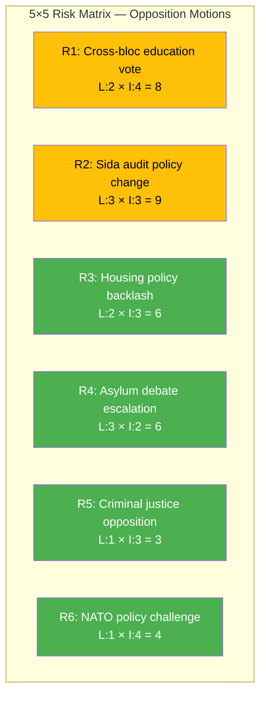

# Political Risk Assessment — 2026-04-14

**Generated**: 2026-04-14 07:17 UTC
**Data Sources**: get_motioner (rm=2025/26)
**Documents Analyzed**: 30 (key doc: HD024076)
**Confidence**: HIGH
**Produced By**: news-motions workflow (AI-enriched)

---

## 📋 Risk Context

| Field | Value |
|-------|-------|
| **Risk ID** | RSK-2026-04-14-MOT |
| **Analysis Date** | 2026-04-14 07:17 UTC |
| **Documents Analyzed** | 30 |
| **Coalition Risk Score** | 4/100 (LOW) |

---

## 📊 Risk Matrix (Likelihood × Impact)

## Detailed Risk Scoring

| Risk | Description | L | I | Score | Level | Evidence |
|------|-------------|:-:|:-:|:-----:|:-----:|----------|
| R1 | Cross-bloc education voting bloc (S+MP in UbU) | 2 | 4 | 8 | MEDIUM | mot. 4022-4025 (S), mot. 4058+4066 (MP) |
| R2 | Tripartisan Sida audit demands force policy concession | 3 | 3 | 9 | MEDIUM | mot. 4070 (C), 4071 (V), 4072 (MP) |
| R3 | Housing deregulation backlash from 6 CU motions | 2 | 3 | 6 | LOW | mot. 4059, 4060, 4064, 4065, 4067 (MP), 4040 (C) |
| R4 | Asylum debate intensifies ahead of 2026 election | 3 | 2 | 6 | LOW | mot. 4076 (V), 4027-4028 (V) |
| R5 | Criminal justice opposition delays implementation | 1 | 3 | 3 | LOW | mot. 4062, 4063 (MP), 4073 (V), 4074 (MP) |
| R6 | NATO independence motion complicates security policy | 1 | 4 | 4 | LOW | mot. 4029 (V) |

## Forward Risk Indicators

| Indicator | Trigger | Timeline | Confidence |
|-----------|---------|----------|:----------:|
| UbU committee vote on education motions | If S+MP+V coordinate, could force tillkännagivande | May–June 2026 | M |
| UU committee handling of Sida audit motions | 3-party alignment may extract government concession | May 2026 | M |
| SfU committee on reception law | V motion alone insufficient, but debate amplifies issue | April–May 2026 | H |
| CU committee on housing package | MP's 5 motions create extended debate but no majority risk | May–June 2026 | H |

## Data Quality Notes

Risk scores based on committee composition, historical voting patterns, and coalition majority analysis. Coalition stability at 4/100 (LOW) per CIA platform data. All risk scores conservative given secure government majority.
