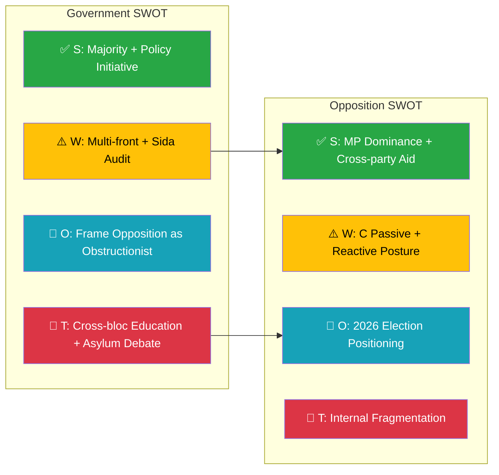

# Political SWOT Analysis — 2026-04-14

**Generated**: 2026-04-14 07:16 UTC
**Data Sources**: get_motioner (rm=2025/26, limit=30)
**Documents Analyzed**: 30
**Confidence**: HIGH
**Produced By**: news-motions workflow (AI-enriched)

---

## 📋 SWOT Context

| Field | Value |
|-------|-------|
| **SWOT ID** | SWT-2026-04-14-MOT |
| **Analysis Date** | 2026-04-14 07:16 UTC |
| **Analysis Scope** | Opposition motions April 2026 |
| **Reference Period** | 2026-04-01 to 2026-04-13 |
| **Produced By** | news-motions workflow (AI-enriched) |
| **Primary MCP Sources** | get_motioner, get_sync_status |
| **Temporal Window** | 2026-04-01 to 2026-04-13 |

---

## 🏛️ Government Coalition SWOT

### ✅ Strengths

| # | Statement | Evidence (dok_id) | Confidence | Impact | Entry Date |
|---|-----------|-------------------|:----------:|:------:|:----------:|
| S1 | Coalition maintains legislative majority; motions will be defeated in committee votes | Coalition 176 seats, opposition at 173 | H | H | 2026-04-14 |
| S2 | Government advancing 15+ propositions simultaneously shows policy initiative | prop. 196, 197, 201, 207, 211, 221, 227, 229 | H | M | 2026-04-14 |
| S3 | Opposition fragmented across 4 parties with no unified counter-agenda | mot. 4022-4076 across S/V/MP/C | H | M | 2026-04-14 |

### ⚠️ Weaknesses

| # | Statement | Evidence (dok_id) | Confidence | Impact | Entry Date |
|---|-----------|-------------------|:----------:|:------:|:----------:|
| W1 | Multi-front opposition attack spanning 9 committees stretches government defense resources | 30 motions across CU, UbU, JuU, UU, SoU, MJU, NU, SfU, FiU | H | M | 2026-04-14 |
| W2 | Sida audit criticism comes from 3 parties (C+V+MP mot. 4070-4072) creating tripartisan foreign policy challenge | HD024070, HD024071, HD024072 | H | H | 2026-04-14 |
| W3 | Housing deregulation agenda facing 6 CU motions from MP+C, exposing voter sensitivity on rental policy | HD024059, HD024060, HD024064, HD024065, HD024067, HD024040 | H | M | 2026-04-14 |

### 🌟 Opportunities

| # | Statement | Evidence (dok_id) | Confidence | Impact | Entry Date |
|---|-----------|-------------------|:----------:|:------:|:----------:|
| O1 | Defeat of opposition motions demonstrates government strength ahead of 2026 election | All motions subject to majority voting | M | M | 2026-04-14 |
| O2 | Opposition's focus on blocking rather than proposing alternatives can be framed as obstructionism | 8 outright rejection motions (avslår) | M | L | 2026-04-14 |

### 🔴 Threats

| # | Statement | Evidence (dok_id) | Confidence | Impact | Entry Date |
|---|-----------|-------------------|:----------:|:------:|:----------:|
| T1 | MP+V+S potential coordination on education creates cross-bloc voting bloc in UbU | mot. 4022-4025 (S) + mot. 4058, 4066 (MP) | M | H | 2026-04-14 |
| T2 | Asylum law opposition (mot. 4076) amplifies public debate on reception conditions ahead of election | HD024076 | M | M | 2026-04-14 |

---

## 🏛️ Opposition Bloc SWOT

### ✅ Strengths

| # | Statement | Evidence (dok_id) | Confidence | Impact | Entry Date |
|---|-----------|-------------------|:----------:|:------:|:----------:|
| S1 | MP dominates opposition activity (14/30 motions) with specialized spokespeople per policy area | mot. 4057-4072 | H | H | 2026-04-14 |
| S2 | Cross-party Sida audit response (C+V+MP) demonstrates ability to coordinate on foreign policy | HD024070, HD024071, HD024072 | H | H | 2026-04-14 |
| S3 | S education campaign positions Anders Ygeman as shadow education minister | mot. 4022-4025 | H | M | 2026-04-14 |

### ⚠️ Weaknesses

| # | Statement | Evidence (dok_id) | Confidence | Impact | Entry Date |
|---|-----------|-------------------|:----------:|:------:|:----------:|
| W1 | C barely active (2 motions) — weakest opposition participation suggests coalition-adjacent positioning | HD024040, HD024070 | H | M | 2026-04-14 |
| W2 | Most motions are reactive (responding to govt propositions) rather than proactive policy proposals | 28/30 motions reference government bills | H | M | 2026-04-14 |
| W3 | MP concentration on blocking risks "party of no" image without constructive alternatives | 6 outright rejections from MP | M | M | 2026-04-14 |

---

## 📊 SWOT Quadrant Mapping

## 8 Stakeholder Groups Analysis

| Stakeholder | Impact | Key Evidence |
|-------------|--------|--------------|
| **Citizens** | Housing (6 CU motions), education (5 UbU), asylum (1 SfU) directly affect daily life | mot. 4059-4067, 4022-4025, 4076 |
| **Government Coalition** | Must defend 15+ propositions simultaneously; majority secure but debate pressure high | All 30 motions target government bills |
| **Opposition Bloc** | MP leads (47%), S focused on education, V on migration — fragmented but active | Party distribution: MP 14, S 6, V 6, C 2 |
| **Business/Industry** | Competition policy (mot. 4057), rental market (mot. 4065), rural policy (mot. 4026) affect business environment | HD024057, HD024065, HD024026 |
| **Civil Society** | Humanitarian aid (Sida audit), asylum reception, social support reforms | mot. 4070-4072, 4076, 4027-4028 |
| **International/EU** | NATO policy (mot. 4029), Sida audit, foreign prison execution (mot. 4063) | HD024029, HD024070-72, HD024063 |
| **Judiciary/Constitutional** | Criminal justice reforms (4 JuU motions), building rules override (mot. 4060) | HD024062, HD024063, HD024073, HD024074 |
| **Media/Public Opinion** | Housing and migration most likely to generate public debate ahead of 2026 election | CU and SfU motions |

## Data Quality Notes

SWOT confidence: HIGH. Based on 30 motions from official Riksdag data. Full-text unavailable for individual motions — analysis based on metadata, summaries, and committee assignments.
