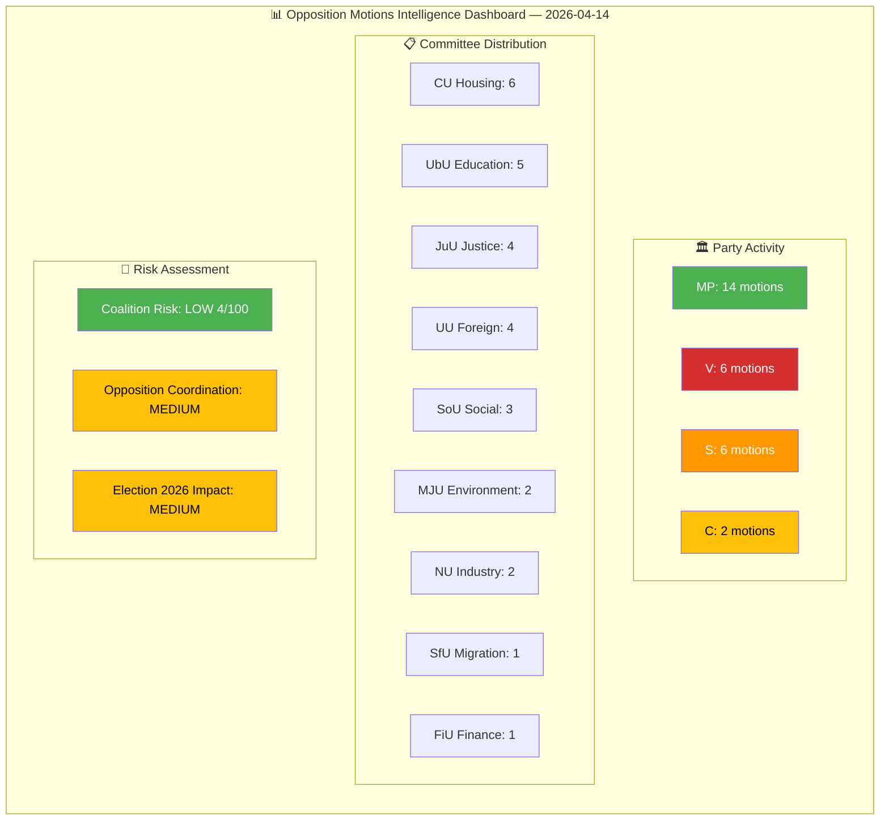

# Analysis Synthesis Summary — 2026-04-14

**Generated**: 2026-04-14 07:15 UTC
**Data Sources**: get_motioner, get_sync_status, search_anforanden
**Documents Analyzed**: 30
**Confidence**: HIGH
**Produced By**: news-motions agentic workflow (AI-enriched)

---

## 📋 Synthesis Context

| Field | Value |
|-------|-------|
| **Synthesis ID** | SYN-2026-04-14-MOT |
| **Analysis Date** | 2026-04-14 07:15 UTC |
| **Documents Analyzed** | 30 |
| **Analysis Period** | 2026-04-01 – 2026-04-13 |
| **Produced By** | news-motions workflow (AI-enriched) |
| **Overall Confidence** | HIGH |

---

## 📊 Intelligence Dashboard

## Summary

The April 2026 opposition motion cycle reveals **Miljöpartiet (MP) as the dominant opposition force** with 14 of 30 motions (47%), deploying a broad policy offensive across housing (CU), justice (JuU), environment (MJU), education (UbU), and foreign affairs (UU). **Socialdemokraterna (S)** focuses narrowly on education reform (4 motions via Anders Ygeman), while **Vänsterpartiet (V)** targets migration/asylum and justice. **Centerpartiet (C)** is minimally active (2 motions).

The most politically significant pattern is the **tripartisan response to the Riksrevisionen Sida audit** (skr. 2025/26:226): C, V, and MP each filed separate motions (mot. 4070, 4071, 4072) attacking the government from different angles — C on administrative efficiency, V on migration conditionality in aid, MP on systematic reform. This represents rare cross-bloc opposition coordination in foreign policy. [HIGH confidence]

## Key Findings

1. **MP housing policy offensive**: Amanda Palmstierna filed 5 CU motions (mot. 4059, 4060, 4064, 4065, 4067) opposing rental market deregulation, fast-track prison construction, and building rule changes — a systematic campaign against the government's housing liberalization agenda [HIGH confidence]
2. **S education monopoly**: Anders Ygeman personally leads all 4 S education motions (mot. 4022-4025), challenging curricula, grading reform, teacher funding, and school transparency — positioning S as the "education party" for 2026 [HIGH confidence]
3. **V+MP justice bloc**: Both parties filed parallel motions against prop. 227 on young offender investigation (mot. 4073 V, mot. 4074 MP), signaling potential left-green coordination in JuU committee [MEDIUM confidence]
4. **V asylum rejection**: Tony Haddou's mot. 4076 rejecting the new reception law (prop. 229) is V's most recent motion, continuing their hardline opposition to tightened asylum rules [HIGH confidence]
5. **Tripartisan Sida audit response**: C+V+MP each challenge the government's humanitarian aid management from distinct angles (mot. 4070-4072) [HIGH confidence]

## Top Documents by Significance

| Score | dok_id | Title | Party | Committee |
|-------|--------|-------|-------|-----------|
| 7/10 | HD024076 | Reject new reception law (prop. 229) | V | SfU |
| 7/10 | HD024070-72 | Sida humanitarian aid audit responses | C+V+MP | UU |
| 6/10 | HD024075 | Reject alcohol deregulation (prop. 221) | S | SoU |
| 6/10 | HD024073-74 | Young offender investigation opposition | V+MP | JuU |
| 5/10 | HD024022-25 | Education reform scrutiny package | S | UbU |
| 5/10 | HD024065-67 | Housing policy resistance cluster | MP | CU |

## Election 2026 Implications

- **Electoral Impact** [MEDIUM]: MP's hyperactivity establishes them as the most engaged opposition party, but risks spreading too thin
- **Coalition Scenarios** [MEDIUM]: S+MP+V coordination on justice and education suggests potential governing bloc foundations
- **Voter Salience** [HIGH]: Housing, education, and migration are top voter concerns — opposition motions directly target these
- **Campaign Vulnerability** [MEDIUM]: Government faces multi-front attacks but coalition discipline remains strong (4/100 risk)
- **Policy Legacy** [LOW]: Most motions likely to be rejected but create campaign ammunition for 2026

## AI-Recommended Article Metadata

- **Recommended Title (EN)**: Miljöpartiet Launches Broadside Against Housing Deregulation as Opposition Ramps Up Pre-Election Pressure
- **Recommended Title (SV)**: Miljöpartiet angriper bostadsavregleringen när oppositionen ökar trycket inför valet
- **Meta Description (EN)**: MP files 14 of 30 opposition motions targeting housing, justice, and asylum policy. Cross-party Sida audit challenge signals growing opposition coordination ahead of 2026 election.
- **Meta Description (SV)**: MP lämnar 14 av 30 oppositionsmotioner om bostäder, rättsväsende och asyl. Flerpartiutmaning av Sida-granskning visar ökad samordning inför valet 2026.

## Data Quality Notes

Overall confidence: **HIGH**. Analysis based on 30 motions from riksdag-regering-mcp (get_motioner, rm=2025/26). Full-text unavailable for most motions — analysis based on metadata, titles, and summaries. Document dates span 2026-04-01 to 2026-04-13.
