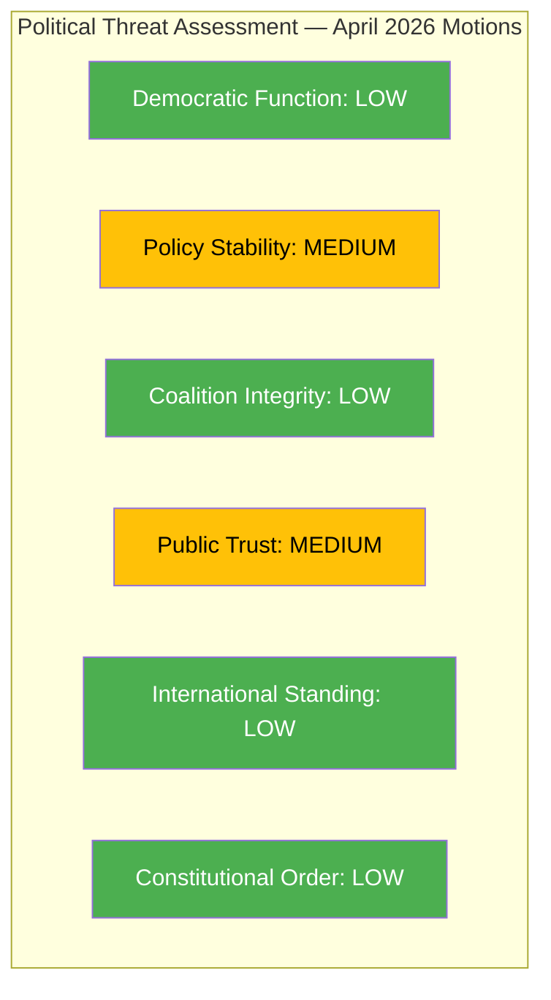

# Political Threat Analysis — 2026-04-14

**Generated**: 2026-04-14 07:17 UTC
**Data Sources**: get_motioner (rm=2025/26)
**Documents Analyzed**: 30
**Confidence**: HIGH
**Produced By**: news-motions workflow (AI-enriched)

---

## 📋 Threat Context

| Field | Value |
|-------|-------|
| **Threat ID** | THR-2026-04-14-MOT |
| **Analysis Date** | 2026-04-14 07:17 UTC |
| **Threat Level** | LOW-MEDIUM |

---

## Threat Taxonomy Assessment

## Detailed Threat Analysis

### 1. Democratic Function Threats: LOW
Opposition motions are a normal democratic function. No threats to democratic processes detected.

### 2. Policy Stability Threats: MEDIUM
- **Housing policy**: 6 CU motions from MP+C challenge government's housing liberalization package (mot. 4059, 4060, 4064, 4065, 4067, 4040). While motions will be defeated, sustained opposition creates policy uncertainty for housing industry. [MEDIUM confidence]
- **Education reform**: S+MP parallel motions on grading (mot. 4025+4058) and teacher policy (mot. 4023+4066) could slow implementation timeline. [MEDIUM confidence]
- **Asylum policy**: V's outright rejection of reception law (mot. 4076) combined with reformed income support opposition (mot. 4027-4028) indicates sustained migration policy contestation. [HIGH confidence]

### 3. Coalition Integrity Threats: LOW
No evidence of government-side defections. SD support agreement holds. C's minimal participation (2 motions) suggests continued coalition-adjacent positioning rather than active opposition.

### 4. Public Trust Threats: MEDIUM
- Sida audit response from 3 parties (mot. 4070-4072) highlights government management failures in humanitarian aid — could erode trust in foreign policy competence. [MEDIUM confidence]
- Criminal justice opposition (4 JuU motions) targeting young offender and recidivism laws creates narrative of government overreach on law-and-order. [LOW confidence]

### 5. International Standing: LOW
V's NATO independence motion (mot. 4029) is politically marginal. Sida audit motions address aid efficiency, not Sweden's international commitments.

### 6. Constitutional Order: LOW
MP's opposition to fast-track prison construction (mot. 4060) raises planning-law constitutional concerns but within normal policy debate.

## Forward Threat Indicators

| Indicator | Trigger | Timeline | Confidence |
|-----------|---------|----------|:----------:|
| MP escalation from motions to interpellations | If housing motions rejected without debate | May 2026 | M |
| V media campaign on asylum | Pre-election amplification of mot. 4076 | April–September 2026 | H |
| Cross-party education alliance formalization | S+MP joint press conference or coordination | May–June 2026 | L |

## Data Quality Notes

Threat assessment based on 30 motions and coalition stability data (4/100). Confidence HIGH for party activity patterns, MEDIUM for forward indicators requiring behavioral prediction.
