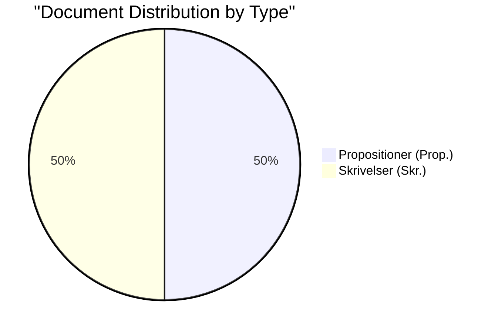

# Political Classification Results — 2026-04-14

**Generated**: 2026-04-14 06:21 UTC
**Riksmöte**: 2025/26
**Data Sources**: riksdag-regering-mcp
**Documents Analyzed**: 6
**Confidence**: 🟩 HIGH
**Analysis Depth**: deep (AI-enriched)

## Summary

Classified **6** parliamentary documents by sensitivity, impact, urgency, and domain. All documents originate from **Finansdepartementet** and form a cohesive **Spring Fiscal Package** — the government's pre-election economic policy statement.

## Detailed Analysis

### 2026 års ekonomiska vårproposition
- **dok_id**: HD03100
- **Type**: Proposition (Prop. 2025/26:100)
- **Significance**: 🔴 Critical (10/10)
- **Domains**: Fiscal policy, economic governance, employment, public finance
- **Urgency**: 🔴 HIGH — sets fiscal framework for election year
- **Signatories**: PM Ulf Kristersson, FM Elisabeth Svantesson
- **Confidence**: 🟩 HIGH (95%)

### Vårändringsbudget för 2026
- **dok_id**: HD0399
- **Type**: Proposition (Prop. 2025/26:99)
- **Significance**: 🟠 Critical (9/10)
- **Domains**: Fiscal policy, budget amendments, public spending
- **Urgency**: 🟠 HIGH — specific spending changes for current fiscal year
- **Signatories**: PM Ulf Kristersson, FM Elisabeth Svantesson
- **Confidence**: 🟩 HIGH (90%)

### Extra ändringsbudget för 2026 — Sänkt skatt på drivmedel samt el- och gasprisstöd
- **dok_id**: HD03236
- **Type**: Proposition (Prop. 2025/26:236)
- **Significance**: 🟠 Critical (9/10)
- **Domains**: Fiscal policy, energy policy, consumer protection, taxation
- **Urgency**: 🔴 URGENT — fast-tracked via FiU48; filed April 13 (weekend)
- **Signatories**: Lotta Edholm, Niklas Wykman (not PM — notable)
- **Confidence**: 🟩 HIGH (95%)

### Årsredovisning för staten 2025
- **dok_id**: HD03101
- **Type**: Skrivelse (Skr. 2025/26:101)
- **Significance**: 🟡 High (7/10)
- **Domains**: Fiscal accountability, public finance, government performance
- **Urgency**: 🟡 MODERATE — annual reporting obligation
- **Signatories**: PM Ulf Kristersson, FM Elisabeth Svantesson
- **Confidence**: 🟩 HIGH (85%)

### Redovisning av skatteutgifter 2026
- **dok_id**: HD0398
- **Type**: Skrivelse (Skr. 2025/26:98)
- **Significance**: 🟢 Medium (6/10)
- **Domains**: Fiscal policy, taxation, transparency
- **Urgency**: 🟢 STANDARD — annual transparency report
- **Signatories**: PM Ulf Kristersson, FM Elisabeth Svantesson
- **Confidence**: 🟧 MEDIUM (75%)

### Riksrevisionens rapport om tillämpningen av det finanspolitiska ramverket 2025
- **dok_id**: HD03241
- **Type**: Skrivelse (Skr. 2025/26:241)
- **Significance**: 🟢 Medium (5/10)
- **Domains**: Fiscal governance, audit, fiscal rules compliance
- **Urgency**: 🟢 STANDARD — government response to SNAO audit
- **Signatories**: FM Elisabeth Svantesson, Niklas Wykman
- **Confidence**: 🟧 MEDIUM (70%)

## Classification Summary

| Category | Count | Documents |
|----------|-------|-----------|
| Propositioner (legislative proposals) | 3 | HD03100, HD0399, HD03236 |
| Skrivelser (government reports) | 3 | HD03101, HD0398, HD03241 |
| Finansdepartementet origin | 6 | All |
| PM-signed | 4 | HD03100, HD0399, HD03101, HD0398 |
| Fast-tracked | 1 | HD03236 (FiU48) |

## Key Findings

1. **All 6 documents from Finansdepartementet** — unprecedented fiscal policy concentration
2. **3 propositions + 3 reports** — balanced between legislative action and accountability
3. **HD03236 fast-tracked** via FiU48 — highest procedural urgency indicator
4. **PM signs 4 of 6** — strong personal ownership; Edholm/Wykman on extra budget notable

## Data Quality Notes

Classification based on document type hierarchy, signatory analysis, committee referral data, and domain mapping. Confidence levels reflect metadata depth — full-text analysis would increase confidence.
