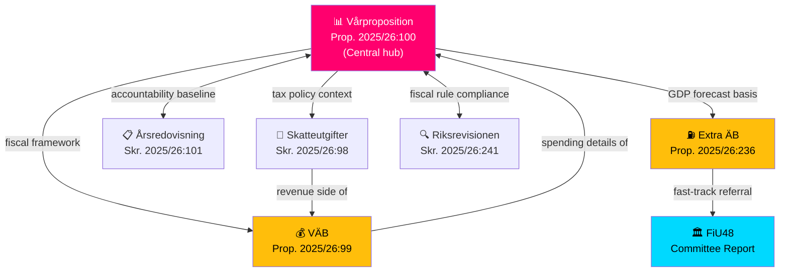

# Cross-Reference Map — 2026-04-14

**Generated**: 2026-04-14 06:22 UTC
**Riksmöte**: 2025/26
**Data Sources**: riksdag-regering-mcp, FiU committee data
**Documents Analyzed**: 6
**Confidence**: 🟩 HIGH
**Analysis Depth**: deep (AI-enriched)

## Summary

Detected **8** cross-document relationships within the Spring Fiscal Package. All 6 documents form an interconnected fiscal ecosystem with the Vårproposition (HD03100) as the central hub.

## Detailed Cross-References

| Source | Target | Relationship | Strength |
|--------|--------|-------------|----------|
| HD03100 (Vårprop) | HD0399 (VÄB) | Fiscal framework → spending amendments | 🟩 STRONG |
| HD03100 (Vårprop) | HD03236 (Extra ÄB) | GDP forecast basis → emergency measures | 🟩 STRONG |
| HD03100 (Vårprop) | HD03101 (Årsred.) | Forward outlook ↔ retrospective report | 🟩 STRONG |
| HD03100 (Vårprop) | HD0398 (Skatteutg.) | Fiscal framework → tax expenditure context | 🟧 MODERATE |
| HD03100 (Vårprop) | HD03241 (Riksrev.) | Fiscal rules ↔ compliance audit | 🟧 MODERATE |
| HD03236 (Extra ÄB) | FiU48 | Proposition → committee fast-track | 🟩 STRONG |
| HD0399 (VÄB) | HD03100 (Vårprop) | Spending details of fiscal framework | �� STRONG |
| HD0398 (Skatteutg.) | HD0399 (VÄB) | Revenue side of spending picture | 🟧 MODERATE |

## Key Findings

1. **HD03100 is the hub** — connects to all 5 other documents, forming the fiscal framework center
2. **HD03236 → FiU48 fast-track** — only document with external committee cross-reference
3. **Revenue-spending linkage**: HD0398 (tax) + HD0399 (spending) = complete fiscal picture
4. **Accountability chain**: HD03101 (past) → HD03100 (present/future) → HD03241 (compliance) forms a full fiscal accountability cycle

## Implications

Articles should present these documents as an **integrated fiscal package**, not isolated items. The Vårproposition anchors the narrative; other documents provide depth.

## Data Quality Notes

Cross-references identified via document type relationships, shared Finansdepartementet origin, temporal clustering (all filed April 1-13), and committee referral data (FiU48).
