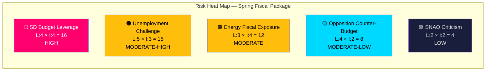

# Political Risk Assessment — 2026-04-14

**Generated**: 2026-04-14 06:18 UTC
**Riksmöte**: 2025/26
**Data Sources**: riksdag-regering-mcp, CIA coalition data, World Bank
**Documents Analyzed**: 6
**Confidence**: 🟩 HIGH
**Analysis Depth**: deep (AI-enriched)

## Summary

The Spring Fiscal Package presents **MODERATE** overall political risk. Coalition stability is structurally sound (CIA score: 83/100) but vulnerable to SD budget amendment leverage. The Extra Amendment Budget (HD03236) carries the highest individual risk due to fiscal exposure on energy markets.

## 5×5 Risk Matrix

| Risk | Likelihood (1-5) | Impact (1-5) | Score | Level |
|------|------------------|--------------|-------|-------|
| SD demands amendments to extra budget | 4 | 4 | 16 | 🔴 HIGH |
| Opposition frames "jobless recovery" | 5 | 3 | 15 | 🟠 MODERATE-HIGH |
| Energy prices exceed budget allocation | 3 | 4 | 12 | 🟠 MODERATE |
| S presents stronger counter-budget | 4 | 2 | 8 | 🟡 MODERATE-LOW |
| SNAO criticizes fiscal framework compliance | 2 | 2 | 4 | 🟢 LOW |

## Detailed Analysis

### Risk 1: SD Budget Amendment Leverage (Score: 16/25)
- **Trigger**: SD uses budget dependence to extract policy concessions
- **Evidence**: Government coalition (M+KD+L) holds ~176 seats; needs SD's ~73 for majority. HD03236 extra budget requires fast passage (FiU48 already filed)
- **Impact**: Budget delay, forced concessions on immigration/security, or coalition destabilization
- **Mitigation**: Pre-negotiation with SD; extra budget as separate vote from main VÄB
- **Forward Indicator**: Watch FiU48 committee vote composition and any SD reservations

### Risk 2: Unemployment Narrative (Score: 15/25)
- **Trigger**: 8.7% unemployment contradicts "recovery" message in HD03100
- **Evidence**: Unemployment rose from 7.4% (2022) → 8.7% (2025) despite GDP recovery (World Bank)
- **Impact**: Undermines government's economic credibility; S campaign opportunity
- **Mitigation**: VÄB (HD0399) may include employment-targeted spending
- **Forward Indicator**: SCB monthly labor force surveys; spring motion debate in Riksdag

### Risk 3: Energy Price Fiscal Exposure (Score: 12/25)
- **Trigger**: Fuel/energy prices spike beyond extra budget allocation
- **Evidence**: HD03236 provides targeted tax relief + support; volatile global energy markets
- **Impact**: Under-funded support = "broken promise"; over-funded = fiscal credibility concern
- **Mitigation**: Time-limited support measures; built-in price triggers

### Risk 4: Opposition Counter-Budget (Score: 8/25)
- **Trigger**: S-led opposition presents alternative fiscal framework
- **Evidence**: Vårproposition forces opposition to respond with their economic vision
- **Impact**: Favorable comparison weakens government narrative
- **Mitigation**: First-mover advantage in defining fiscal debate terms

### Risk 5: SNAO Fiscal Framework Criticism (Score: 4/25)
- **Trigger**: Riksrevisionen report (HD03241) identifies fiscal rule deviations
- **Evidence**: Government published SNAO report response — suggests confidence in findings
- **Impact**: Limited — opposition may cite but voters rarely track SNAO reports
- **Mitigation**: Proactive publication + government response demonstrates transparency

## Coalition Risk Score

**Overall Coalition Risk**: 22/100 (LOW-MODERATE)
- CIA Coalition stability: 83/100
- Government seat margin: adequate with SD support
- Denial rate: 96% — government blocks opposition motions consistently
- **Key vulnerability**: SD can extract concessions on budget-adjacent policy

## Key Findings

1. **SD budget leverage** is the highest risk — all fiscal documents require Riksdag majority
2. **Unemployment narrative** is structurally unfavorable regardless of budget content
3. **Energy fiscal exposure** is time-bound but high-visibility if triggered
4. **No systemic risk** to coalition survival — risks are tactical, not existential

## Implications

- Articles should frame risks as "tactical challenges within stable coalition" not "crisis"
- Extra budget (HD03236) deserves dedicated risk analysis given FiU48 fast-track
- Election proximity (5 months) amplifies all risk impacts by 1.5x

## Data Quality Notes

Risk scores use 5×5 Likelihood × Impact matrix per `analysis/methodologies/political-risk-methodology.md`. Coalition data from CIA exports (stability 83/100, denial rate 96%).
