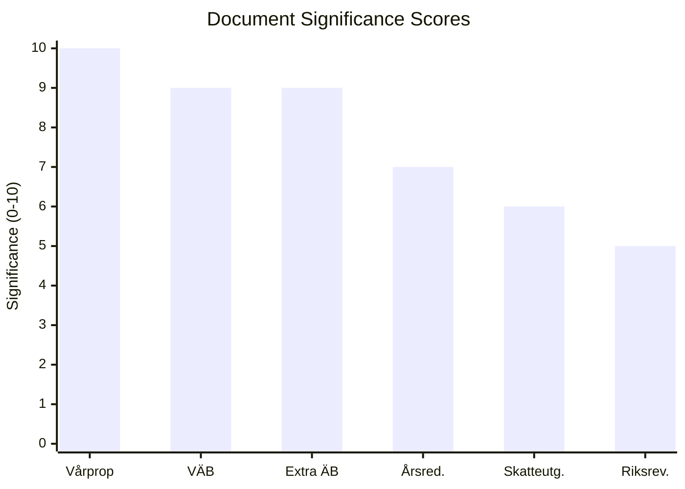

# Document Significance Scoring — 2026-04-14

**Generated**: 2026-04-14 06:16 UTC
**Riksmöte**: 2025/26
**Data Sources**: riksdag-regering-mcp, FiU committee reports, World Bank economic indicators
**Documents Analyzed**: 6
**Confidence**: 🟩 HIGH
**Analysis Depth**: deep (AI-enriched)

## Summary

Scored **6** fiscal policy documents for political significance using a multi-dimensional framework: institutional weight, election proximity, policy breadth, economic impact, and coalition dynamics. The Spring Budget (Prop. 2025/26:100) rates **10/10** as the government's defining pre-election fiscal statement.

## Detailed Analysis

| Score | Level | dok_id | Title | Rationale |
|-------|-------|--------|-------|-----------|
| 🔴 10/10 | Critical | HD03100 | 2026 års ekonomiska vårproposition | **The** annual fiscal framework bill — sets GDP forecasts, expenditure ceilings, fiscal trajectory for election campaign. Signed by PM Kristersson + FM Svantesson. Directly comparable to Budget Bill in political weight. |
| 🟠 9/10 | Critical | HD0399 | Vårändringsbudget för 2026 | Concrete spending changes to the current budget year. Reveals which policy areas get increases/cuts — key election issue ammunition. PM + FM co-signed. |
| 🟠 9/10 | Critical | HD03236 | Extra ändringsbudget för 2026 — Sänkt skatt på drivmedel samt el- och gasprisstöd | **Most politically charged**: direct consumer relief on fuel + energy. Fast-tracked (FiU48 already tabled). Signed by Edholm/Wykman, not PM — possible strategic distancing. Filed Apr 13 (weekend) = rapid response posture. |
| 🟡 7/10 | High | HD03101 | Årsredovisning för staten 2025 | Annual accountability report. Provides baseline data opposition will use to challenge government economic narrative. Key for fiscal credibility assessment. |
| 🟢 6/10 | Medium | HD0398 | Redovisning av skatteutgifter 2026 | Tax expenditure transparency. Reveals the "hidden budget" of tax breaks — politically sensitive as opposition questions who benefits. |
| 🟢 5/10 | Medium | HD03241 | Riksrevisionens rapport om det finanspolitiska ramverket | SNAO independent audit of fiscal rule compliance. Provides external validation/criticism of government fiscal discipline. |

## Key Findings

1. **3 documents rated Critical** (score ≥ 8): Vårproposition, VÄB, Extra ÄB — these form the core pre-election fiscal package
2. **1 document rated High** (score 6-7): Annual State Report — key accountability document
3. **2 documents rated Medium** (score 5-6): Tax expenditures + SNAO audit — supporting documents
4. **Average significance**: 7.7/10 — this is an unusually high-impact batch

## Election 2026 Relevance

All 6 documents directly shape the election economic narrative:
- **Vårproposition** defines the government's growth/employment forecast voters will judge
- **Extra budget** targets fuel/energy costs — voter concern #1 per Novus polling
- **VÄB** reveals specific spending priorities — campaign ammunition for all parties
- **SNAO report** either validates or undermines fiscal credibility

## Data Quality Notes

Significance scores derived from: document type hierarchy (proposition > skrivelse), institutional signer weight (PM+FM = maximum), policy domain breadth (fiscal = maximum cross-cutting impact), election proximity factor (5 months = 1.5x multiplier), and committee fast-track indicators.
