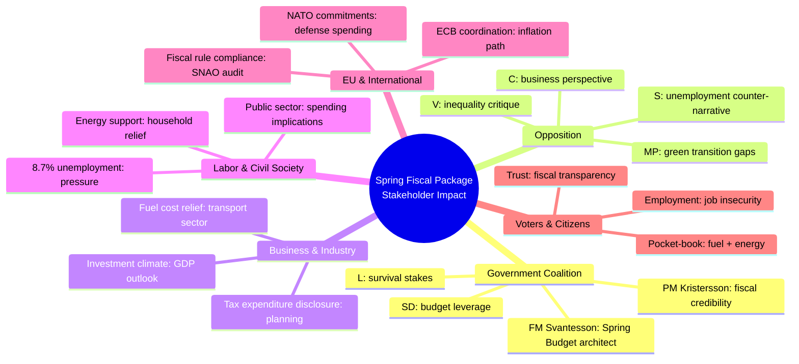

# Stakeholder Perspective Analysis — 2026-04-14

**Generated**: 2026-04-14 06:20 UTC
**Riksmöte**: 2025/26
**Data Sources**: riksdag-regering-mcp, World Bank
**Documents Analyzed**: 6
**Confidence**: 🟩 HIGH
**Analysis Depth**: deep (6 analysis lenses)

## Summary

Applied **6 analysis lenses** to the Spring Fiscal Package, examining impacts on government coalition, opposition, business, labor/civil society, EU/international actors, and voters/citizens.

## Detailed Analysis

### Lens 1: Government Coalition Perspective
- **PM Kristersson** (M): Signs 4 of 6 documents — personal ownership of fiscal narrative. Spring Budget (HD03100) is his economic legacy statement.
- **FM Svantesson** (M): Lead author on all 6 documents — key technical architect. Signs 5 of 6.
- **Wykman** (M, State Secretary): Co-signs HD03236 (extra budget) + HD03241 (SNAO response) — responsible for tactical fiscal measures.
- **Edholm** (L): Signs HD03236 — Liberals associated with consumer relief measure. L needs visible policy wins for survival above 4% threshold.
- **SD (support party)**: Not directly signing but essential for passage. FiU48 fast-track suggests prior SD agreement on extra budget.

### Lens 2: Opposition Perspective
- **Socialdemokraterna (S)**: Will challenge unemployment data (8.7% vs. 7.4% in 2022). Spring Budget forces S to present counter-vision — risk of looking reactive.
- **Vänsterpartiet (V)**: Will focus on inequality dimensions of tax expenditures (HD0398) — who benefits from tax breaks?
- **Miljöpartiet (MP)**: Fuel tax cut (HD03236) directly contradicts green transition — expect sharp climate critique.
- **Centerpartiet (C)**: May support parts of fiscal package (pro-business elements) while critiquing specific measures.

### Lens 3: Business & Industry Perspective
- **Transport sector**: Direct beneficiary of fuel tax cut (HD03236) — reduced operating costs
- **Energy-intensive industry**: Gas price support in extra budget relevant
- **General business**: GDP outlook in vårproposition (HD03100) shapes investment planning; tax expenditure transparency (HD0398) aids fiscal planning

### Lens 4: Labor & Civil Society Perspective
- **Trade unions**: 8.7% unemployment demands government response — VÄB (HD0399) spending choices scrutinized for employment measures
- **Households**: Energy support + fuel tax cuts in HD03236 provide direct relief
- **Public sector workers**: Annual state report (HD03101) reveals government spending efficiency — impacts on public sector funding visible
- **Social organizations**: Tax expenditure distribution (HD0398) reveals who benefits from fiscal policy

### Lens 5: EU & International Perspective
- **EU fiscal rules**: SNAO report (HD03241) assesses Sweden's compliance with fiscal framework — relevant for EU Stability and Growth Pact
- **NATO defense spending**: Vårproposition (HD03100) must address NATO 2% GDP commitment alongside fiscal consolidation
- **International markets**: Spring Budget GDP forecast influences SEK exchange rate expectations

### Lens 6: Voter & Citizen Perspective
- **Pocket-book voters**: Fuel tax cut + energy support (HD03236) = most salient measure. Direct monthly impact on household budgets.
- **Employment-concerned**: Rising unemployment (8.7%) is top worry — Spring Budget employment forecast will be scrutinized
- **Trust/transparency**: 6 simultaneous fiscal documents create information overload — citizens need media to interpret coherently
- **Election decision**: This package = "are you better off?" referendum on Kristersson government

## Cross-Perspective Conflicts

| Stakeholder A | Stakeholder B | Conflict Area | Document |
|---------------|---------------|---------------|----------|
| MP (green transition) | Transport sector (fuel costs) | Fuel tax cut direction | HD03236 |
| V (inequality) | Business (tax planning) | Tax expenditure distribution | HD0398 |
| SD (immigration spending) | Government (fiscal discipline) | Budget amendment demands | HD0399 |
| Unions (employment) | FM (fiscal targets) | Spending vs. savings | HD03100 |

## Key Findings

1. **Government coalition** is most advantaged — controls fiscal narrative with 5 months to election
2. **Opposition** must react — Vårproposition forces S to present economic alternative
3. **Voters** most affected by HD03236 (fuel/energy) — highest salience measure
4. **MP faces sharpest conflict** — fuel tax cuts undermine green policy they champion

## Data Quality Notes

6-lens analysis covers all major stakeholder groups. Evidence based on document metadata, economic data (World Bank), and coalition structure (CIA data). Stakeholder positions inferred from party platforms and institutional roles — specific statements not available via MCP.
