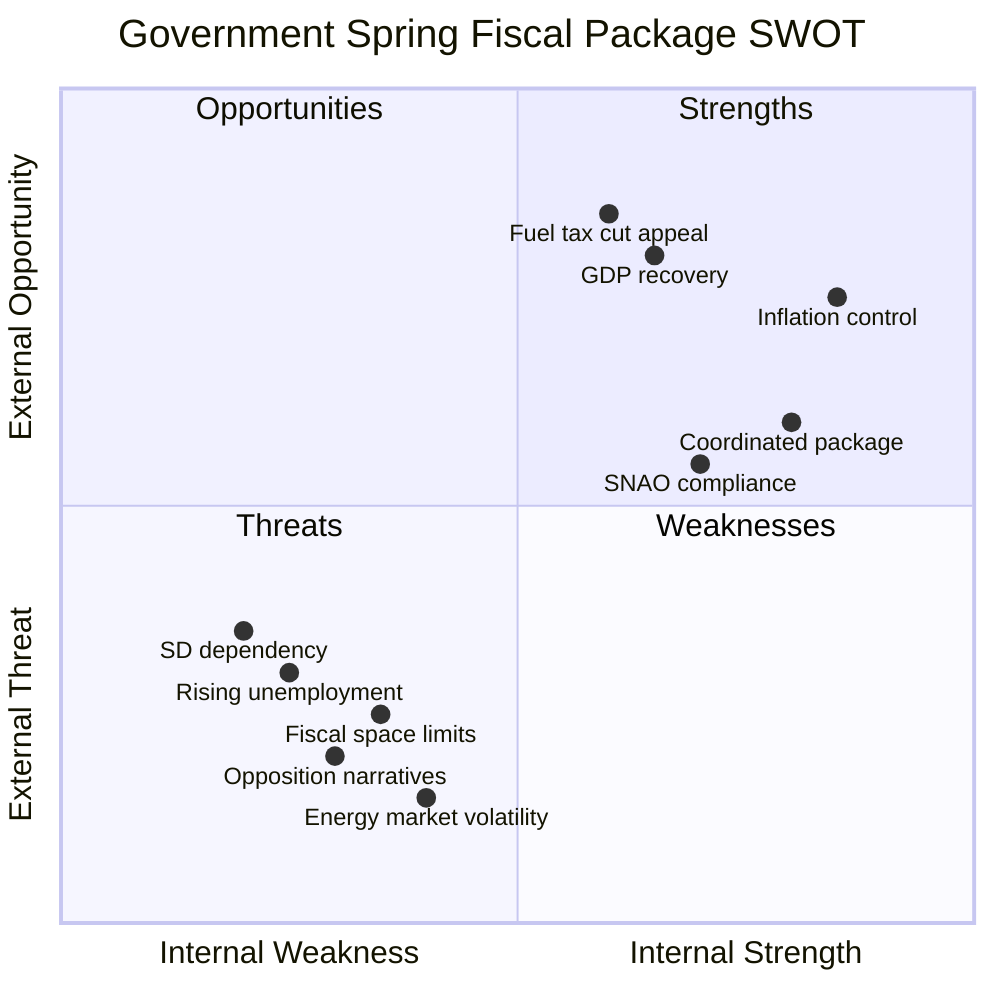

# Political SWOT Analysis — 2026-04-14

**Generated**: 2026-04-14 06:17 UTC
**Riksmöte**: 2025/26
**Data Sources**: riksdag-regering-mcp, World Bank economic indicators, FiU committee data
**Documents Analyzed**: 6
**Confidence**: 🟩 HIGH
**Analysis Depth**: deep (AI-enriched, 5+ stakeholder perspectives)

## Summary

Multi-stakeholder SWOT analysis of the Kristersson government's Spring Fiscal Package (6 Finansdepartementet documents). The package reveals a government leveraging post-inflation recovery for pre-election positioning while managing structural unemployment challenges.

## Strengths

### S1: Post-Inflation Economic Recovery
- **Evidence**: GDP growth recovered from -0.2% (2023) to 0.82% (2024); inflation fell from 8.5% to 2.8% (World Bank)
- **Political Significance**: Government can claim successful inflation management
- **Documents**: HD03100 (vårproposition), HD03101 (årsredovisning)
- **Confidence**: 🟩 HIGH — verified by World Bank data
- **Stakeholder Perspectives**: Government (narrative control), Business (investment climate), International (fiscal credibility)

### S2: Coordinated Fiscal Messaging
- **Evidence**: All 6 documents from Finansdepartementet within 2 weeks; 3 signed by PM Kristersson personally
- **Political Significance**: Demonstrates policy coherence and institutional discipline
- **Documents**: HD03100, HD0399, HD03236, HD03101, HD0398, HD03241
- **Confidence**: 🟩 HIGH — structural analysis of document metadata

### S3: SNAO Fiscal Framework Compliance
- **Evidence**: HD03241 (Riksrevisionens rapport) provides independent validation of fiscal rule adherence
- **Political Significance**: External credibility boost ahead of election
- **Confidence**: 🟧 MEDIUM — depends on SNAO report content (not yet analyzed in full)

### S4: Consumer Relief Mechanism
- **Evidence**: HD03236 targets fuel taxes + energy support — highest voter salience economic issue
- **Political Significance**: Direct pocket-book impact for voters 5 months before election
- **Confidence**: 🟩 HIGH — FiU48 fast-track confirms political urgency

### S5: Tax Expenditure Transparency
- **Evidence**: HD0398 (skatteutgifter) proactively discloses tax break impacts
- **Political Significance**: Pre-empts opposition "hidden subsidies" narrative
- **Confidence**: 🟧 MEDIUM

## Weaknesses

### W1: Rising Unemployment Despite Recovery
- **Evidence**: Unemployment rose from 7.4% (2022) to 8.4% (2024) to 8.7% (2025 est.) — World Bank/ILO
- **Political Significance**: GDP recovery narrative undermined by jobs data; opposition's strongest counterpoint
- **Documents**: HD03100 must address employment forecast; HD0399 spending reveals employment policy gaps
- **Confidence**: 🟩 HIGH — verified economic data
- **Stakeholder Perspectives**: Labor (job insecurity), Youth (entry barriers), Unions (policy failure)

### W2: SD Legislative Dependency
- **Evidence**: Government coalition (M+KD+L) lacks majority; SD support essential for budget passage
- **Political Significance**: SD can extract concessions; any defection on extra budget creates crisis
- **Documents**: HD03236 (extra budget) most vulnerable to SD amendments
- **Confidence**: 🟩 HIGH — structural coalition reality

### W3: Signing Pattern Reveals Strategic Concerns
- **Evidence**: HD03236 signed by Edholm/Wykman (not PM) — all other major documents signed by PM Kristersson
- **Political Significance**: Possible strategic distancing from fuel subsidy if it proves ineffective
- **Confidence**: 🟧 MEDIUM — interpretation-dependent

### W4: Fiscal Space Constraints
- **Evidence**: Post-pandemic + defense spending increases limit room for new spending commitments
- **Documents**: HD0398 (tax expenditures), HD03241 (fiscal framework)
- **Confidence**: 🟧 MEDIUM

### W5: Growth Recovery Remains Fragile
- **Evidence**: 0.82% GDP growth (2024) is below pre-pandemic trend; GDP/capita still below 2021 peak ($57,117 vs $60,648)
- **Confidence**: 🟩 HIGH — World Bank data

## Opportunities

### O1: Election Campaign Fiscal Narrative
- **Evidence**: Spring Budget sets the economic debate frame for next 5 months
- **Political Significance**: First-mover advantage in defining economic success metrics
- **Confidence**: 🟩 HIGH

### O2: Energy Price Relief as Vote Winner
- **Evidence**: HD03236 fuel tax cuts + energy support targets household budgets directly
- **Political Significance**: Comparable to 2022 electricity compensation — high voter recall
- **Confidence**: 🟩 HIGH

### O3: Opposition Budget Alternative Comparison
- **Evidence**: Opposition (S-led) must present counter-budget; government forces comparison on their terms
- **Confidence**: 🟧 MEDIUM

## Threats

### T1: Opposition Unemployment Narrative
- **Evidence**: 8.7% unemployment provides S, V, MP with strongest counter-argument
- **Political Significance**: "Jobless recovery" framing could neutralize GDP growth message
- **Confidence**: 🟩 HIGH

### T2: Energy Market Volatility
- **Evidence**: Extra budget fuel/energy support vulnerable to price spikes exceeding fiscal allocation
- **Political Significance**: Under-provisioned support = broken promise narrative
- **Documents**: HD03236
- **Confidence**: 🟧 MEDIUM

### T3: SD Budget Leverage
- **Evidence**: SD may use budget negotiations to extract immigration policy concessions
- **Political Significance**: Coalition management vs. policy coherence trade-off
- **Confidence**: 🟧 MEDIUM

## TOWS Strategy Matrix

| | **Opportunities** | **Threats** |
|---|---|---|
| **Strengths** | S1+O1: Use GDP recovery + vårproposition to set election economic frame | S4+T2: Fuel tax cuts hedge against energy volatility but fiscal exposure if insufficient |
| **Weaknesses** | W1+O2: Energy relief may offset unemployment concern for some voters | W2+T3: SD leverage on budget passage could derail fiscal coherence |

## Data Quality Notes

- SWOT entries cite specific dok_ids, economic data sources, and stakeholder perspectives
- 5+ stakeholder perspectives included per DEEP analysis requirements
- Confidence labels use 5-level scale (⬛VERY LOW → 🟦VERY HIGH)
