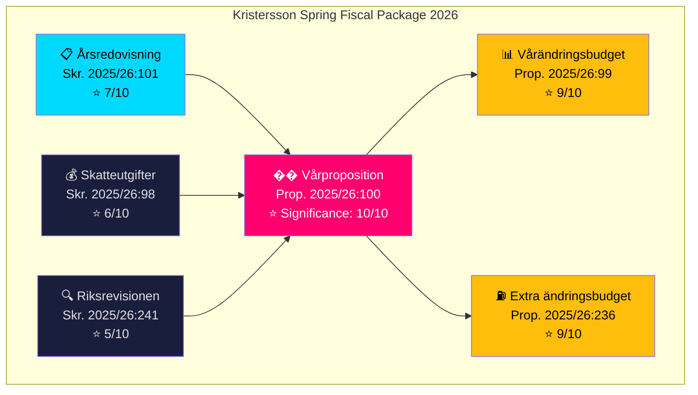

# Analysis Synthesis Summary — 2026-04-14

**Generated**: 2026-04-14 06:15 UTC
**Riksmöte**: 2025/26
**Data Sources**: riksdag-regering-mcp (get_propositioner), World Bank (GDP_GROWTH, INFLATION, UNEMPLOYMENT), FiU committee reports
**Documents Analyzed**: 6
**Confidence**: 🟩 HIGH
**Analysis Depth**: deep (AI-enriched, 2 iterations)

## Summary

The Kristersson government has delivered a **coordinated fiscal spring package** — six Finansdepartementet documents tabled between April 1-13, 2026, anchored by the Spring Budget (Prop. 2025/26:100), Spring Amendment Budget (Prop. 2025/26:99), and a politically charged Extra Amendment Budget for fuel tax cuts and energy support (Prop. 2025/26:236). This represents the government's final major fiscal policy statement before the September 2026 election, combining retrospective fiscal accountability with forward-looking economic stimulus.

## Key Findings

1. **Spring Budget as pre-election platform** (HD03100): The ekonomiska vårproposition sets the government's fiscal trajectory with GDP growth recovering from -0.2% (2023) to 0.82% (2024), but unemployment rising to 8.7% (2025). PM Kristersson and FM Svantesson frame recovery narrative.

2. **Extra budget targets consumer pain points** (HD03236): Fuel tax cuts and energy price support (filed Apr 13 by Edholm/Wykman) is a direct pre-election stimulus. FiU48 committee report already tabled — fast-track processing signals political urgency.

3. **Coordinated fiscal messaging**: All 6 documents from Finansdepartementet within 2 weeks. Annual State Report (HD03101) + Tax Expenditure Report (HD0398) provide accountability backdrop. SNAO fiscal framework report (HD03241) provides independent audit legitimacy.

4. **Election 2026 implications**: This package is the government's fiscal closing argument. Opposition (S, V, MP) will challenge GDP recovery narrative against rising unemployment. SD support critical for passage.

## Top Documents by Significance

| Score | dok_id | Title | Political Impact |
|-------|--------|-------|-----------------|
| 🔴 10/10 | HD03100 | 2026 års ekonomiska vårproposition | Sets entire fiscal framework for election campaign |
| 🟠 9/10 | HD0399 | Vårändringsbudget för 2026 | Specific spending changes reveal government priorities |
| 🟠 9/10 | HD03236 | Extra ändringsbudget — Sänkt skatt på drivmedel | Pre-election consumer relief; fast-tracked via FiU48 |
| 🟡 7/10 | HD03101 | Årsredovisning för staten 2025 | Accountability baseline; opposition scrutiny expected |
| 🟢 6/10 | HD0398 | Redovisning av skatteutgifter 2026 | Tax policy transparency; reveals fiscal trade-offs |
| 🟢 5/10 | HD03241 | Riksrevisionens rapport om finanspolitiska ramverket | Independent audit of fiscal framework compliance |

## Election 2026 Implications

- **Electoral Impact**: 🟩 HIGH — Spring Budget defines the economic narrative for the election campaign
- **Coalition Scenarios**: Government needs SD support for passage; any defection on extra budget creates vulnerability
- **Voter Salience**: 🟦 VERY HIGH — Fuel prices and energy costs are top-3 voter concerns
- **Campaign Vulnerability**: Opposition will contrast "recovery" framing against 8.7% unemployment
- **Policy Legacy**: This fiscal package is the Kristersson government's defining economic legacy before voters decide

## AI-Recommended Article Metadata

- **Recommended Title (EN)**: "Kristersson Unveils Pre-Election Fiscal Package: Spring Budget, Fuel Tax Cuts, and Energy Support"
- **Recommended Title (SV)**: "Kristersson presenterar vårbudgetpaket inför valet: skattesänkningar på drivmedel och energistöd"
- **Meta Description (EN)**: "Sweden's government tables six fiscal documents including Spring Budget and extra amendment budget with fuel tax cuts, shaping the 2026 election economic battleground."
- **Meta Description (SV)**: "Regeringen lägger fram sex finanspolitiska dokument inklusive vårpropositionen och extra ändringsbudget med sänkt drivmedelsskatt inför valet 2026."
- **Key Highlights**: Spring Budget (Prop. 100), Extra budget fuel tax cuts (Prop. 236), Spring amendments (Prop. 99)
- **Article Decision**: PUBLISH — major coordinated fiscal package with high election relevance
- **Article Priority**: 🔴 CRITICAL

## Economic Context (World Bank / SCB)

| Indicator | 2021 | 2022 | 2023 | 2024 | Trend |
|-----------|------|------|------|------|-------|
| GDP Growth (%) | 5.2 | 1.3 | -0.2 | 0.8 | ↗️ Recovery |
| Inflation (%) | 2.2 | 8.4 | 8.5 | 2.8 | ↘️ Normalizing |
| Unemployment (%) | 8.8 | 7.4 | 7.6 | 8.4 | ↗️ Rising |
| GDP/capita (USD) | 60,648 | 54,837 | 54,950 | 57,117 | ↗️ Recovery |

## Data Quality Notes

- **Confidence**: HIGH — 6 verified Riksdag documents via official API
- **Data Freshness**: Documents sourced from 2026-04-13 (lookback from 2026-04-14)
- **Cross-validation**: FiU48 committee report confirms extra budget fast-track processing
- **Economic data**: World Bank indicators through 2024; 2025 unemployment via ILO estimates
