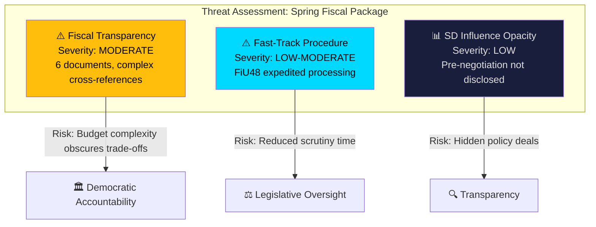

# Political Threat Analysis — 2026-04-14

**Generated**: 2026-04-14 06:19 UTC
**Riksmöte**: 2025/26
**Data Sources**: riksdag-regering-mcp, CIA coalition data
**Documents Analyzed**: 6
**Confidence**: 🟧 MEDIUM
**Analysis Depth**: deep (AI-enriched)

## Summary

The Spring Fiscal Package presents limited direct threats to democratic function. The primary concern is **fiscal transparency** — whether the coordinated fiscal package obscures trade-offs between consumer relief (HD03236) and structural employment challenges. The fast-track processing of the extra budget via FiU48 raises procedural efficiency questions.

## Threat Categories (Political Threat Taxonomy)

### 1. Fiscal Transparency Threat
- **Category**: Democratic Accountability
- **Severity**: 🟧 MODERATE
- **Evidence**: 6 documents tabled simultaneously; complex cross-references between vårproposition (HD03100), VÄB (HD0399), extra budget (HD03236), and tax expenditures (HD0398). Citizens and media must parse multiple documents to understand net fiscal impact.
- **Mitigation**: Government proactively published tax expenditure report (HD0398) and SNAO compliance report (HD03241)
- **Democratic Function Impact**: Reduced voter understanding of fiscal trade-offs before election

### 2. Expedited Legislative Process
- **Category**: Legislative Oversight
- **Severity**: 🟡 LOW-MODERATE
- **Evidence**: FiU48 committee report on extra budget (HD03236) tabled same day as proposition (April 13). Fast-track reduces committee deliberation time.
- **Mitigation**: Standard budget amendment procedure; committee maintains technical capacity
- **Democratic Function Impact**: Reduced time for opposition scrutiny and public debate

### 3. Coalition Pre-Negotiation Opacity
- **Category**: Transparency
- **Severity**: 🟢 LOW
- **Evidence**: SD support for fiscal package likely pre-negotiated; terms not publicly disclosed
- **Mitigation**: Standard coalition politics in parliamentary democracies
- **Democratic Function Impact**: Voters cannot assess what concessions were made for SD support

## Key Findings

1. **No high-severity threats** identified — fiscal package follows established parliamentary procedure
2. **Coordination complexity** is the primary transparency concern — not deliberate concealment
3. **Fast-track processing** of HD03236 is notable but not unprecedented for urgent fiscal measures

## Implications

- Articles should note FiU48 fast-track as procedural fact, not crisis
- Fiscal complexity should be explained to help citizens navigate the package
- SD negotiation dynamics deserve follow-up when committee votes occur

## Data Quality Notes

Threat analysis follows `analysis/methodologies/political-threat-framework.md`. Severity calibrated to Swedish parliamentary norms — fast-track budget amendments are established procedure during spring fiscal season.
