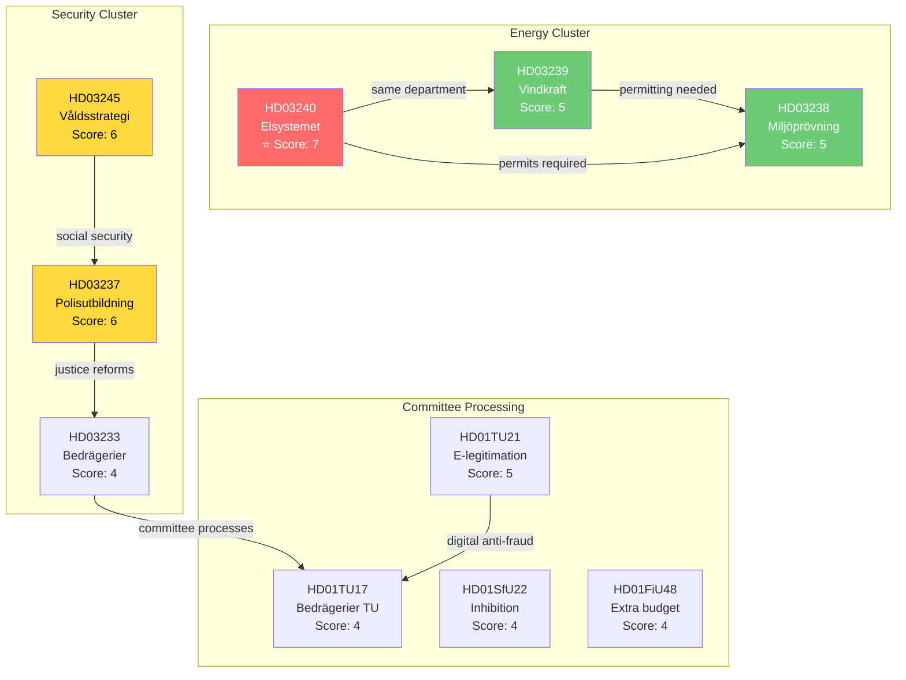

# Cross-Reference Map — 2026-04-14

**Generated**: 2026-04-14 15:28 UTC (AI-enriched)
**Documents Analyzed**: 17
**Confidence**: HIGH
**Produced By**: AI-driven analysis (realtime-1526)

## Document Relationship Map

## Key Cross-References

| Source | Target | Relationship |
|--------|--------|-------------|
| HD03240 (Elsystemet) | HD03239 (Vindkraft) | Both from Klimat- och näringslivsdepartementet; electricity reform enables wind power expansion |
| HD03239 (Vindkraft) | HD03238 (Miljöprövning) | Wind power projects require environmental permits — new authority streamlines process |
| HD03233 (Bedrägerier prop) | HD01TU17 (Bedrägerier bet) | Committee report (TU17) processes the proposition (233) |
| HD03237 (Polisutbildning) | HD03245 (Våldsstrategi) | Both address public safety — police capacity enables violence prevention |
| HD01TU21 (E-legitimation) | HD01TU17 (Bedrägerier) | State e-ID can counter digital fraud; both in TU committee |
| HD03236 (Extra budget) | HD01FiU48 (Extra budget bet) | Committee processing the extra budget proposition |

## Cluster Analysis

1. **Energy Transformation Cluster** (3 documents): HD03240 + HD03239 + HD03238 — coherent energy transition package
2. **Public Safety Cluster** (3 documents): HD03237 + HD03233 + HD03245 — multi-vector security approach
3. **Committee Processing Cluster** (4 documents): HD01TU21 + HD01TU17 + HD01SfU22 + HD01FiU48 — items advancing to Riksdag decisions
