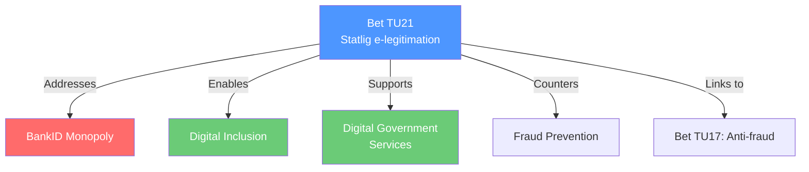

# Document Analysis: En statlig e-legitimation

**Generated**: 2026-04-14 15:28 UTC (AI-enriched)
**dok_id**: HD01TU21
**Document Type**: Betänkande (Bet. 2025/26:TU21)
**Committee**: TU (Trafikutskottet)
**Date**: 2026-04-14
**Status**: Planerat (scheduled for Riksdag decision)
**Riksmöte**: 2025/26
**Significance**: 🟡 MEDIUM (5/10)
**Confidence**: HIGH (80%)

## Executive Summary

The Transport Committee (TU) has processed the government's proposal for a state-issued electronic identification (e-legitimation). This is a landmark digital infrastructure decision — Sweden currently relies entirely on private-sector e-ID solutions (BankID), creating market concentration and exclusion risks. The committee report is scheduled for Riksdag decision.

## Political Intelligence

## 6-Lens Analysis

### 1. Policy Impact
- **Digital infrastructure**: State e-ID creates public alternative to BankID
- **Inclusion**: Addresses exclusion of elderly, immigrants, and others lacking BankID
- **Security**: State-controlled identity infrastructure for critical services
- **EU alignment**: Supports eIDAS 2.0 regulation compliance

### 2. Stakeholder Impact
| Stakeholder | Impact | Direction |
|-------------|--------|-----------|
| Citizens without BankID | HIGH | Positive — digital access |
| Government agencies | HIGH | Positive — universal verification |
| Banks/BankID AB | MEDIUM | Negative — market competition |
| Fraud victims | MEDIUM | Positive — stronger identity security |

### 3. Key Insights
1. Landmark decision — breaks BankID's de facto monopoly on Swedish e-identification
2. TU committee referral signals infrastructure framing rather than financial/security
3. Status "planerat" — Riksdag vote imminent
4. Links to anti-fraud proposition (HD03233) — identity verification core to preventing telecom fraud
