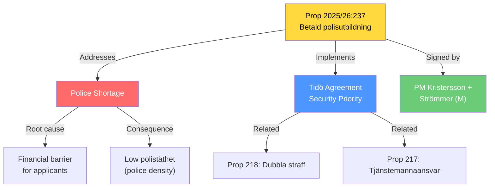

# Document Analysis: En betald polisutbildning

**Generated**: 2026-04-14 15:28 UTC (AI-enriched)
**dok_id**: HD03237
**Document Type**: Proposition (Prop. 2025/26:237)
**Committee**: JuU (Justitieutskottet)
**Department**: Justitiedepartementet
**Date**: 2026-04-14
**Signed by**: PM Ulf Kristersson (M), Justice Minister Gunnar Strömmer (M)
**Riksmöte**: 2025/26
**Significance**: 🟡 MEDIUM-HIGH (6/10)
**Confidence**: HIGH (85%)

## Executive Summary

PM Kristersson and Justice Minister Strömmer propose making police education a paid (salaried) program to increase police recruitment and police density across Sweden. This addresses the acknowledged police shortage — a core Tidö Agreement priority — by removing the financial barrier that deters potential applicants. The proposition signals that the government considers existing recruitment incentives insufficient.

## Political Intelligence

## 6-Lens Analysis

### 1. Policy Impact
- **Scope**: National police recruitment — affects Polismyndigheten, police academy, and public safety nationwide
- **Financial**: Converting unpaid education to salaried positions requires significant budget allocation
- **Timeline**: Aims to increase "polistillväxten och polistätheten" — multi-year impact on police numbers
- **Precedent**: Follows model from other Nordic countries with paid police/military education

### 2. Political Dynamics
- **Government position**: PM Kristersson personally signs — signals top priority
- **Coalition alignment**: Core M+SD security agenda; KD+L supportive of rule of law investment
- **Opposition**: S likely supports principle but may criticize timing; V may question policing approach vs social investment
- **SD angle**: Aligns with SD's "lag och ordning" (law and order) priority — reinforces Tidö cooperation

### 3. Stakeholder Impact
| Stakeholder | Impact | Direction |
|-------------|--------|-----------|
| Police applicants | HIGH | Positive — removes financial barrier |
| Polismyndigheten | HIGH | Positive — larger recruitment pool |
| Citizens (safety) | MEDIUM | Positive — more police long-term |
| State budget | MEDIUM | Negative — new expenditure commitment |
| Universities | LOW | Neutral — police education separate |

### 4. SWOT Contribution
- **Strength**: Addresses acknowledged recruitment gap with concrete financial mechanism
- **Weakness**: Implies current police shortage is worse than government has publicly communicated
- **Opportunity**: Could attract career changers and diverse applicants; model for other public sector recruitment
- **Threat**: Budget pressure from paid education commitment; implementation timeline may be slow

### 5. Risk Assessment
| Risk | Likelihood | Impact |
|------|-----------|--------|
| Insufficient budget allocation | MEDIUM | HIGH |
| Slow implementation vs expectation | HIGH | MEDIUM |
| Quality concerns with rapid expansion | LOW | MEDIUM |

### 6. Constitutional/Legal
- Referred to JuU (Justitieutskottet) for processing
- PM Kristersson + Justice Minister Strömmer co-signature signals executive priority
- May require amendments to police education regulations

## Key Insights

1. PM personally signing this proposition signals it's a top government priority
2. Acknowledges police shortage more explicitly than previous government communications
3. Part of broader justice package with Prop 217 (tjänstemannaansvar) and Prop 218 (double penalties)
4. Financial model change — from unpaid to paid — is the key policy innovation
