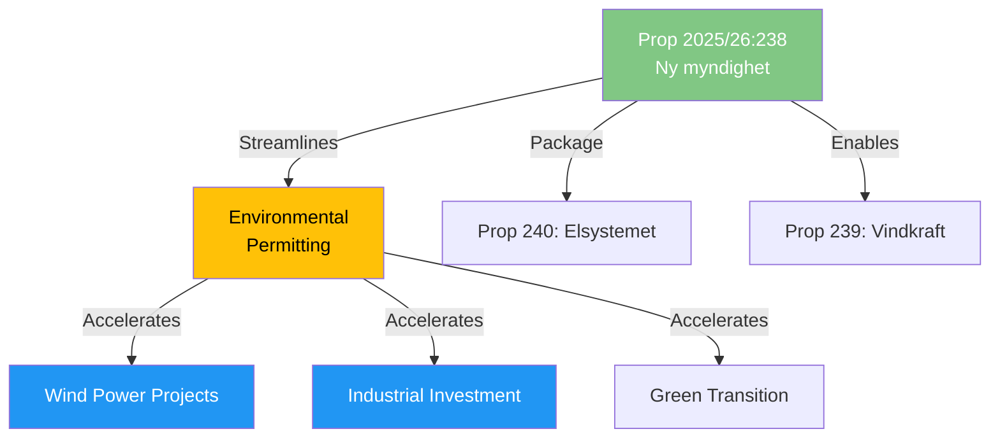

# Document Analysis: Ny myndighet för miljöprövning

**Generated**: 2026-04-14 15:28 UTC (AI-enriched)
**dok_id**: HD03238
**Document Type**: Proposition (Prop. 2025/26:238)
**Committee**: NU (via Klimat- och näringslivsdepartementet)
**Date**: 2026-04-14
**Signed by**: PM Ulf Kristersson, Minister Johan Britz (L)
**Significance**: 🟡 MEDIUM (5/10)
**Confidence**: HIGH (80%)

## Executive Summary

The government proposes creating a new dedicated authority for environmental permitting, designed to streamline and accelerate the currently fragmented environmental review process. This is critical for the energy transition (wind power, industrial electrification) and the third leg of the energy transformation triple-package. PM Kristersson's personal signature signals executive-level commitment to removing environmental permitting bottlenecks.

## Political Intelligence

## Key Insights

1. Institutional reform creating new authority — significant governance change
2. Addresses longstanding business complaint about slow environmental permitting
3. PM personal signature reflects government priority
4. Critical enabler for wind power (Prop 239) and electricity reform (Prop 240)

## Stakeholder Impact
| Stakeholder | Impact | Direction |
|-------------|--------|-----------|
| Industry | HIGH | Positive — faster permitting |
| Environmental orgs | MEDIUM | Mixed — faster but potentially weaker scrutiny |
| Municipalities | MEDIUM | Positive — clearer process |
| Current permitting staff | HIGH | Mixed — organizational change |
