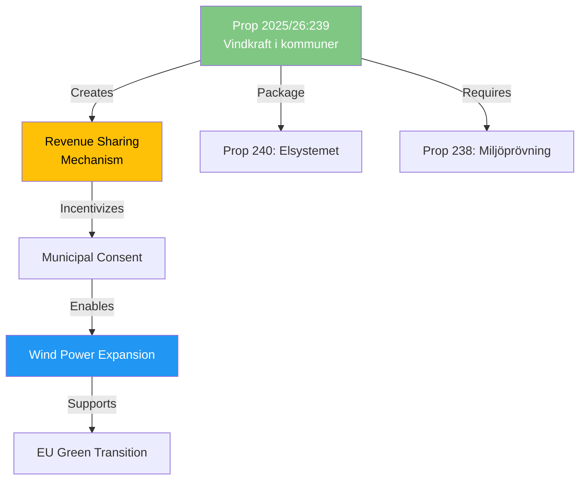

# Document Analysis: Vindkraft i kommuner

**Generated**: 2026-04-14 15:28 UTC (AI-enriched)
**dok_id**: HD03239
**Document Type**: Proposition (Prop. 2025/26:239)
**Committee**: NU (Näringsutskottet)
**Department**: Klimat- och näringslivsdepartementet
**Date**: 2026-04-14
**Signed by**: Acting PM Lotta Edholm, Minister Johan Britz (L)
**Riksmöte**: 2025/26
**Significance**: 🟡 MEDIUM (5/10)
**Confidence**: HIGH (80%)

## Executive Summary

The government proposes a new law on revenue sharing ("intäktsdelning") for wind power, enabling municipalities hosting wind power installations to receive a share of revenue. This addresses the persistent "municipal veto" problem — municipalities have blocked wind power projects due to lack of local economic benefit. Part of the energy transition triple-package with Prop 240 (electricity system) and Prop 238 (environmental permitting).

## Political Intelligence

## 6-Lens Analysis

### 1. Policy Impact
- **Innovation**: New revenue-sharing model — first of its kind in Swedish law
- **Problem solved**: Municipal veto on wind power due to "all cost, no benefit" perception
- **Scale**: Could unlock hundreds of stalled wind power projects nationwide
- **Economic**: New municipal income source from energy infrastructure

### 2. Political Dynamics
- **Government position**: L minister Britz leads — energy transition core Liberal agenda
- **Coalition alignment**: M supports business investment; KD cautious on environmental issues; SD neutral
- **Opposition**: C strongly supportive (rural municipalities benefit); MP+V want more ambitious targets; S likely supports
- **Municipal angle**: Cross-party support likely in municipalities receiving revenue

### 3. Stakeholder Impact
| Stakeholder | Impact | Direction |
|-------------|--------|-----------|
| Rural municipalities | HIGH | Positive — new revenue source |
| Wind power developers | HIGH | Positive — consent pathway |
| Local residents | MEDIUM | Mixed — visual/noise impact vs economic benefit |
| Energy consumers | MEDIUM | Positive — more supply = lower prices |

### 4. Key Insights
1. Revenue sharing is the key innovation to break the municipal veto deadlock
2. Part of coherent energy triple-package — strongest when all three pass together
3. L minister Britz positioned as energy transition leader within coalition
4. Municipal economic incentive approach mirrors successful Nordic models
