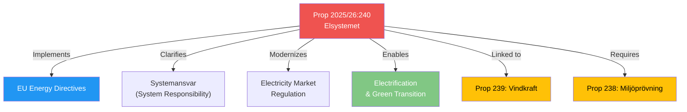

# Document Analysis: Nya lagar om elsystemet

**Generated**: 2026-04-14 15:28 UTC (AI-enriched)
**dok_id**: HD03240
**Document Type**: Proposition (Prop. 2025/26:240)
**Committee**: NU (Näringsutskottet)
**Department**: Klimat- och näringslivsdepartementet
**Date**: 2026-04-14
**Signed by**: Acting PM Lotta Edholm, Minister Elisabet Lann (KD)
**Riksmöte**: 2025/26
**Significance**: 🔴 HIGH (7/10)
**Confidence**: HIGH (85%)

## Executive Summary

The government proposes comprehensive reform of Sweden's electricity system through new legislation modernizing the regulatory framework, clarifying system responsibility (systemansvar), and implementing EU energy directives. This is the flagship energy proposition — one of three energy-related bills delivered on April 14, forming a coherent energy transformation package. Lagrådet (Council on Legislation) was consulted and the government largely followed its recommendations.

## Political Intelligence

## 6-Lens Analysis

### 1. Policy Impact
- **Scope**: National electricity infrastructure — affects all energy producers, distributors, and consumers
- **EU compliance**: Implements mandatory EU energy directives (deadline pressure)
- **Systemic change**: New regulatory framework for system responsibility — Svenska Kraftnät role clarified
- **Economic magnitude**: Energy sector accounts for ~3% of Swedish GDP; reform affects pricing, investment, and industrial competitiveness

### 2. Political Dynamics
- **Government position**: L minister Britz (Klimat- och näringslivsdepartementet) leads; PM Edholm and KD minister Lann co-sign
- **Coalition alignment**: Energy reform aligns M (business), KD (consumer), L (green liberal), SD (energy independence)
- **Opposition potential**: S may criticize pace; V+MP may push for stronger renewables focus; C supportive of market reform
- **Cross-party**: Energy infrastructure has broad consensus potential — implementation details create debate

### 3. Stakeholder Impact
| Stakeholder | Impact | Direction |
|-------------|--------|-----------|
| Energy producers | HIGH | Positive — clearer regulatory framework |
| Industrial consumers | HIGH | Mixed — transition uncertainty but long-term clarity |
| Municipalities | MEDIUM | Linked to Prop 239 (wind revenue) |
| Svenska Kraftnät | HIGH | Expanded systemansvar role |
| EU Commission | MEDIUM | Positive — compliance demonstrated |

### 4. SWOT Contribution
- **Strength**: Demonstrates government energy reform capacity; Lagrådet endorsement
- **Weakness**: Complexity of simultaneous reform across multiple energy sub-systems
- **Opportunity**: Positions Sweden as EU energy transition leader; attracts green investment
- **Threat**: Energy price volatility during transition; implementation delays

### 5. Risk Assessment
| Risk | Likelihood | Impact |
|------|-----------|--------|
| Implementation delays | MEDIUM | HIGH |
| Energy price disruption | LOW | HIGH |
| Industry compliance costs | HIGH | MEDIUM |
| EU directive non-compliance | LOW | HIGH |

### 6. Constitutional/Legal
- Lagrådet consulted — government "i huvudsak" followed recommendations
- New legislation framework — not amendment to existing
- Committee referral: NU (Näringsutskottet) — energy policy expertise

## Key Insights

1. This is the most significant single proposition on April 14 — energy infrastructure reform with EU directive implementation
2. Part of coherent triple-proposition energy package (240 + 239 + 238)
3. Lagrådet consultation strengthens legal foundation
4. Minister quote: "Vi fortsätter städa i energipolitiken genom att förtydliga systemansvaret och modernisera regelverket"

## Data Quality Notes

- **Confidence**: HIGH (85%) — proposition confirmed in MCP, government press release corroborates
- **Full text**: Partially available via summary; full proposition text accessible via Riksdagen
- **Cross-verified**: Government press release from Apr 13 confirms proposition details
