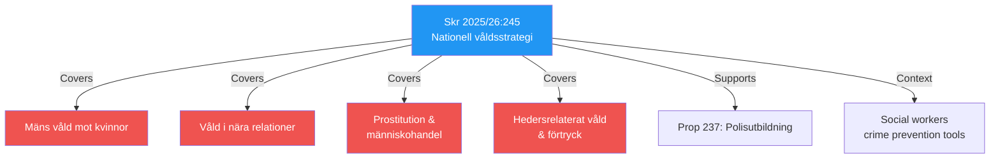

# Document Analysis: Nationell strategi mot våld, förtryck och utnyttjande

**Generated**: 2026-04-14 15:28 UTC (AI-enriched)
**dok_id**: HD03245
**Document Type**: Regeringens skrivelse (Skr. 2025/26:245)
**Committee**: AU (Arbetsmarknadsutskottet)
**Department**: Arbetsmarknadsdepartementet
**Date**: 2026-04-14
**Riksmöte**: 2025/26
**Significance**: 🟡 MEDIUM-HIGH (6/10)
**Confidence**: HIGH (80%)

## Executive Summary

The government presents a comprehensive national strategy against men's violence against women, domestic violence, exploitation in prostitution and human trafficking, and honor-related violence and oppression. This is a government skrivelse (written communication) — not a proposition — meaning it presents the government's strategic direction without proposing specific legislation. A dedicated press conference was held on April 14.

## Political Intelligence

## 6-Lens Analysis

### 1. Policy Impact
- **Scope**: National strategy covering 4 distinct violence/exploitation categories
- **Type**: Skrivelse (strategic direction, not legislation) — sets framework for future legislation
- **Cross-sectoral**: Affects social services, police, judiciary, healthcare, education
- **International**: Aligns with Istanbul Convention obligations and Nordic cooperation

### 2. Political Dynamics
- **Government position**: Cross-departmental effort — Arbetsmarknadsdepartementet leads
- **Coalition alignment**: KD has championed honor violence issues; M supports crime prevention; L pushes equality
- **Opposition**: S likely supportive of direction but may demand more resources; V+MP may push for structural analysis
- **SD angle**: Honor violence component aligns with SD integration critique

### 3. Stakeholder Impact
| Stakeholder | Impact | Direction |
|-------------|--------|-----------|
| Violence victims | HIGH | Positive — strategic commitment |
| Social services | HIGH | Mixed — new responsibilities, resource needs |
| Police | MEDIUM | Positive — clearer mandate |
| Civil society orgs | HIGH | Positive — advocacy framework |
| Municipalities | MEDIUM | Mixed — implementation burden |

### 4. SWOT Contribution
- **Strength**: Comprehensive scope covering all major violence categories
- **Weakness**: Skrivelse format lacks binding legislative commitments
- **Opportunity**: Could build cross-party consensus on violence prevention
- **Threat**: Resource allocation may not match strategic ambition

### 5. Risk Assessment
| Risk | Likelihood | Impact |
|------|-----------|--------|
| Unfunded mandate | MEDIUM | HIGH |
| Implementation gaps | HIGH | MEDIUM |
| Politicization of honor violence | MEDIUM | MEDIUM |

### 6. Constitutional/Legal
- Skrivelse format: strategic communication, no legislative proposals
- Referred to AU (Arbetsmarknadsutskottet) for processing
- Framework for future legislative proposals expected

## Key Insights

1. Comprehensive 4-category national strategy is politically ambitious but non-binding
2. Press conference on Apr 14 signals government prioritization
3. Honor violence component bridges KD social conservatism and SD integration critique
4. Links to government's broader social worker training initiative (press release Apr 13)
