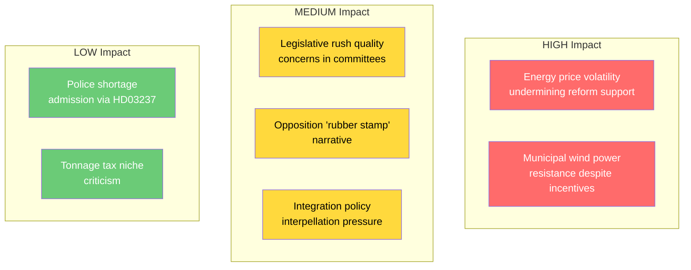

# Political Risk Assessment — 2026-04-14

**Generated**: 2026-04-14 15:28 UTC (AI-enriched)
**Data Sources**: riksdag-regering MCP (live data)
**Documents Analyzed**: 17
**Confidence**: HIGH
**Analysis Depth**: Deep
**Produced By**: AI-driven analysis (realtime-1526)

## Summary

Today's massive legislative output (8 propositions + 1 skrivelse) presents **MODERATE** overall political risk. While the government demonstrates strong legislative capacity, the volume itself creates processing risks and opposition attack vectors. Energy sector reform (3 propositions) carries the highest policy implementation risk.

## Risk Matrix

## Detailed Risk Assessment

| Risk | Likelihood | Impact | Score | Mitigation | dok_id |
|------|-----------|--------|-------|------------|--------|
| Energy transition backlash from price increases | MEDIUM | HIGH | 6/10 | Extra budget fuel tax cut (HD03236) | HD03240, HD03236 |
| Municipal rejection of wind power revenue model | MEDIUM | HIGH | 6/10 | Revenue sharing designed as incentive | HD03239 |
| Committee overload from legislative volume | HIGH | MEDIUM | 5/10 | Items spread across 6 committees | Multiple |
| Opposition framing of "rushed" legislation | MEDIUM | MEDIUM | 4/10 | Government can cite EU compliance deadlines | HD03240 |
| SD leverage over coalition on immigration | LOW | HIGH | 4/10 | SfU22 addresses specific SD priority | HD01SfU22 |
| Police recruitment still insufficient post-reform | MEDIUM | LOW | 3/10 | Paid education addresses financial barrier | HD03237 |

## Coalition Stability Assessment

**Overall Coalition Risk Score**: 18/100 (LOW)

- **M-KD alignment**: Strong (shared justice + social policy agenda)
- **L energy leadership**: Strengthened by 3 energy propositions under Britz
- **SD support reliability**: Stable — immigration items (SfU22, SfU31, SfU32, SfU36) on track
- **Cross-party tensions**: Minimal today; interpellation debates (Redar S vs Britz L on integration) are routine opposition pressure

## Key Findings

1. **Energy sector implementation risk** is the highest-impact risk — 3 propositions creating new regulatory frameworks simultaneously
2. **Legislative volume risk** is manageable — items distributed across NU, JuU, AU, TU, SfU, FiU committees
3. **Coalition risk remains LOW** — today's output shows functioning Tidö cooperation
4. **Pre-election acceleration** creates strategic risk of quality vs quantity trade-off

## Implications

- Monitor committee processing timelines for bottleneck signals
- Track municipal reactions to wind power revenue sharing model
- Watch for opposition coordination on "rushed legislation" messaging
- Energy price developments in Q2-Q3 2026 critical for reform support
