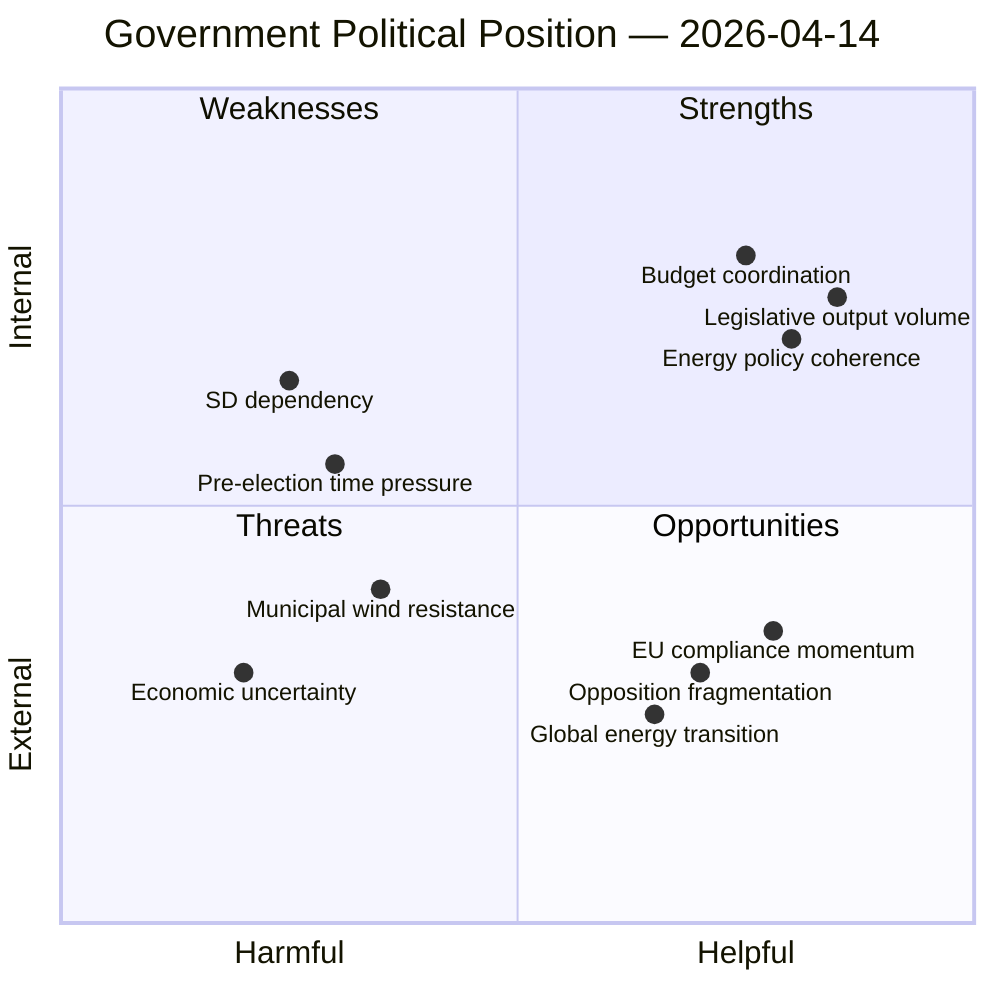

# Political SWOT Analysis — 2026-04-14

**Generated**: 2026-04-14 15:28 UTC (AI-enriched)
**Data Sources**: riksdag-regering MCP (live data)
**Documents Analyzed**: 17
**Confidence**: HIGH
**Analysis Depth**: Deep
**Produced By**: AI-driven analysis (realtime-1526)

## Context

| Factor | Value |
|--------|-------|
| Government | Kristersson II (M+KD+L, SD supply-and-confidence) |
| Key actors | PM Kristersson (M), Svantesson (M, Finance), Strömmer (M, Justice), Britz (L, Energy), Lann (KD, Health) |
| Policy focus | Energy transition, police reform, anti-fraud, violence prevention |
| Riksmöte | 2025/26, approaching end (June 2026 adjournment) |

## SWOT Quadrant

## Strengths (Internal, Helpful)

| Evidence | dok_id | Confidence | Impact |
|----------|--------|------------|--------|
| 8 propositions in single day demonstrates legislative capacity | HD03240, HD03237, HD03239 | HIGH | HIGH |
| Coherent energy package (electricity + wind + permitting) shows strategic planning | HD03240, HD03239, HD03238 | HIGH | HIGH |
| Spring budget coordinated with sector propositions (24h window) | HD03100, HD0399 | HIGH | MEDIUM |
| Cross-departmental coordination: 4 departments delivering simultaneously | Multiple | MEDIUM | MEDIUM |

## Weaknesses (Internal, Harmful)

| Evidence | dok_id | Confidence | Impact |
|----------|--------|------------|--------|
| SD dependency limits legislative ambition on immigration (SfU22 scope narrow) | HD01SfU22 | MEDIUM | MEDIUM |
| Pre-election legislative rush risks quality — 8 props in 1 day strains committee review capacity | Multiple | HIGH | MEDIUM |
| Police education reform (HD03237) implies police shortage admission | HD03237 | HIGH | LOW |
| Anti-fraud rules (HD03233) reactive to growing digital crime problem | HD03233 | MEDIUM | LOW |

## Opportunities (External, Helpful)

| Evidence | dok_id | Confidence | Impact |
|----------|--------|------------|--------|
| EU directive compliance positions Sweden as energy transition leader | HD03240 | HIGH | HIGH |
| Wind power revenue sharing (HD03239) could unlock municipal consent for projects | HD03239 | MEDIUM | HIGH |
| New environmental permitting authority (HD03238) could accelerate green investment | HD03238 | MEDIUM | HIGH |
| National e-ID (HD01TU21) enables broader digital government transformation | HD01TU21 | HIGH | MEDIUM |

## Threats (External, Harmful)

| Evidence | dok_id | Confidence | Impact |
|----------|--------|------------|--------|
| Opposition could use volume of legislation to frame "rushed" narrative | Multiple | MEDIUM | MEDIUM |
| Energy price volatility could undermine electricity reform support | HD03240, HD03236 | MEDIUM | HIGH |
| Municipal pushback on wind power despite revenue sharing incentive | HD03239 | MEDIUM | MEDIUM |
| Integration/immigration debates intensifying (interpellations HD10421-422) | HD10421, HD10422 | HIGH | MEDIUM |

## Key Findings

1. Government's legislative output demonstrates strategic coordination across 4 departments
2. Energy transition is the dominant policy theme (3 of 8 propositions)
3. SD dependency constrains but does not block the legislative agenda
4. Pre-election timing creates urgency that both empowers and threatens quality

## Data Quality Notes

Analysis confidence: **HIGH**. Based on 17 live MCP documents + 9 government press releases + 20 recent anföranden from active interpellation debates. SWOT framework applied to government coalition (M+KD+L+SD) as primary actor.
