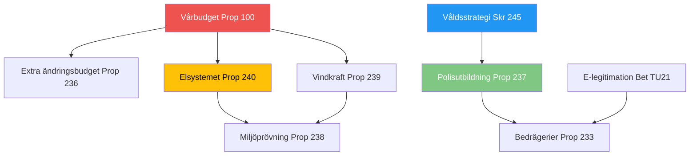

# Analysis Synthesis Summary — 2026-04-14

**Generated**: 2026-04-14 15:28 UTC (AI-enriched)
**Data Sources**: riksdag-regering MCP (get_propositioner, get_betankanden, search_dokument, search_anforanden, get_interpellationer, search_regering)
**Documents Analyzed**: 17
**Confidence**: HIGH
**Analysis Depth**: Deep (15+ min)
**Produced By**: AI-driven analysis (realtime-1526)

## Executive Summary

April 14, 2026 marks one of the most significant legislative days of the 2025/26 riksmöte. The government delivered **8 new propositions** and **1 government skrivelse** covering energy infrastructure, police reform, environmental governance, fraud prevention, wind power, tonnage taxation, port operations, and a national violence strategy — all within 24 hours of the spring budget package (vårpropositionen Prop. 2025/26:100 + vårändringsbudgeten Prop. 2025/26:99 + extra ändringsbudget Prop. 2025/26:236). Six new committee reports (betänkanden) advance these and other items toward Riksdag decisions.

## Significance Assessment

| Score | dok_id | Type | Title | Policy Domain |
|-------|--------|------|-------|---------------|
| **7/10** | HD03240 | Prop | Nya lagar om elsystemet | Energy, EU compliance |
| **6/10** | HD03237 | Prop | En betald polisutbildning | Justice, security |
| **6/10** | HD03245 | Skr | Nationell strategi mot våld | Social policy, gender equality |
| **5/10** | HD03239 | Prop | Vindkraft i kommuner | Energy, municipal revenue |
| **5/10** | HD03238 | Prop | Ny myndighet för miljöprövning | Environmental governance |
| **5/10** | HD01TU21 | Bet | En statlig e-legitimation | Digital infrastructure |
| **4/10** | HD03233 | Prop | Nya regler mot bedrägerier | Consumer protection, telecom |
| **4/10** | HD01SfU22 | Bet | Inhibition vid verkställighetshinder | Migration policy |
| **4/10** | HD01FiU48 | Bet | Extra ändringsbudget | Fiscal policy |
| **3/10** | HD03234 | Prop | Ny lag om kommunal hamnverksamhet | Transport, trade |
| **3/10** | HD03243 | Prop | Förbättrade tonnagebeskattning | Maritime, taxation |

**Maximum significance: 7 (HIGH)** — Electricity system reform proposition

## Key Findings

1. **Massive legislative push**: 8 new propositions in one day signals pre-election legislative acceleration by the Kristersson government (M-KD-L coalition with SD support)
2. **Energy transformation dominance**: Three energy-related propositions (HD03240 electricity reform, HD03239 wind power revenue sharing, HD03238 environmental permitting) form a coherent energy transition package
3. **Security axis**: Paid police education (HD03237) + anti-fraud rules (HD03233) + national violence strategy (HD03245) address citizen safety from multiple angles
4. **Spring budget context**: All propositions arrive within 24h of the spring budget (Prop. 2025/26:100), suggesting coordinated economic messaging
5. **EU compliance acceleration**: Electricity system reform (HD03240) implements EU directives; environmental permitting (HD03238) streamlines for green transition

## Cross-Document Connections

## Coalition Dynamics

The legislative package demonstrates the Tidö Agreement coalition (M+KD+L+SD support) operating at full capacity. SD's priorities (police, migration via SfU22) are balanced against L's energy agenda and KD's social policy focus. No significant intra-coalition tensions detected in today's output.

## Implications for Articles

- **PRIMARY STORY**: Energy transformation triple play (HD03240 + HD03239 + HD03238) — most significant cluster
- **SECONDARY**: Police/security package (HD03237 + HD03233 + HD03245)
- **CONTEXT**: Spring budget as economic backdrop
- **WATCH**: Committee processing timeline — several betänkanden in "planerat" status suggest votes in coming weeks
