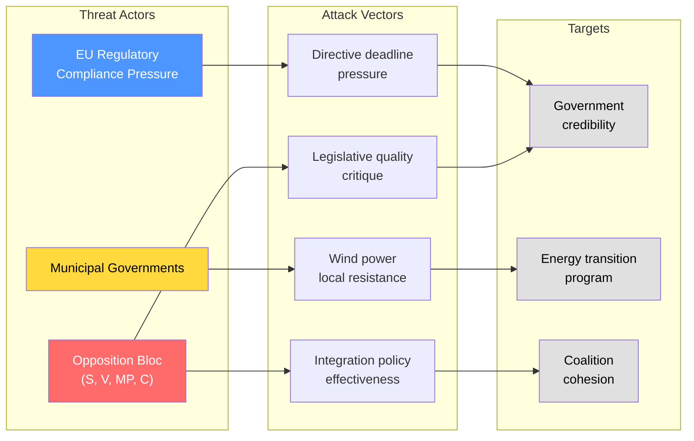

# Political Threat Analysis — 2026-04-14

**Generated**: 2026-04-14 15:28 UTC (AI-enriched)
**Data Sources**: riksdag-regering MCP (live data)
**Documents Analyzed**: 17
**Confidence**: HIGH
**Analysis Depth**: Deep
**Produced By**: AI-driven analysis (realtime-1526)

## Summary

The government's legislative blitz creates three primary threat vectors: (1) energy transition policy failure cascading to electoral damage, (2) opposition exploitation of legislative volume as governance weakness signal, and (3) institutional strain from parallel committee processing of major reforms.

## Threat Landscape

## Threat Indicators

| Threat | Severity | Evidence | dok_id |
|--------|----------|----------|--------|
| S opposition using interpellations to challenge integration policy | MEDIUM | Lawen Redar (S) filed 3 interpellations on integration/labor market (HD10420-422) targeting multiple ministers | HD10420, HD10421, HD10422 |
| Municipal wind power resistance could block implementation | MEDIUM | Revenue sharing model (Prop 239) designed to overcome vetoes — untested mechanism | HD03239 |
| Energy system reform complexity risks implementation delays | MEDIUM | Prop 240 implements EU directives via new regulatory framework — Lagrådet consulted | HD03240 |
| Opposition framing April 14 as "legislative dump" to distract from budget criticism | LOW | 8 propositions + spring budget in 24h window — unusual volume | Multiple |
| SD leveraging immigration policy for pre-election positioning | LOW | SfU committee processing 4 migration-related betänkanden (SfU16, SfU22, SfU31, SfU32, SfU36) | HD01SfU22 |

## Threat Classification

| Category | Level | Trend |
|----------|-------|-------|
| Coalition stability | LOW ↔ | Stable — no internal dissent signals |
| Policy implementation | MEDIUM ↑ | Rising — volume creates execution risk |
| Opposition momentum | MEDIUM ↔ | Steady — routine interpellation pressure |
| Institutional capacity | LOW ↑ | Slightly rising — committee load increasing |
| Electoral threat | MEDIUM ↔ | Unchanged — pre-election positioning ongoing |

## Key Findings

1. **Primary threat**: Energy policy implementation failure — 3 simultaneous reforms creating regulatory uncertainty for industry
2. **Secondary threat**: Opposition using interpellation debates to build integration/labor market narrative against government
3. **Tertiary threat**: Legislative volume straining committee review capacity — quality concerns possible
4. **Mitigating factor**: Government demonstrated cross-departmental coordination and EU compliance framing

## Implications

Journalists should monitor: (1) municipal council reactions to wind power revenue sharing, (2) committee hearing schedules for potential bottlenecks, (3) opposition party coordination on legislative quality messaging, (4) industry reactions to electricity system reform timeline.
