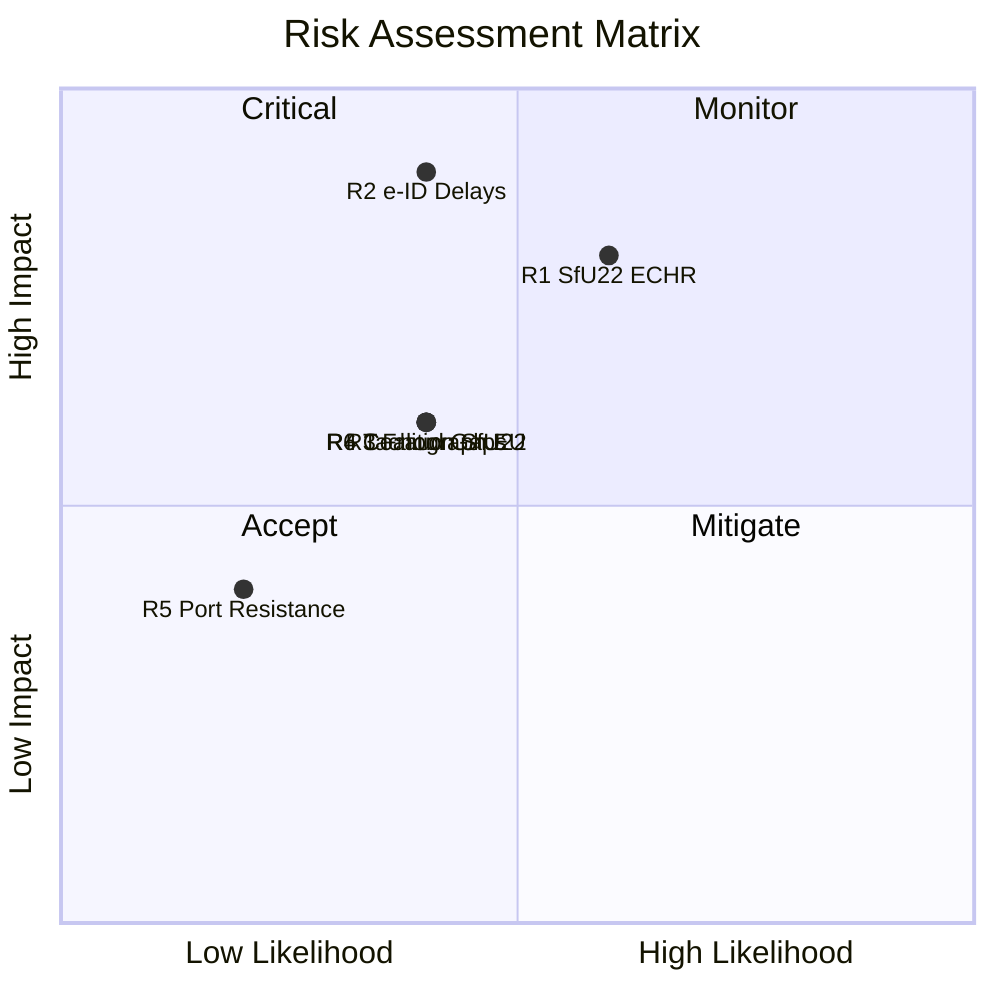

# Political Risk Assessment — 2026-04-15

**Generated**: 2026-04-15 | **Enriched**: AI-driven quantified risk matrix
**Documents Analyzed**: 6 committee reports
**Confidence**: MEDIUM
**Coalition Risk Score**: 4/100 (LOW)

## Risk Matrix (Quantified L×I)

| # | Risk Description | Likelihood (1-5) | Impact (1-5) | L×I Score | Risk Level | Trigger | Timeline |
|---|-----------------|-------------------|--------------|-----------|------------|---------|----------|
| R1 | SfU22 ECHR challenge on enforcement inhibition model | 3 | 4 | **12** | 🟧 MEDIUM | NGO filing after adoption | 6-12 months post-decision |
| R2 | TU21 e-ID implementation delays disrupting digital services | 2 | 5 | **10** | 🟧 MEDIUM | Procurement failure or vendor issues | Q4 2026 – Q1 2027 |
| R3 | TU17 telecom fraud rules compliance gaps | 2 | 3 | **6** | 🟡 LOW-MEDIUM | First major fraud case post-implementation | H2 2026 |
| R4 | TU22 tachograph enforcement insufficient (EU infringement) | 2 | 3 | **6** | 🟡 LOW-MEDIUM | EC review of member state implementation | 2027 |
| R5 | TU19 port law municipal resistance | 1 | 2 | **2** | 🟢 LOW | Municipal association objections | H2 2026 |
| R6 | Coalition fragmentation on SfU22 human rights dimension | 2 | 3 | **6** | 🟡 LOW-MEDIUM | L party dissent in committee vote | May-June 2026 |

## Coalition Stability Assessment

- **Overall coalition risk**: 4/100 — **LOW** [HIGH confidence]
- **Government majority**: 175+ seats (Tidö coalition: M, KD, L with SD confidence-and-supply)
- **Key vulnerability**: SfU22 could expose L-SD tension if Liberals push for rights safeguards
- **Mitigation**: Government has pre-negotiated committee positions through Tidö Agreement framework

## Risk Trend

All 6 reports represent routine legislative processing. No emergency measures or controversial fast-tracking detected. The June 2026 decision cluster creates a concentrated risk window but all reports follow standard committee timelines.

## Forward Risk Indicators

1. **Watch**: Liberal (L) party committee members' reservations on SfU22 — signal of internal coalition tension
2. **Watch**: Telecom industry response to TU17 compliance requirements — lobbying activity indicator
3. **Monitor**: EU Commission assessment of Sweden's e-ID readiness relative to EUDI Wallet timeline
