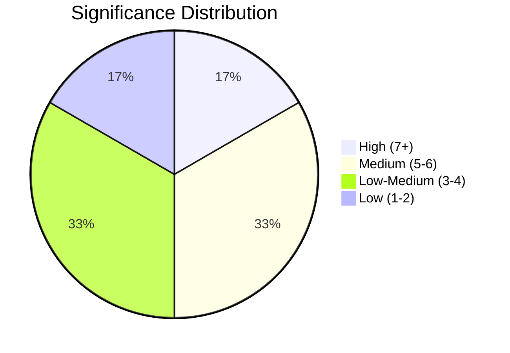

# Document Significance Scoring — 2026-04-15

**Generated**: 2026-04-15 | **Enriched**: AI-driven 5-dimension scoring
**Documents Analyzed**: 6
**Confidence**: HIGH
**Methodology**: 5-dimension scoring (policy breadth, EU compliance, citizen impact, coalition risk, institutional change)

## Scoring Framework

Each document scored 0-10 across five dimensions:
1. **Policy Breadth** — number of policy domains affected
2. **EU Compliance Urgency** — transposition deadline pressure
3. **Citizen Impact** — direct effect on residents
4. **Coalition Risk** — potential for internal government friction
5. **Institutional Change** — structural reform significance

## Detailed Scoring

### HD01TU21 — En statlig e-legitimation (Score: 7/10)

| Dimension | Score | Rationale |
|-----------|-------|-----------|
| Policy Breadth | 8 | Affects digital services, banking, healthcare, government access |
| EU Compliance | 8 | EU Digital Identity Wallet Regulation — mandatory deadline |
| Citizen Impact | 9 | Every Swedish resident needs e-ID; replaces BankID monopoly |
| Coalition Risk | 1 | Broad cross-party support expected |
| Institutional Change | 9 | Creates new state digital infrastructure |
| **Composite** | **7/10** | **🟡 Medium-High** |

### HD01TU17 — Anti-fraud telecom rules (Score: 6/10)

| Dimension | Score | Rationale |
|-----------|-------|-----------|
| Policy Breadth | 5 | Telecoms, consumer protection, law enforcement |
| EU Compliance | 3 | National initiative (Prop 2025/26:233), not EU-mandated |
| Citizen Impact | 7 | Directly protects consumers from telecom fraud/spoofing |
| Coalition Risk | 1 | Crime agenda — core Tidö priority |
| Institutional Change | 5 | New obligations on telecom operators |
| **Composite** | **6/10** | **🟡 Medium** |

### HD01SfU22 — Enforcement inhibition (Score: 5/10)

| Dimension | Score | Rationale |
|-----------|-------|-----------|
| Policy Breadth | 3 | Immigration enforcement only |
| EU Compliance | 2 | National measure |
| Citizen Impact | 4 | Affects specific foreign nationals with execution barriers |
| Coalition Risk | 2 | SD/Tidö aligned; opposition may challenge on rights grounds |
| Institutional Change | 6 | Replaces temporary residence permits with inhibition model |
| **Composite** | **5/10** | **🟡 Medium** |

### HD01TU19 — Municipal port operations (Score: 4/10)

| Dimension | Score | Rationale |
|-----------|-------|-----------|
| Policy Breadth | 3 | Maritime, municipal governance |
| EU Compliance | 2 | National reform |
| Citizen Impact | 2 | Limited to port municipalities |
| Coalition Risk | 1 | Technical legislation |
| Institutional Change | 4 | New legal framework for municipal ports |
| **Composite** | **4/10** | **🟢 Low-Medium** |

### HD01TU22 — Tachograph manipulation (Score: 4/10)

| Dimension | Score | Rationale |
|-----------|-------|-----------|
| Policy Breadth | 3 | Transport, road safety, EU harmonization |
| EU Compliance | 6 | Implements EU tachograph regulation |
| Citizen Impact | 2 | Affects professional drivers and transport companies |
| Coalition Risk | 1 | Technical-regulatory, non-contentious |
| Institutional Change | 3 | Enforcement mechanisms |
| **Composite** | **4/10** | **🟢 Low-Medium** |

### HD01FöU22 — Defence committee report (Score: 2/10)

| Dimension | Score | Rationale |
|-----------|-------|-----------|
| Policy Breadth | 2 | Defence only — title unavailable |
| EU Compliance | 1 | N/A |
| Citizen Impact | 1 | Unknown — insufficient metadata |
| Coalition Risk | 1 | Defence consensus expected |
| Institutional Change | 1 | Unknown |
| **Composite** | **2/10** | **🟢 Low** |

## Summary Distribution

