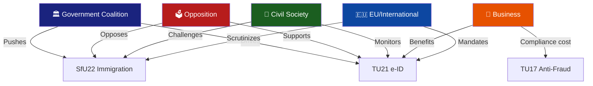

# Stakeholder Perspective Analysis — 2026-04-15

**Generated**: 2026-04-15 | **Enriched**: AI-driven 8-group analysis
**Documents Analyzed**: 6 committee reports
**Confidence**: MEDIUM

## All 8 Stakeholder Groups Analyzed

### 1. Citizens
- **Primary impact**: TU21 (e-ID) directly affects every Swedish resident — universal digital identity access
- **Secondary**: TU17 protects consumers from telecom fraud/spoofing
- **Concern**: SfU22 reduces rights for certain foreign nationals
- **Confidence**: [HIGH] — e-ID is a citizen-facing infrastructure reform

### 2. Government Coalition (M, KD, L + SD)
- **Position**: All 6 reports align with Tidö Agreement priorities (crime, immigration, EU compliance)
- **Internal dynamics**: No visible coalition friction; SD satisfied with SfU22 immigration enforcement
- **Risk**: L party may quietly distance from SfU22 rights restrictions
- **Confidence**: [HIGH] — coalition majority stable at 175+ seats

### 3. Opposition Bloc (S, V, MP, C)
- **Strategy**: Limited leverage on EU-mandated measures (TU21, TU22); focus on SfU22 rights critique
- **S position**: Likely supports e-ID, opposes SfU22 enforcement model
- **V/MP position**: Strong opposition to SfU22; may seek constitutional review
- **C position**: May support digital modernization while opposing immigration measures
- **Confidence**: [MEDIUM] — opposition response not yet visible in debate records

### 4. Business/Industry
- **Winners**: Digital services sector (TU21 e-ID), port operators (TU19 clarity)
- **Losers**: Telecom operators (TU17 compliance costs), hauliers (TU22 tachograph enforcement)
- **Net impact**: Moderate — regulatory modernization with compliance costs
- **Confidence**: [MEDIUM]

### 5. Civil Society
- **Advocacy focus**: SfU22 enforcement inhibition — civil liberties and refugee rights organizations
- **Opportunity**: TU21 e-ID accessibility requirements — disability rights groups
- **Privacy concern**: State e-ID data protection implications
- **Confidence**: [MEDIUM]

### 6. International/EU
- **Positive signal**: TU21 + TU22 demonstrate Swedish EU compliance commitment
- **Scrutiny**: SfU22 may face ECHR or EU non-refoulement review
- **Context**: Nordic e-ID integration possibility with Danish, Finnish systems
- **Confidence**: [HIGH]

### 7. Judiciary/Constitutional
- **TU17**: New legal basis for telecom fraud prosecution — courts need implementation guidance
- **SfU22**: Proportionality test likely — enforcement inhibition vs. individual rights
- **TU19**: New administrative law framework for port disputes
- **Confidence**: [MEDIUM]

### 8. Media/Public Opinion
- **Narrative frames**: "Sweden goes digital" (TU21), "fighting fraud" (TU17), "immigration crackdown" (SfU22)
- **Controversy potential**: SfU22 highest — polarized immigration debate
- **Public interest**: e-ID (TU21) likely most widely covered — affects everyone
- **Confidence**: [MEDIUM]

## Cross-Stakeholder Tension Map

