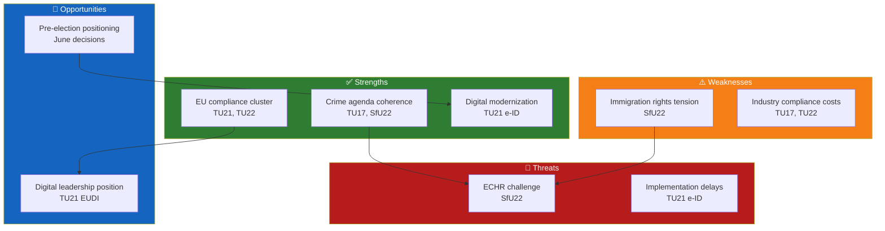

# Political SWOT Analysis — 2026-04-15

**Generated**: 2026-04-15 | **Enriched**: AI-driven 8-stakeholder SWOT
**Documents Analyzed**: 6 committee reports (HD01TU17, TU19, TU21, TU22, SfU22, FöU22)
**Confidence**: MEDIUM
**Analysis Depth**: deep

## SWOT by Stakeholder Group

### 1. Citizens
| Factor | Type | Evidence |
|--------|------|----------|
| State e-ID reduces BankID dependency | ✅ Strength | TU21: universal digital access (dok_id: HD01TU21) |
| Anti-fraud rules protect consumers | ✅ Strength | TU17: telecom spoofing prevention (dok_id: HD01TU17) |
| Immigration enforcement reduces rights | ⚠️ Weakness | SfU22: inhibition replaces permits (dok_id: HD01SfU22) |
| Digital identity wallet opportunity | 🔵 Opportunity | TU21: EU EUDI Wallet integration |
| e-ID implementation delays | 🔴 Threat | Risk of digital divide if rollout fails |

### 2. Government Coalition (M, KD, L + SD support)
| Factor | Type | Evidence |
|--------|------|----------|
| Unified legislative agenda | ✅ Strength | 6 reports with no visible coalition friction |
| Crime/security narrative | ✅ Strength | TU17 (fraud), SfU22 (immigration) — Tidö priorities |
| Thin majority risk on immigration | ⚠️ Weakness | SfU22 may expose L-SD tensions on rights |
| EU compliance credibility | 🔵 Opportunity | TU21, TU22 show responsible EU membership |
| Port law municipal pushback | 🔴 Threat | TU19 may face local government resistance |

### 3. Opposition Bloc (S, V, MP, C)
| Factor | Type | Evidence |
|--------|------|----------|
| Limited attack surface on EU measures | ⚠️ Weakness | TU21, TU22 — hard to oppose EU compliance |
| Immigration rights critique | ✅ Strength | SfU22 offers principled opposition (V, MP) |
| Digital inclusion agenda | 🔵 Opportunity | TU21 — opposition can demand stronger accessibility |
| Pre-election positioning window | 🔵 Opportunity | June decisions provide campaign material |
| Fragmented response | 🔴 Threat | S and C may support e-ID while V/MP oppose SfU22 |

### 4. Business/Industry
| Factor | Type | Evidence |
|--------|------|----------|
| Port law modernization | ✅ Strength | TU19: clearer framework for port operators (dok_id: HD01TU19) |
| Anti-fraud telecom compliance cost | ⚠️ Weakness | TU17: new obligations on telecom companies |
| e-ID market opportunity | 🔵 Opportunity | TU21: digital services expansion |
| Tachograph enforcement costs | 🔴 Threat | TU22: increased compliance burden on hauliers |

### 5. Civil Society
| Factor | Type | Evidence |
|--------|------|----------|
| Digital inclusion advocacy | ✅ Strength | TU21 opens universal digital access |
| Immigration rights defense | ✅ Strength | SfU22 inhibition model — NGO monitoring role |
| Enforcement gap risk | ⚠️ Weakness | Anti-fraud rules (TU17) may lack implementation oversight |
| ECHR challenge possibility | 🔵 Opportunity | SfU22 — rights organizations may challenge at ECHR |
| Surveillance creep concern | 🔴 Threat | State e-ID (TU21) raises privacy questions |

### 6. International/EU
| Factor | Type | Evidence |
|--------|------|----------|
| EU compliance demonstrated | ✅ Strength | TU21 (EUDI Wallet), TU22 (tachograph regulation) |
| Sweden as digital leader | 🔵 Opportunity | State e-ID positions Sweden alongside Estonia |
| Non-refoulement scrutiny | 🔴 Threat | SfU22 inhibition model may face EU review |

### 7. Judiciary/Constitutional
| Factor | Type | Evidence |
|--------|------|----------|
| Clear legal frameworks | ✅ Strength | TU19 (port law), TU17 (telecom) provide statutory basis |
| Constitutional proportionality test | ⚠️ Weakness | SfU22: balance between enforcement and individual rights |
| Digital evidence framework | 🔵 Opportunity | TU17 anti-fraud rules create digital investigation tools |

### 8. Media/Public Opinion
| Factor | Type | Evidence |
|--------|------|----------|
| Crime-fighting narrative appeal | ✅ Strength | TU17 anti-fraud resonates with public |
| e-ID as modernization story | 🔵 Opportunity | TU21 — positive "Sweden goes digital" framing |
| Immigration debate polarization | 🔴 Threat | SfU22 will generate heated media coverage |

## Cross-SWOT Mermaid Diagram

