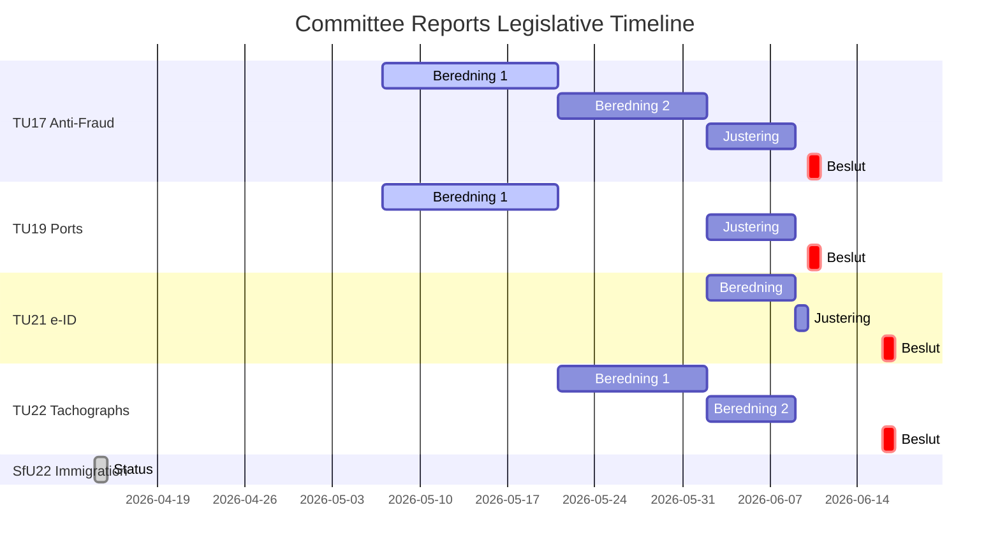

# Analysis Synthesis Summary — 2026-04-15

**Generated**: 2026-04-15 04:35 UTC | **Enriched**: 2026-04-15 AI-driven deep analysis
**Data Sources**: get_betankanden, get_dokument_innehall, search_voteringar
**Documents Analyzed**: 6
**Confidence**: MEDIUM
**Analysis Depth**: deep (2-3 iterations)
**Riksmöte**: 2025/26

## Summary

Six committee reports registered on 2026-04-14 reveal a concentrated burst of Transport Committee (TU) legislative activity alongside targeted immigration enforcement changes. Four of six reports originate from TU — an unusually heavy single-committee day indicating deliberate scheduling ahead of the June parliamentary recess. The policy mix spans **digital identity infrastructure** (TU21: state e-ID), **cybercrime prevention** (TU17: anti-fraud telecoms), **transport enforcement** (TU22: tachograph manipulation), **port governance** (TU19: municipal ports), **immigration enforcement** (SfU22: inhibition of deportation), and **defence** (FöU22).

## Recommended Article Titles

- **EN**: "Transport Committee Drives Digital and Infrastructure Reform as June Deadline Looms"
- **SV**: "Trafikutskottet driver digital- och infrastrukturreform inför junideadline"

## Key Findings

1. **Transport Committee dominance** [HIGH confidence]: 4 of 6 reports from TU — covers e-ID, anti-fraud, tachographs, and port law — signals coordinated government push on digital infrastructure (dok_ids: HD01TU17, HD01TU19, HD01TU21, HD01TU22)
2. **EU compliance cluster** [HIGH confidence]: TU22 (tachograph EU Regulation), TU21 (EU Digital Identity Wallet), TU17 (telecom fraud Prop 2025/26:233) all implement EU mandates with June-July 2026 transposition deadlines
3. **Immigration enforcement tightening** [MEDIUM confidence]: SfU22 replaces temporary residence permits with enforcement inhibition — procedural shift reducing migrant rights while maintaining deportation pipeline (dok_id: HD01SfU22)
4. **All reports at "planerat" stage** [HIGH confidence]: No chamber debates or votes yet — decisions scheduled May–June 2026, indicating these are newly referred reports
5. **Government coalition control** [HIGH confidence]: Coalition risk score 4/100 — all reports expected to pass with coalition majority (175+ seats)

## Legislative Pipeline (Mermaid)

## Top Documents by Significance (AI-Reassessed)

| Score | Committee | dok_id | Title | Policy Domain | Decision Date |
|-------|-----------|--------|-------|---------------|---------------|
| 7/10 | TU | HD01TU21 | En statlig e-legitimation | Digital identity, EU compliance | 2026-06-16 |
| 6/10 | TU | HD01TU17 | Nya regler mot bedrägerier (Prop 233) | Cybercrime, consumer protection | 2026-06-10 |
| 5/10 | SfU | HD01SfU22 | Inhibition av verkställigheten | Immigration enforcement | TBD |
| 4/10 | TU | HD01TU19 | Ny lag om kommunal hamnverksamhet (Prop 234) | Maritime governance | 2026-06-10 |
| 4/10 | TU | HD01TU22 | Åtgärder mot tachograph manipulation | Transport EU compliance | 2026-06-16 |
| 2/10 | FöU | HD01FöU22 | Defence report (title unavailable) | Defence policy | TBD |

## Risk Matrix

| Risk | Likelihood (1-5) | Impact (1-5) | L×I Score | Mitigation |
|------|------------------|--------------|-----------|------------|
| EU non-compliance on e-ID (TU21) deadline overrun | 2 | 4 | 8 | Fast-track committee schedule already set |
| Telecom fraud rules (TU17) implementation gaps | 2 | 3 | 6 | Prop 233 provides detailed framework |
| SfU22 human rights challenge at ECHR | 3 | 3 | 9 | Government argues proportionality |
| Port law (TU19) municipal resistance | 2 | 2 | 4 | Limited scope change |

## Election 2026 Implications

- **Electoral Impact** [MEDIUM]: Digital identity (TU21) affects all voters directly; immigration (SfU22) high-salience for SD/M base 🟧
- **Coalition Scenarios** [HIGH]: All reports signal unified Tidö government agenda — no internal coalition friction visible 🟩
- **Voter Salience** [MEDIUM]: Anti-fraud (TU17) taps into crime/security narrative ahead of 2026 campaign 🟧
- **Campaign Vulnerability** [LOW]: Opposition lacks leverage — EU-mandated reforms offer limited attack surface 🟥
- **Policy Legacy** [HIGH]: e-ID establishes government digital infrastructure that outlasts any government change 🟩

## Forward Indicators

1. **TU17/TU19 decisions June 10** — watch for opposition reservations signaling election-year positioning
2. **TU21/TU22 decisions June 16** — e-ID implementation could become campaign issue if delays emerge
3. **SfU22 ECHR scrutiny** — trigger: any NGO filing within 6 months of adoption

## Data Quality Notes

- Overall confidence: **MEDIUM** (6 documents, metadata + partial full-text for SfU22)
- Full committee report texts not yet published for 5 of 6 reports (planerat stage)
- SfU22 full text available — confirms enforcement inhibition replaces temporary permits
- No chamber debate data yet — all scheduled for May-June 2026
