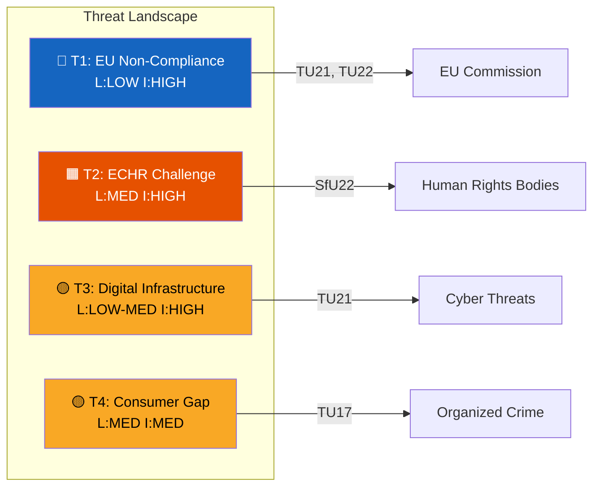

# Political Threat Analysis — 2026-04-15

**Generated**: 2026-04-15 | **Enriched**: AI-driven threat frameworks
**Documents Analyzed**: 6 committee reports
**Confidence**: MEDIUM

## Threat Taxonomy

### T1: EU Non-Compliance Risk (TU21, TU22)
- **Actor**: European Commission
- **Vector**: Infringement proceedings if transposition deadlines missed
- **Impact**: Financial penalties, reputational damage
- **Probability**: LOW (Sweden has strong EU compliance record)
- **Evidence**: TU21 (EUDI Wallet), TU22 (tachograph regulation) both have clear timelines

### T2: Human Rights Challenge (SfU22)
- **Actor**: NGOs, ECHR, UNHCR
- **Vector**: Legal challenge to enforcement inhibition replacing residence permits
- **Impact**: Forced policy revision, international criticism
- **Probability**: MEDIUM — inhibition model is untested legally
- **Evidence**: SfU22 shifts from granting temporary permits to mere enforcement pause (dok_id: HD01SfU22)

### T3: Digital Infrastructure Vulnerability (TU21)
- **Actor**: Cyberattack actors, implementation failure
- **Vector**: State e-ID system as critical national infrastructure target
- **Impact**: Service disruption affecting millions of citizens
- **Probability**: LOW-MEDIUM — requires robust security architecture
- **Evidence**: TU21 creates new state digital identity infrastructure

### T4: Consumer Protection Gap (TU17)
- **Actor**: Fraud networks, organized crime
- **Vector**: Adaptation to new telecom anti-fraud rules
- **Impact**: Continued consumer victimization despite new framework
- **Probability**: MEDIUM — criminals adapt to regulatory changes
- **Evidence**: TU17 implements Prop 2025/26:233 targeting electronic communications fraud

