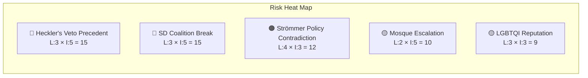

# Political Risk Assessment — 2026-04-15

**Generated**: 2026-04-15 07:05 UTC
**Documents Analyzed**: 3 (HD10431, HD10430, HD10429)
**Confidence**: HIGH
**Produced By**: AI-driven deep analysis (Copilot opus 4.6)

## Risk Matrix

| Risk | Likelihood (1-5) | Impact (1-5) | L×I Score | Category |
|------|-------------------|--------------|-----------|----------|
| SD breaks from government on Prop 133 vote | 3 | 5 | 15 | Coalition Stability |
| Strömmer's dual-issue response creates policy contradiction | 4 | 3 | 12 | Ministerial Accountability |
| Mosque hate speech escalates to security incident | 2 | 5 | 10 | Public Safety |
| Government LGBTQI commitment perceived as weakening | 3 | 3 | 9 | International Reputation |
| Heckler's veto precedent established via Prop 133 | 3 | 5 | 15 | Constitutional Rights |

## Critical Risk: Intra-Coalition Fracture

**HD10429** represents the highest-risk interpellation. SD's Farivar explicitly states the government's previous response was "inte tillfredsställande" (unsatisfactory) — formal parliamentary language signaling escalation. The interpellation was delayed ("Fördröjd") before filing, suggesting internal deliberation within SD before taking this public step against their own alliance partner.

**Forward Indicators**:
- Strömmer's response due April 24 — watch for SD reaction
- If response echoes March 4 written answer, expect SD motion or public criticism
- Riksdag vote on Proposition 133 will be the definitive test of SD loyalty

## Ministerial Accountability Risk

Justice Minister Strömmer faces a paradox: HD10429 demands he protect free speech (including for controversial demonstrations), while HD10430 demands action against hate speech in mosques. These create competing demands:
- Strengthening Prop 133 (restricting demos) satisfies security concerns but alienates SD on free speech
- Weakening Prop 133 satisfies SD but undermines government's security narrative

## Forward Risk Indicators

| Indicator | Trigger Point | Expected Timeline |
|-----------|--------------|-------------------|
| Strömmer response to HD10429 | April 24-27 | 1-2 weeks |
| Strömmer response to HD10430 | April 24 | 1-2 weeks |
| Dousa response to HD10431 | April 28 | 2 weeks |
| Prop 133 committee vote | TBD | 2-4 weeks |
| SD position statement on Prop 133 | Post-response | 2-3 weeks |

