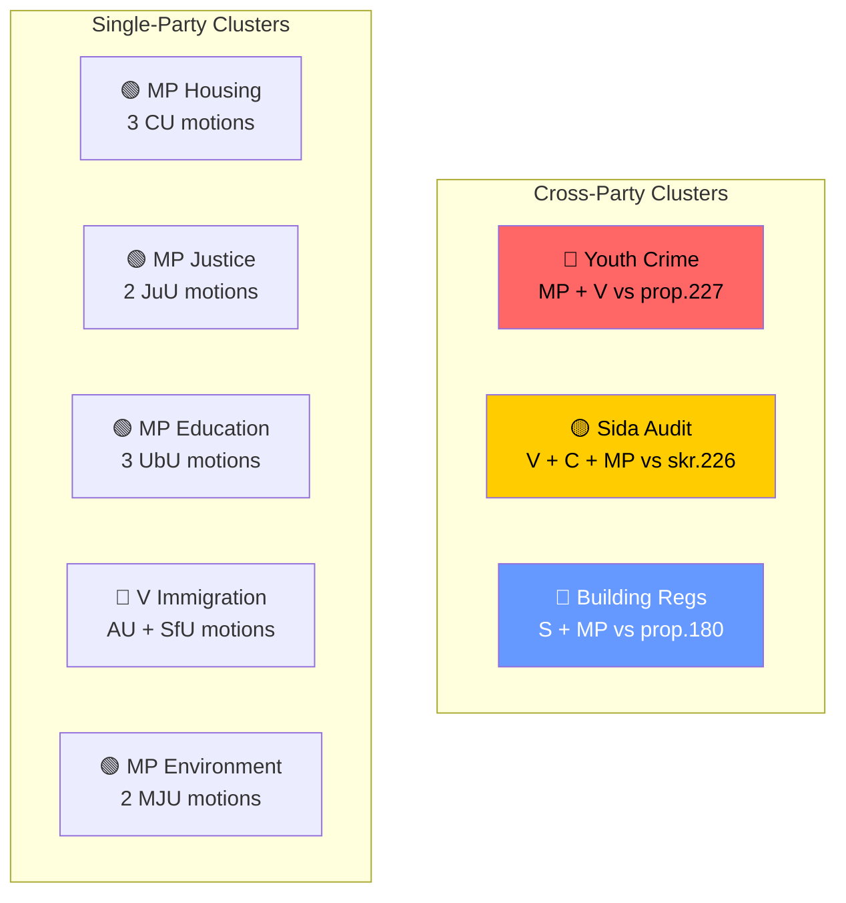

# Cross-Reference Map — 2026-04-15

**Generated**: 2026-04-15 07:22 UTC | **AI-Enriched**: Yes
**Documents Analyzed**: 24 | **Confidence**: HIGH

## Summary

Detected **8** cross-document relationship clusters across 24 opposition motions.

## Cross-Reference Clusters

### Cluster 1: Youth Crime Investigation (prop. 227)
- **mot. 2025/26:4074** (MP, JuU) — opposes expanded police powers for youth investigations
- **mot. 2025/26:4073** (V, JuU) — opposes same proposition with focus on child rights
- **Relationship**: MP-V alignment on civil liberties, dual opposition to same proposition

### Cluster 2: Sida Humanitarian Aid Audit (skr. 226)
- **mot. 2025/26:4071** (V, UU) — demands no migration conditions on foreign aid
- **mot. 2025/26:4070** (C, UU) — demands accountability improvements at Sida
- **mot. 2025/26:4072** (MP, UU) — demands efficiency improvements at Sida
- **Relationship**: Rare three-party convergence (V, C, MP) on foreign aid accountability

### Cluster 3: Building Regulations (prop. 180)
- **mot. 2025/26:4010** (S, CU) — opposes specific building code changes
- **mot. 2025/26:4059** (MP, CU) — demands resource conservation in building amendments
- **Relationship**: S-MP parallel opposition on building deregulation

### Cluster 4: Housing Policy Package
- **mot. 2025/26:4065** (MP, CU) — opposes flexible rental market (prop. 187)
- **mot. 2025/26:4064** (MP, CU) — demands consumer protection in rent-to-own (prop. 188)
- **mot. 2025/26:4067** (MP, CU) — demands landlord requirement regulation (prop. 212)
- **Relationship**: MP comprehensive housing defense strategy targeting 3 propositions

### Cluster 5: Criminal Justice Package
- **mot. 2025/26:4062** (MP, JuU) — opposes enhanced recidivism penalties (prop. 181)
- **mot. 2025/26:4063** (MP, JuU) — opposes prison abroad (prop. 185)
- **Relationship**: MP systematic challenge to government criminal justice expansion

### Cluster 6: Education Reform
- **mot. 2025/26:4066** (MP, UbU) — demands teacher qualification growth (prop. 196)
- **mot. 2025/26:4049** (MP, UbU) — demands full school transparency (prop. 191)
- **mot. 2025/26:4058** (MP, UbU) — warns about national exam risks (prop. 197)
- **Relationship**: MP education triple offensive

### Cluster 7: Immigration Reform
- **mot. 2025/26:4077** (V, AU) — demands adapted immigrant housing timelines (prop. 215)
- **mot. 2025/26:4076** (V, SfU) — demands rejection of new reception law (prop. 229)
- **Relationship**: V dual immigration challenge targeting both housing and reception

### Cluster 8: Environmental Policy
- **mot. 2025/26:4068** (MP, MJU) — opposes hunting simplification (prop. 211)
- **mot. 2025/26:4069** (MP, MJU) — demands stronger food supply readiness (prop. 205)
- **Relationship**: MP environmental defense

## Data Quality Notes

Cross-reference confidence: **HIGH**. Clusters identified by shared proposition targets, committee assignments, and party coordination patterns.
