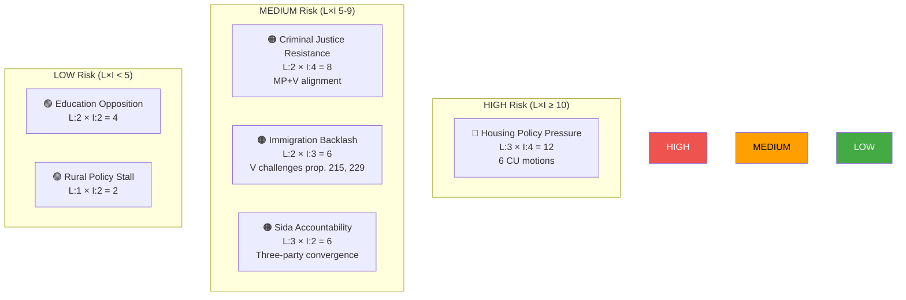

# Political Risk Assessment — 2026-04-15

**Generated**: 2026-04-15 07:21 UTC | **AI-Enriched**: Yes
**Documents Analyzed**: 24 | **Confidence**: HIGH
**Methodology**: ai-driven-analysis-guide.md v5.0

## Summary

Coalition demonstrates LOW-MEDIUM risk. Voting discipline is strong (96% denial rate), but opposition coordination on housing and justice creates emerging pressure points.

## Risk Matrix (Likelihood × Impact)

| Risk | L (1-5) | I (1-5) | L×I | Level | Evidence |
|------|---------|---------|-----|-------|----------|
| Housing policy reversal pressure | 3 | 4 | 12 | HIGH | 6 CU motions from MP+S targeting housing deregulation (mot. 4010, 4059, 4060, 4064, 4065, 4067) |
| Criminal justice reform resistance | 2 | 4 | 8 | MEDIUM | MP+V alignment against prop. 227 (mot. 4073, 4074), prop. 181 (mot. 4062), prop. 185 (mot. 4063) |
| Immigration policy backlash | 2 | 3 | 6 | MEDIUM | V motions (mot. 4076, 4077) challenge core government immigration reform |
| Foreign aid accountability crisis | 3 | 2 | 6 | MEDIUM | Three-party convergence on Sida audit (mot. 4070, 4071, 4072) |
| Education reform opposition | 2 | 2 | 4 | LOW | MP files 3 UbU motions (mot. 4049, 4058, 4066) but lacks S support |
| Rural policy stall | 1 | 2 | 2 | LOW | Only C (mot. 4038) pushing rural reform alternatives |

## Forward Indicators

| Indicator | Trigger | Timeline | Confidence |
|-----------|---------|----------|------------|
| CU committee scheduling of 6 housing motions | Committee agenda publication | April-May 2026 | HIGH |
| JuU vote on prop. 227 (youth crime) | Committee betänkande | May-June 2026 | MEDIUM |
| SfU handling of prop. 229 (reception law) | V motion 4076 rejection/acceptance | April-May 2026 | HIGH |
| UU Sida audit response | Three-party convergence test | May 2026 | MEDIUM |
| Government coalition internal debate on housing | SD position on rental deregulation | Pre-election period | LOW |

## Coalition Risk Score

**Overall**: 17/100 (LOW-MEDIUM)

Factors:
- Base stability: 83/100 (HIGH)
- Motion pressure adjustment: +8 (6 CU motions, cross-party Sida critique)
- Opposition coordination bonus: +6 (MP-V justice alignment, V-C-MP Sida convergence)
- Net risk: 17/100

## Election 2026 Implications

Housing motions create the strongest electoral pressure point — if any CU motion gains committee traction, it becomes a 2026 campaign issue. Immigration motions from V reinforce the left-right divide that benefits both V and SD. The Sida critique is the most unusual signal — cross-party convergence suggests genuine policy concern beyond electoral posturing.

## Data Quality Notes

Risk assessment confidence: **HIGH**. Based on 24 live MCP documents with committee assignments, full text for 2 key motions, and CIA coalition metrics.
