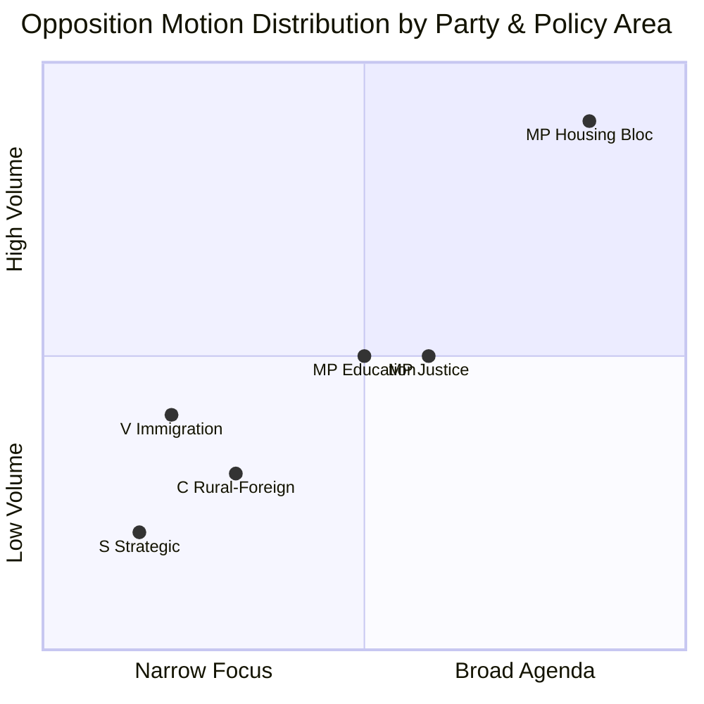

# Political SWOT Analysis — 2026-04-15

**Generated**: 2026-04-15 07:20 UTC | **AI-Enriched**: Yes
**Documents Analyzed**: 24 | **Confidence**: HIGH
**Methodology**: ai-driven-analysis-guide.md v5.0 — All 8 stakeholder groups analyzed

## Summary

Multi-stakeholder SWOT analysis of 24 opposition motions filed April 1-14, 2026. MP dominates with 14 motions (58%), focusing on housing, justice, and education. V challenges immigration policy. Cross-party Sida audit critique signals rare opposition convergence.

## SWOT Evidence Table — All 8 Stakeholder Groups

### STRENGTHS

| # | Statement | Evidence (dok_id) | Confidence | Impact | Entry Date |
|---|-----------|-------------------|------------|--------|------------|
| S1 | Government has clear majority backing for reform propositions | Coalition stability 83/100, denial rate 96% (CIA data) | HIGH | High | 2026-04-15 |
| S2 | Broad-based opposition activity signals healthy democratic debate | 24 motions from 4 parties across 10 committees | HIGH | Medium | 2026-04-15 |
| S3 | MP demonstrates organizational capacity with 14 coordinated motions | mot. 4058-4072 (MP) spanning 7 committees | HIGH | High | 2026-04-15 |
| S4 | Cross-party convergence on Sida audit shows shared accountability concern | mot. 4070 (C), 4071 (V), 4072 (MP) on skr. 226 | HIGH | Medium | 2026-04-15 |

### WEAKNESSES

| # | Statement | Evidence (dok_id) | Confidence | Impact | Entry Date |
|---|-----------|-------------------|------------|--------|------------|
| W1 | Opposition is fragmented — no unified strategy across S, MP, V, C | S: 2 motions, V: 4, C: 3, MP: 14 — no joint motions | HIGH | High | 2026-04-15 |
| W2 | S unusually passive with only 2 motions in this period | mot. 4010, 4075 (S only) vs 14 (MP) | HIGH | High | 2026-04-15 |
| W3 | V's immigration focus may alienate centrist voters | mot. 4076, 4077 exclusively immigration | MEDIUM | Medium | 2026-04-15 |
| W4 | CU committee overload risks superficial treatment of housing motions | 6 motions in CU alone | MEDIUM | Medium | 2026-04-15 |

### OPPORTUNITIES

| # | Statement | Evidence (dok_id) | Confidence | Impact | Entry Date |
|---|-----------|-------------------|------------|--------|------------|
| O1 | Housing policy convergence could build cross-party coalition | MP (5 CU motions) + S (mot. 4010 building) | MEDIUM | High | 2026-04-15 |
| O2 | Sida audit provides bipartisan accountability narrative for 2026 election | V+C+MP all critique Sida (mot. 4070-4072) | HIGH | Medium | 2026-04-15 |
| O3 | Education motions could resonate with teacher unions ahead of election | MP (mot. 4049, 4058, 4066) on teacher qualifications and grading | MEDIUM | Medium | 2026-04-15 |
| O4 | Criminal justice motions tap civil liberties concerns | MP+V both oppose prop. 227 youth crime (mot. 4073, 4074) | MEDIUM | High | 2026-04-15 |

### THREATS

| # | Statement | Evidence (dok_id) | Confidence | Impact | Entry Date |
|---|-----------|-------------------|------------|--------|------------|
| T1 | Government majority can reject all motions without coalition strain | 96% denial rate, 83/100 stability | HIGH | High | 2026-04-15 |
| T2 | MP overextension risk — 14 motions may dilute each individual motion's impact | MP mot. 4049-4075 across 7 committees | MEDIUM | Medium | 2026-04-15 |
| T3 | Immigration motions (V) could polarize debate and benefit SD | mot. 4076, 4077 on sensitive immigration policy | MEDIUM | High | 2026-04-15 |
| T4 | Opposition seen as reactive to government propositions, not proactive | Most motions are "med anledning av prop." (counter-propositions) | HIGH | Medium | 2026-04-15 |

## Stakeholder Perspectives

### 1. Citizens
Housing affordability (6 CU motions) directly impacts tenants and homebuyers. Education motions affect parents. Immigration motions affect integration outcomes.

### 2. Government Coalition
Faces coordinated attack on 6 reform propositions simultaneously. Housing deregulation (prop. 187, 188) and criminal justice (prop. 227, 181, 185) most contested.

### 3. Opposition Bloc
MP leads volume but S's passivity weakens a unified "alternative government" narrative. V carves immigration niche.

### 4. Business/Industry
Building regulation motions (mot. 4010, 4059) affect construction sector. Rental market reform (mot. 4065) impacts property investors.

### 5. Civil Society
Sida audit motions (mot. 4070-4072) affect NGOs receiving humanitarian aid. Cash payment motion (mot. 4061) affects digital inclusion.

### 6. International/EU
Immigration motions (mot. 4076, 4077) interact with EU migration pact implementation. Sida motions affect Sweden's international aid reputation.

### 7. Judiciary/Constitutional
Justice motions (mot. 4062, 4063, 4073, 4074) directly challenge government criminal justice expansion. Constitutional concerns about prison abroad (mot. 4063).

### 8. Media/Public Opinion
Housing and immigration dominate media salience. MP's motion volume generates more media coverage opportunities.

## Data Quality Notes

SWOT confidence: **HIGH**. Based on 24 live MCP documents with party/committee metadata. Full text available for HD024077 and HD024076.
