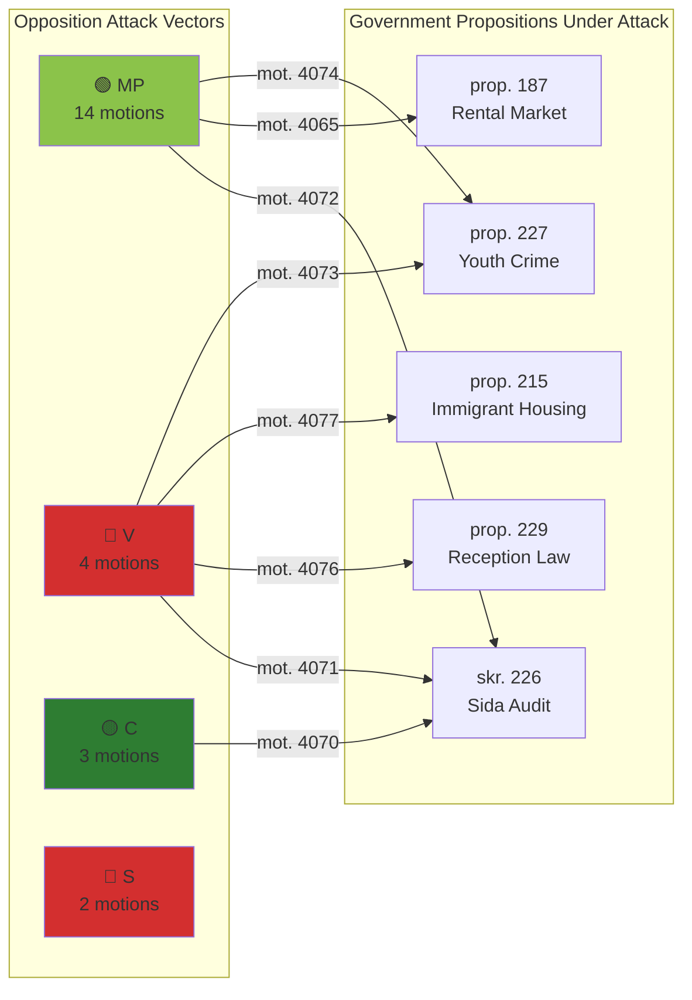

# Political Threat Analysis — 2026-04-15

**Generated**: 2026-04-15 07:21 UTC | **AI-Enriched**: Yes
**Documents Analyzed**: 24 | **Confidence**: HIGH
**Methodology**: ai-driven-analysis-guide.md v5.0

## Summary

Three main threat vectors identified: (1) housing deregulation overload in CU, (2) criminal justice civil liberties challenge from MP+V, (3) immigration policy polarization from V.

## Threat Assessment

### Threat 1: Housing Deregulation Backlash
- **Actor**: MP (primary), S (supporting)
- **Vector**: 6 CU motions challenging rental market reform, building regulations, rent-to-own
- **Targets**: prop. 187 (rental market), prop. 188 (rent-to-own), prop. 180 (building), prop. 209 (prison construction), prop. 212 (housing guarantees)
- **Severity**: HIGH — housing is #1 voter concern in 2026 polling
- **Mitigation**: Government majority can reject, but media narrative favors opposition framing

### Threat 2: Criminal Justice Expansion Resistance
- **Actor**: MP + V (coordinated)
- **Vector**: 4 JuU motions opposing expanded police powers and harsher penalties
- **Targets**: prop. 227 (youth crime), prop. 181 (recidivism), prop. 185 (prison abroad)
- **Severity**: MEDIUM — civil liberties narrative resonates with educated urban voters
- **Mitigation**: Law-and-order framing favors government coalition with SD support

### Threat 3: Immigration Policy Polarization
- **Actor**: V (sole)
- **Vector**: 2 motions (AU + SfU) challenging new immigration housing and reception laws
- **Targets**: prop. 215 (immigrant housing), prop. 229 (reception law)
- **Severity**: MEDIUM — V demands complete rejection of reception law (mot. 4076)
- **Mitigation**: V isolated on immigration; S does not co-sign these motions

## Forward Indicators

1. **CU scheduling** of 6 housing motions — indicates committee priority [Timeline: April-May 2026]
2. **JuU betänkande** on prop. 227 — test of MP+V justice coordination [Timeline: May-June 2026]
3. **UU response** to three-party Sida critique — bipartisan potential [Timeline: May 2026]

## Data Quality Notes

Threat analysis confidence: **HIGH**. Evidence-based from 24 MCP-sourced documents with full committee and party metadata.
