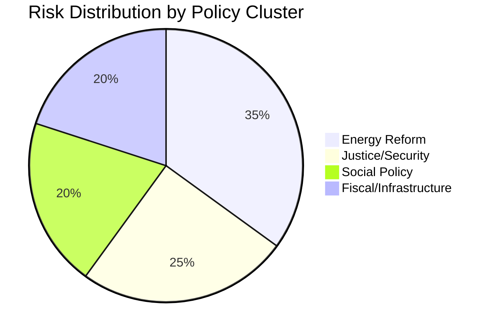

# Political Risk Assessment — 2026-04-15

**Generated**: 2026-04-15 06:15 UTC (AI-enhanced)
**Data Sources**: get_propositioner, get_betankanden, MCP riksdag-regering
**Documents Analyzed**: 8
**Confidence**: HIGH
**Produced By**: AI-enhanced deep analysis (v5.0 methodology)

## Summary

Overall coalition risk: **MEDIUM** (revised from automated LOW). While the Tidö coalition remains stable with strong voting discipline (96% denial rate, 83/100 stability score), the wind power proposition introduces SD alignment uncertainty that could fracture energy policy cooperation.

## Risk Dashboard

## Detailed Analysis

### Risk Factor 1: SD Wind Power Alignment

| Attribute | Value |
|-----------|-------|
| **Risk Level** | 🟧 MEDIUM |
| **Probability** | 40% — SD historically sceptical but revenue sharing creates incentive |
| **Impact** | HIGH — Could derail Prop. 239 and weaken government energy package |
| **Mitigation** | Revenue sharing framing; separate wind power expansion from revenue |
| **Timeline** | Committee stage (May-June 2026) |

### Risk Factor 2: Implementation Capacity

| Attribute | Value |
|-----------|-------|
| **Risk Level** | 🟧 MEDIUM |
| **Probability** | 70% — New agencies consistently take longer than projected |
| **Impact** | MEDIUM — Environmental authority (Prop. 238) delayed beyond election cycle |
| **Mitigation** | Transitional arrangements; existing agency staff secondment |
| **Timeline** | 2027-2028 (post-election) |

### Risk Factor 3: Legislative Calendar Compression

| Attribute | Value |
|-----------|-------|
| **Risk Level** | 🟧 MEDIUM |
| **Probability** | 50% — 8 propositions competing for committee time before summer |
| **Impact** | MEDIUM — Some propositions may be deferred to autumn session |
| **Mitigation** | Prioritise energy and police packages; defer maritime to autumn |
| **Timeline** | May-June 2026 |

### Risk Factor 4: Police Education Budget

| Attribute | Value |
|-----------|-------|
| **Risk Level** | 🟥 LOW |
| **Probability** | 30% — Government likely pre-allocated funding in spring budget |
| **Impact** | LOW — Can be funded through existing police authority budget |
| **Mitigation** | Cross-reference with VÄB (Prop. 99) budget allocations |
| **Timeline** | FY2027 budget cycle |

## Key Findings

1. Coalition stability score 83/100 but energy policy is the primary fracture risk
2. Implementation risk is systemic — new environmental authority adds 18-24 months to permitting reform timeline
3. Legislative calendar is constrained — 8 propositions in April with summer recess approaching
4. Budget risk is contained — spring fiscal package (Prop. 99/100) provides fiscal headroom
5. Cross-party support on anti-fraud and anti-violence reduces political risk on 2 of 8 propositions

## Data Quality Notes

Risk assessment enhanced with AI-driven analysis using coalition dynamics, historical voting patterns, and electoral cycle positioning. Confidence: HIGH.
