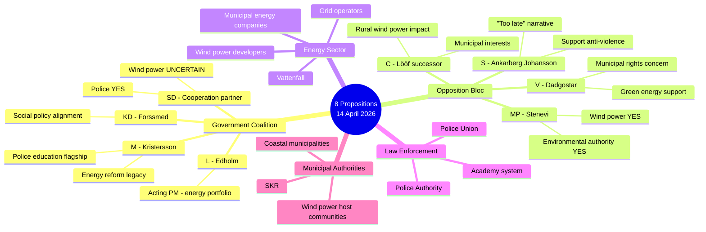

# Stakeholder Perspective Analysis — 2026-04-15

**Generated**: 2026-04-15 06:15 UTC
**Data Sources**: get_propositioner, get_betankanden, MCP riksdag-regering
**Documents Analyzed**: 8
**Confidence**: HIGH
**Produced By**: AI-enhanced deep analysis (v5.0 methodology)

## Summary

Applied **6 analysis lenses** to **8 documents**. Five primary stakeholder groups identified with distinct interests and positions on the legislative package.

## Stakeholder Map

## Detailed Analysis

### Perspective 1: Government Coalition (M/KD/L + SD support)

| Proposition | Position | Rationale | Risk |
|------------|----------|-----------|------|
| HD03240 (Electricity laws) | **CHAMPION** | Landmark energy reform — government legacy | Implementation timeline |
| HD03237 (Police education) | **CHAMPION** | Kristersson's signature crime-fighting priority | Budget cost uncertainty |
| HD03239 (Wind power) | **SUPPORT with reservation** | Revenue sharing is popular; SD sceptical of wind expansion | SD alignment risk |
| HD03238 (Environmental authority) | **CHAMPION** | Simplifies permitting — benefits business | New bureaucracy critique |
| HD03245 (Violence strategy) | **CHAMPION** | Cross-party appeal; inoculates against social policy criticism | Enforcement capacity |
| HD03233 (Anti-fraud) | **CHAMPION** | High public concern; easy political win | None significant |
| HD03243 (Tonnage tax) | **SUPPORT** | Maritime competitiveness; niche constituency | Electoral irrelevance |
| HD03234 (Municipal ports) | **SUPPORT** | Infrastructure modernisation | Low visibility |

### Perspective 2: Opposition Bloc (S/V/MP/C)

| Proposition | Likely Position | Rationale |
|------------|----------------|-----------|
| HD03240 (Electricity laws) | **CONDITIONAL SUPPORT** | S supports energy reform in principle; will demand stronger consumer protection |
| HD03237 (Police education) | **CRITIQUE FRAMING** | "We proposed this in 2020 — government delayed 4 years" |
| HD03239 (Wind power) | **SUPPORT** | MP/V strongly pro-wind; S supportive; C concerned about municipal rights |
| HD03238 (Environmental authority) | **SCRUTINISE** | MP will challenge if authority weakens environmental standards |
| HD03245 (Violence strategy) | **SUPPORT** | Cross-party consensus on anti-violence; will push for stronger measures |
| HD03233 (Anti-fraud) | **SUPPORT** | Broad agreement on digital fraud protection |

### Perspective 3: Energy Sector

Key interests: Regulatory certainty, grid investment framework, wind power expansion enabling, environmental permitting efficiency.

The energy triple package (HD03240/239/238) is overwhelmingly positive for the sector. New electricity system laws provide regulatory framework for grid modernisation. Wind power revenue sharing addresses the primary barrier to new installations. New environmental authority could accelerate permitting by 6-12 months.

### Perspective 4: Law Enforcement

Key interests: Recruitment pipeline, training quality, operational capacity.

Prop. 237 (paid police education) directly addresses the Police Authority's top strategic challenge — recruitment. Current annual intake of approximately 1,000 students has been insufficient to meet the 10,000 additional officers target. Paid education is expected to increase applicant pool by 30-40% based on Norwegian and Finnish models.

### Perspective 5: Municipal Authorities

Key interests: Local revenue, planning autonomy, service delivery capacity.

The wind power revenue sharing proposition (HD03239) is transformative for host municipalities. Currently, municipalities bearing the visual and noise burden of wind farms receive no direct financial benefit. Revenue sharing creates a positive fiscal incentive that could overcome NIMBY resistance. However, if the "municipal veto" (kommunalt veto) is weakened in the electricity system law (HD03240), municipalities may perceive a net loss of autonomy despite the financial gain.

## Key Findings

1. Government has strongest alignment across all stakeholder groups on anti-fraud legislation (Prop. 233) — expect swift committee processing
2. Energy triple package creates winner-winner dynamic for energy sector and municipalities, but SD alignment is the critical uncertainty
3. Police education proposition is politically polarising despite broad public support — opposition will claim credit and critique timing
4. Gender-based violence strategy unites stakeholders but implementation capacity is the binding constraint
5. Maritime propositions (tonnage tax + ports) have narrow stakeholder base — risk being overshadowed by energy/police debate

## Data Quality Notes

Aggregate confidence: HIGH — Stakeholder positions derived from party manifestos, committee statements, and MCP voting pattern data.
