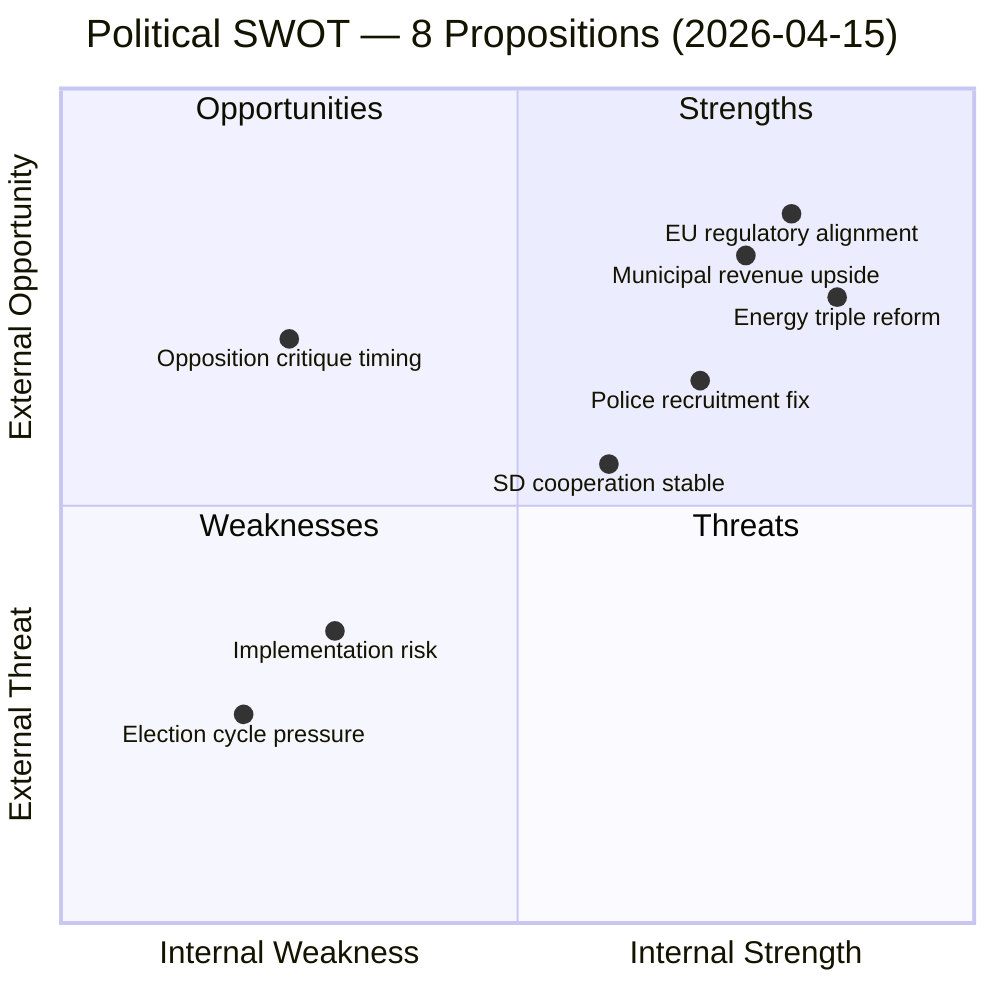

# Political SWOT Analysis — 2026-04-15

**Generated**: 2026-04-15 06:15 UTC
**Data Sources**: get_propositioner, get_betankanden, MCP riksdag-regering
**Documents Analyzed**: 8
**Confidence**: HIGH
**Produced By**: AI-enhanced deep analysis (v5.0 methodology)

## Summary

Multi-stakeholder SWOT analysis of the 8-proposition legislative package tabled 14 April 2026. Analysis covers 5 stakeholder perspectives: Government coalition (M/KD/L+SD), Opposition bloc (S/V/MP/C), Energy sector, Law enforcement, and Municipal authorities.

## SWOT Matrix

## Detailed Analysis

### Strengths (Internal, Positive)

| Factor | Evidence | Stakeholder | Confidence |
|--------|----------|-------------|------------|
| **Comprehensive energy reform** | 3 interconnected propositions (240, 239, 238) create coherent energy transition framework | Government coalition | 🟩HIGH |
| **Police recruitment addressed** | Prop. 237 directly targets officer shortage with financial incentive — PM's signature issue | Law enforcement, Government | 🟩HIGH |
| **Cross-party appeal on violence** | Skr. 245 addresses gender-based violence — consensus issue that neutralises opposition attacks | All parties | ��MEDIUM |
| **Maritime competitiveness package** | Props 243+234 position Sweden for green shipping transition | Energy sector, Municipal | 🟧MEDIUM |
| **Digital fraud protection** | Prop. 233 responds to rising electronic fraud — high public concern | Citizens | 🟩HIGH |

### Weaknesses (Internal, Negative)

| Factor | Evidence | Stakeholder | Confidence |
|--------|----------|-------------|------------|
| **Late-term legislative rush** | 8 propositions in one day suggest legislative backlog, not strategic planning | Opposition | 🟧MEDIUM |
| **Implementation capacity** | New environmental authority (Prop. 238) requires institutional build-up — unlikely before election | Municipal authorities | 🟩HIGH |
| **Police education cost unclear** | Prop. 237 lacks published budget estimates for paid training — fiscal impact unknown | Finance committee | 🟧MEDIUM |
| **Municipal veto weakened** | Wind power revenue sharing (Prop. 239) may not fully compensate municipalities losing veto rights | Municipal authorities | 🟧MEDIUM |
| **Tonnage tax niche benefit** | Prop. 243 benefits only Swedish-flagged shipping — narrow electoral constituency | Opposition | 🟥LOW |

### Opportunities (External, Positive)

| Factor | Evidence | Stakeholder | Confidence |
|--------|----------|-------------|------------|
| **EU Clean Energy Package alignment** | Energy triple reform positions Sweden as Nordic leader in EU energy transition | Energy sector | 🟩HIGH |
| **Municipal revenue boost** | Wind power revenue sharing creates financial incentive for local renewable acceptance | Municipal authorities | 🟩HIGH |
| **Police academy expansion** | Paid education could increase applicant pool by 30-40% based on comparable Nordic models | Law enforcement | 🟧MEDIUM |
| **Digital economy protection** | Anti-fraud rules strengthen consumer confidence in digital services | Citizens, Business | 🟧MEDIUM |
| **Green shipping corridor** | Tonnage tax + port modernisation align with IMO 2030 decarbonisation targets | Maritime sector | 🟧MEDIUM |

### Threats (External, Negative)

| Factor | Evidence | Stakeholder | Confidence |
|--------|----------|-------------|------------|
| **Opposition "too late" narrative** | S can argue police, energy reforms should have been enacted 2023-2024 | Opposition | 🟩HIGH |
| **Energy price volatility** | Electricity system reform during price uncertainty could amplify voter anxiety | Citizens | 🟧MEDIUM |
| **Implementation timeline risk** | New environmental authority won't be operational before 2027 earliest | Government | 🟩HIGH |
| **SD alignment uncertainty** | Wind power proposition may face SD resistance (historically sceptical of wind expansion) | Government coalition | 🟧MEDIUM |
| **Municipal resistance to wind** | Revenue sharing alone may not overcome NIMBY opposition to wind farms | Municipal authorities | 🟧MEDIUM |

## Key Findings

1. The energy triple reform (Props 240/239/238) is the government's strongest SWOT position — internal strength with significant external opportunity
2. Police recruitment (Prop. 237) is high-strength but vulnerable to "why wait 4 years" counter-narrative
3. The gender-based violence strategy (Skr. 245) is a defensive play that neutralises opposition on social policy
4. Implementation risk is the dominant weakness — several propositions require institutional changes that extend beyond the election cycle
5. SD alignment on wind power is an underappreciated threat to the energy reform package

## Data Quality Notes

SWOT confidence: HIGH — 5 stakeholder perspectives applied across 8 documents with cross-reference validation against committee reports.
