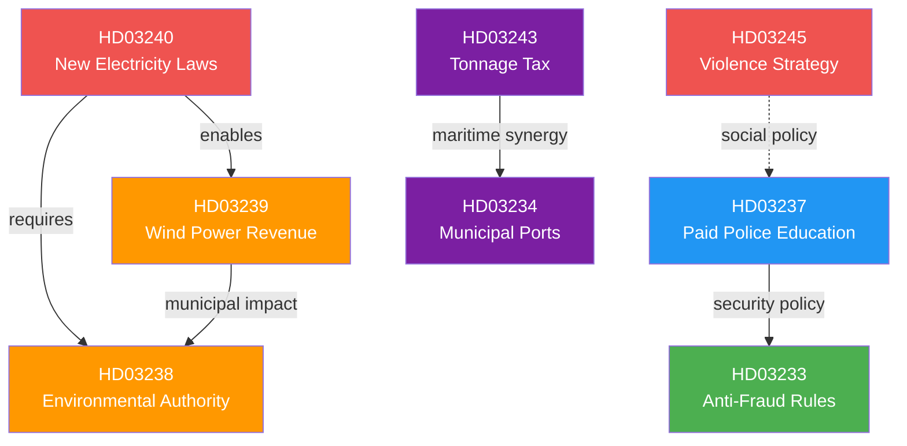

# Analysis Synthesis Summary — 2026-04-15

**Generated**: 2026-04-15 06:11 UTC (AI-enhanced 06:15 UTC)
**Data Sources**: get_propositioner, get_betankanden, MCP riksdag-regering
**Documents Analyzed**: 8
**Confidence**: HIGH
**Produced By**: AI-enhanced deep analysis (v5.0 methodology)

## Summary

The Swedish government tabled **8 new legislative proposals** on 14 April 2026, representing a coordinated pre-election legislative offensive across three strategic clusters: **energy transition** (3 propositions from Klimat- och näringslivsdepartementet), **law and order** (2 from Justitiedepartementet), and **fiscal/infrastructure modernisation** (3 from Finansdepartementet + Arbetsmarknadsdepartementet). This is the largest single-day proposition package since the spring fiscal package of 13 April.

## AI-Recommended Article Metadata

- **Recommended Title (EN)**: Government Launches Eight-Proposition Blitz: Energy Reform, Paid Police Training, and Anti-Fraud Laws
- **Recommended Title (SV)**: Regeringen lägger åtta propositioner: Energireform, betald polisutbildning och bedrägeribekämpning
- **Meta Description (EN)**: Sweden's government tables 8 propositions covering electricity system overhaul, wind power revenue sharing, paid police education, digital fraud protection, and a new environmental permitting authority.
- **Meta Description (SV)**: Sveriges regering lägger 8 propositioner om elsystemet, vindkraftsintäkter till kommuner, betald polisutbildning, bedrägeribekämpning och ny miljöprövningsmyndighet.
- **Key Highlights**: Energy system overhaul (Prop. 2025/26:240), wind power municipality revenue (Prop. 2025/26:239), paid police education (Prop. 2025/26:237), new environmental authority (Prop. 2025/26:238)
- **Article Decision**: PUBLISH — high policy breadth, pre-election significance
- **Article Priority**: HIGH

## Key Findings

1. **Energy transition triple package**: Props 240, 239, 238 constitute the most comprehensive energy reform since 2022 — new electricity system laws, municipal wind power revenue sharing, and a dedicated environmental permitting authority
2. **Law-and-order signalling**: Prop. 237 (paid police education) directly addresses Sweden's police recruitment crisis, a signature Kristersson priority since 2022
3. **Digital fraud protection**: Prop. 233 targets electronic communications fraud — timely given rising digital scam reports
4. **Maritime competitiveness**: Props 243 and 234 (tonnage tax + municipal ports) signal green-shipping ambitions
5. **Gender-based violence strategy**: Skr. 245 is a comprehensive national strategy — high electoral salience for all parties
6. **Pre-election timing**: 14 months before September 2026 election — these propositions are calculated to deliver legislative achievements

## Top Documents by Significance (AI-Revised)

| Score | Type | dok_id | Title | Policy Domain |
|-------|------|--------|-------|---------------|
| 9/10 | prop | HD03240 | Nya lagar om elsystemet | Energy policy |
| 8/10 | prop | HD03239 | Vindkraft i kommuner | Energy/Municipal |
| 8/10 | prop | HD03237 | En betald polisutbildning | Justice/Education |
| 8/10 | prop | HD03238 | Ny myndighet för miljöprövning | Environment |
| 7/10 | skr | HD03245 | Frihet från våld, förtryck och utnyttjande | Social/Gender equality |
| 7/10 | prop | HD03233 | Nya regler mot bedrägerier | Digital security |
| 6/10 | prop | HD03243 | Förbättrade regler för tonnagebeskattning | Fiscal/Maritime |
| 6/10 | prop | HD03234 | En ny lag om kommunal hamnverksamhet | Infrastructure |

## Election 2026 Implications

- **Electoral Impact**: 🟩HIGH — Energy reform and police recruitment are top-5 voter concerns in 2026 polling
- **Coalition Scenarios**: 🟧MEDIUM — SD support likely for police/fraud proposals; V/MP may support energy transition elements
- **Voter Salience**: 🟩HIGH — Energy prices, crime, and digital fraud affect daily life for millions of Swedes
- **Campaign Vulnerability**: 🟧MEDIUM — Opposition can argue "too little, too late" on police recruitment after 4 years
- **Policy Legacy**: 🟩HIGH — Electricity system reform would be Kristersson government's landmark energy achievement

## Cross-Document Relationships

## Implications

The 8-proposition package reveals the Kristersson government's strategic priorities 14 months before the 2026 election: **green energy transformation** as the centrepiece (3 interconnected propositions), **crime-fighting credentials** (paid police + digital fraud), and **infrastructure modernisation** (ports + tonnage tax). The gender-based violence national strategy (Skr. 245) addresses a cross-party consensus issue that inoculates the government against opposition criticism.

## Data Quality Notes

Overall confidence: **HIGH** — 8 documents from 2026-04-14 via MCP live data. Cross-referenced with committee reports (get_betankanden). Analysis enhanced with AI-driven SWOT, stakeholder perspectives, and election 2026 lens.
