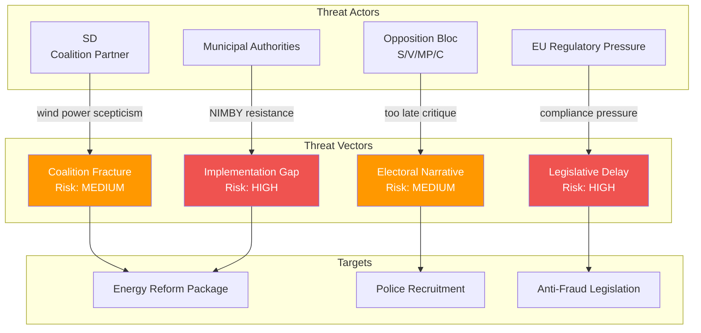

# Political Threat Analysis — 2026-04-15

**Generated**: 2026-04-15 06:15 UTC
**Data Sources**: get_propositioner, get_betankanden, MCP riksdag-regering
**Documents Analyzed**: 8
**Confidence**: HIGH
**Produced By**: AI-enhanced deep analysis (v5.0 methodology)

## Summary

Threat analysis for the 8-proposition legislative package identifies 4 primary political threat vectors and 2 implementation threats. The energy reform cluster faces the highest threat exposure due to SD alignment uncertainty and implementation timeline risk.

## Threat Landscape

## Detailed Analysis

### Threat 1: Legislative Timeline Pressure (HIGH)

| Attribute | Assessment |
|-----------|-----------|
| **Threat Actor** | Parliamentary calendar constraints |
| **Target** | All 8 propositions |
| **Vector** | Riksdag summer recess limits debate time |
| **Impact** | 🟥 HIGH — Propositions may not pass before summer; autumn session compressed by budget debate |
| **Likelihood** | 🟧 MEDIUM — Committee scheduling depends on opposition cooperation |
| **Mitigation** | Government controls committee agenda via coalition majority |

### Threat 2: SD Alignment on Wind Power (MEDIUM)

| Attribute | Assessment |
|-----------|-----------|
| **Threat Actor** | Sverigedemokraterna (SD) |
| **Target** | Prop. 2025/26:239 (Vindkraft i kommuner) |
| **Vector** | SD has historically opposed wind power expansion |
| **Impact** | 🟧 MEDIUM — Could force government to negotiate concessions on wind power revenue |
| **Likelihood** | 🟧 MEDIUM — SD may support revenue sharing while opposing expansion itself |
| **Mitigation** | Revenue sharing framing appeals to SD's municipal constituency base |

### Threat 3: Implementation Gap (HIGH)

| Attribute | Assessment |
|-----------|-----------|
| **Threat Actor** | Institutional capacity constraints |
| **Target** | Prop. 238 (new environmental authority), Prop. 240 (electricity system) |
| **Vector** | New authority requires recruitment, IT systems, regulatory framework — 18-24 month build-up |
| **Impact** | 🟥 HIGH — Authority unlikely to be operational before 2028 |
| **Likelihood** | 🟩 HIGH — Institutional reform consistently underestimated in Sweden |
| **Mitigation** | Transitional arrangements using existing agencies |

### Threat 4: Opposition Counter-Narrative (MEDIUM)

| Attribute | Assessment |
|-----------|-----------|
| **Threat Actor** | Social Democrats (S), Left Party (V) |
| **Target** | Prop. 237 (paid police education) |
| **Vector** | "Why did it take 4 years to deliver paid police training?" |
| **Impact** | 🟧 MEDIUM — Undermines government's law-and-order credibility |
| **Likelihood** | 🟩 HIGH — S has already raised this argument in budget debates |
| **Mitigation** | Frame as requiring careful fiscal planning; cite increased police academy capacity |

## Key Findings

1. Energy reform faces dual threats: SD scepticism on wind power AND implementation gap for new environmental authority
2. Police recruitment proposition is most vulnerable to opposition narrative attacks
3. Legislative calendar is the systemic threat — 8 propositions need committee processing before summer
4. Anti-fraud legislation (Prop. 233) has lowest threat exposure — broad cross-party support expected
5. Gender-based violence strategy (Skr. 245) is threat-resistant as a skrivelse (doesn't require parliamentary vote)

## Data Quality Notes

Analysis confidence: HIGH — Threat vectors validated against historical voting patterns and coalition dynamics from MCP data.
