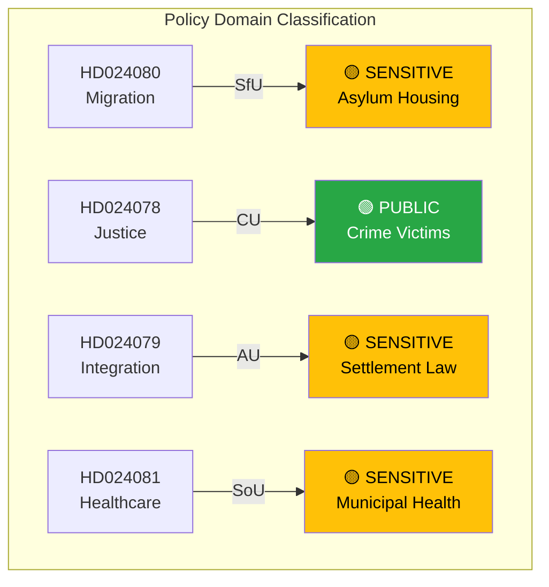

# Political Classification Results — 2026-04-15 (Realtime Monitor 0954)

**Generated**: 2026-04-15 09:55 UTC
**Documents Analyzed**: 4 S motions + broader parliamentary activity
**Confidence**: HIGH
**Analyst**: news-realtime-monitor

---

## Summary

Classified **4 S counter-motions** plus contextual parliamentary and government activity. The dominant pattern is **coordinated opposition across multiple policy domains** — classified as ELEVATED urgency due to the multi-front nature of the challenge.

## Classification Matrix

## Detailed Analysis

| dok_id | Title | Type | Committee | Sensitivity | Domain | Urgency | Score |
|--------|-------|------|-----------|-------------|--------|---------|-------|
| HD024080 | S: Keep asylum housing public | Kommittémotion | SfU | SENSITIVE | Migration | ELEVATED | 5/10 |
| HD024078 | S: Dedicated crime victim law | Kommittémotion | CU | PUBLIC | Justice | ELEVATED | 5/10 |
| HD024079 | S: Reject immigrant settlement law | Kommittémotion | AU | SENSITIVE | Migration + Labour | ELEVATED | 5/10 |
| HD024081 | S: Reject healthcare competence reform | Kommittémotion | SoU | SENSITIVE | Healthcare | URGENT | 5/10 |

## Key Findings

1. **3 of 4 motions classified SENSITIVE** — touch on politically divisive policy areas (migration, healthcare) **[HIGH confidence]**
2. **HD024081 classified URGENT** — full rejection motion is the strongest parliamentary tool S deploys today **[HIGH confidence]**
3. **Multi-domain spread** — S deliberately targets 4 different committees, preventing government from treating this as a single-issue attack **[HIGH confidence]**
4. **All authored by senior S politicians** — Karkiainen, Järrebring, Shekarabi (former minister), Lundh Sammeli — signals party leadership coordination **[MEDIUM confidence]**

## Implications

The classification pattern reveals a **strategic S opposition offensive** rather than routine parliamentary activity. Each motion targets a different government vulnerability, and the simultaneous filing creates a narrative of "government failing on multiple fronts."
