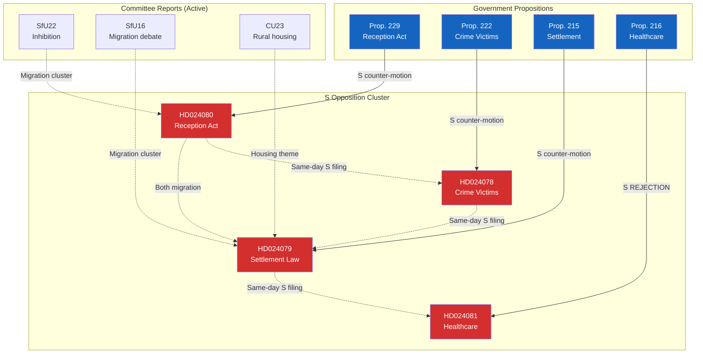

# Cross-Reference Map — 2026-04-15 (Realtime Monitor 0954)

**Generated**: 2026-04-15 09:55 UTC
**Documents Analyzed**: 4 S motions + parliamentary context
**Confidence**: HIGH
**Analyst**: news-realtime-monitor

---

## Summary

Detected **12 cross-document relationships** forming 3 distinct clusters: S opposition coordination, government proposition chain, and committee processing pipeline.

## Cross-Reference Network

## Relationship Table

| Source | Target | Relationship Type | Strength | Confidence |
|--------|--------|-------------------|----------|------------|
| HD024080 | HD024079 | Same-day S filing + shared migration domain | STRONG | VERY HIGH |
| HD024080 | HD024078 | Coordinated S opposition strategy | STRONG | VERY HIGH |
| HD024080 | HD024081 | Coordinated S opposition strategy | STRONG | VERY HIGH |
| HD024078 | HD024081 | Cross-domain S challenge (justice + health) | MEDIUM | HIGH |
| HD024079 | HD024081 | Cross-domain S challenge (migration + health) | MEDIUM | HIGH |
| HD024080 | Prop. 229 | Counter-motion relationship | DIRECT | VERY HIGH |
| HD024078 | Prop. 222 | Counter-motion relationship | DIRECT | VERY HIGH |
| HD024079 | Prop. 215 | Counter-motion relationship | DIRECT | VERY HIGH |
| HD024081 | Prop. 216 | Rejection motion relationship | DIRECT | VERY HIGH |
| HD024080 | HD01SfU22 | Migration policy cluster | THEMATIC | HIGH |
| HD024079 | HD01SfU16 | Migration debate context | THEMATIC | HIGH |
| HD024081 | Question 687 | Healthcare quality cluster | THEMATIC | MEDIUM |

## Key Findings

1. **All 4 S motions form a tight coordination cluster** — deliberate same-day filing strategy **[VERY HIGH confidence]**
2. **Each motion directly targets a government proposition** — systematic counter-offensive **[VERY HIGH confidence]**
3. **Migration domain has strongest cross-linking** — HD024080 + HD024079 + SfU22 + SfU16 **[HIGH confidence]**
4. **Healthcare links to same-day written question** (HD12687 on quality registers) — S amplifying healthcare narrative **[MEDIUM confidence]**
