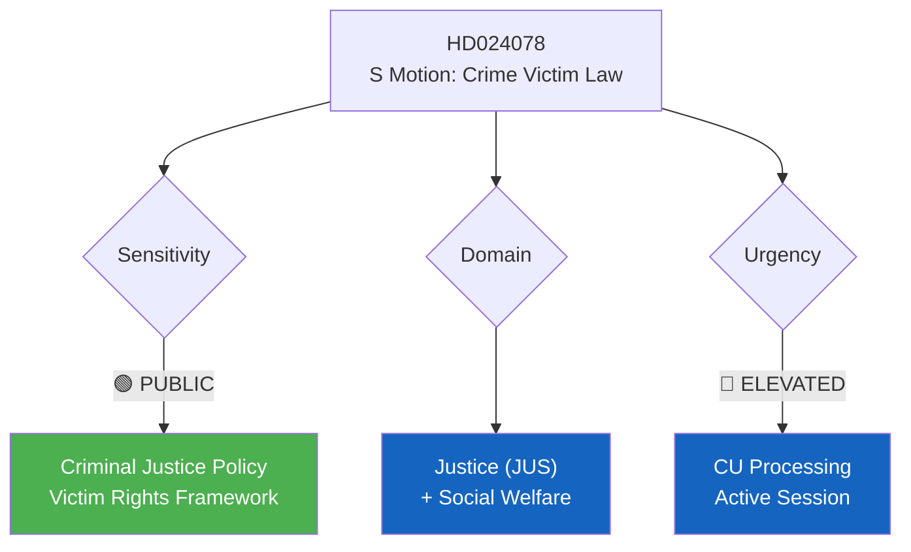

# Document Analysis: S Motion for Dedicated Crime Victim Law (Prop. 2025/26:222)

**Generated**: 2026-04-15 09:55 UTC
**dok_id**: HD024078
**Document Type**: Kommittémotion (Committee Motion)
**Committee**: CU (Civilutskottet)
**Date**: 2026-04-15
**Author**: Joakim Järrebring m.fl. (S)
**Party**: S (Socialdemokraterna)
**Riksmöte**: 2025/26
**Source MCP Tool**: search_dokument
**Significance**: 🟡 Medium (5/10)
**Confidence**: HIGH (85%)
**Analyst**: news-realtime-monitor

---

## 🎯 Executive Summary

S challenges the government's crime victim compensation reform (Prop. 2025/26:222) by demanding a comprehensive, standalone crime victim law (brottsofferlag). While the government proposes incremental improvements to compensation rules, S pushes for a broader legislative framework that would consolidate victim rights. This positions S as the "stronger victim protection" party — a counter-narrative to the government's "tough on crime" agenda. Part of a coordinated 4-motion S filing on April 15. **[HIGH confidence]**

---

## 📊 Political Classification

| Field | Assessment |
|-------|-----------|
| **Sensitivity Level** | PUBLIC — standard legislative debate |
| **Primary Domain** | Justice (JUS) + Social Welfare |
| **Urgency** | ELEVATED — active committee processing |
| **Significance Score** | 5/10 |
| **Confidence** | HIGH |

---

## 💪 SWOT Impact Assessment

### Strengths (Government Perspective)
| Evidence | dok_id | Confidence | Impact |
|----------|--------|------------|--------|
| Prop. 222 delivers concrete compensation improvements now | HD03222 | HIGH | Tangible policy delivery |
| Government frames as part of broader crime package (Prop. 218 doubles penalties) | HD03218 | HIGH | Narrative coherence |

### Weaknesses (Government Perspective)
| Evidence | dok_id | Confidence | Impact |
|----------|--------|------------|--------|
| Piecemeal approach leaves gaps S can exploit | HD024078 | MEDIUM | Opposition leverage |
| No comprehensive victim rights framework to counter S proposal | N/A | MEDIUM | Policy gap |

### Opportunities (Opposition Perspective)
| Evidence | dok_id | Confidence | Impact |
|----------|--------|------------|--------|
| S claims "tougher but fairer" crime policy — targeting swing voters | HD024078 | HIGH | Electoral positioning |
| Cross-references with Prop. 218 (double penalties) creates contrast: "punish criminals AND protect victims" | HD03218 | MEDIUM | Narrative advantage |

### Threats (Political System)
| Evidence | dok_id | Confidence | Impact |
|----------|--------|------------|--------|
| Risk that victim rights debate becomes partisan rather than evidence-based | N/A | MEDIUM | Policy quality risk |
| Comprehensive law may create implementation complexity | HD024078 | LOW | Administrative burden |

---

## 👥 Stakeholder Perspectives

| Stakeholder | Position | Evidence | Impact |
|-------------|----------|----------|--------|
| **Citizens/Crime Victims** | Strong support for better victim protection | Public opinion data | HIGH |
| **Government Coalition** | Prefers incremental approach via Prop. 222 | HD03222 | HIGH |
| **Opposition (S)** | Demands comprehensive brottsofferlag | HD024078, Järrebring | HIGH |
| **Judiciary** | May welcome clearer legal framework | N/A | MEDIUM |
| **Civil Society** | Victim support organizations likely support S approach | N/A | MEDIUM |

---

## 🔗 Cross-Document References

- **HD03218** (Dubbla straff för brott i kriminella nätverk) — Government criminal justice package context
- **HD03222** (Ersättningsregler med brottsoffret i fokus) — The proposition this motion responds to
- **HD024080, HD024079, HD024081** — Coordinated S opposition strategy, filed same day

## 📈 Forward Indicators

1. **Watch**: CU committee vote on Prop. 222 — will S attract support from C or V?
2. **Watch**: Crime victim advocacy group responses to both proposals
3. **Trigger**: High-profile crime victim case could elevate this debate

## Data Quality Notes

- **Analysis confidence**: HIGH (85%)
- **Full-text content**: Metadata + summary; full text at riksdagen.se
- **Analysis method**: 6-lens stakeholder, SWOT, cross-reference analysis
