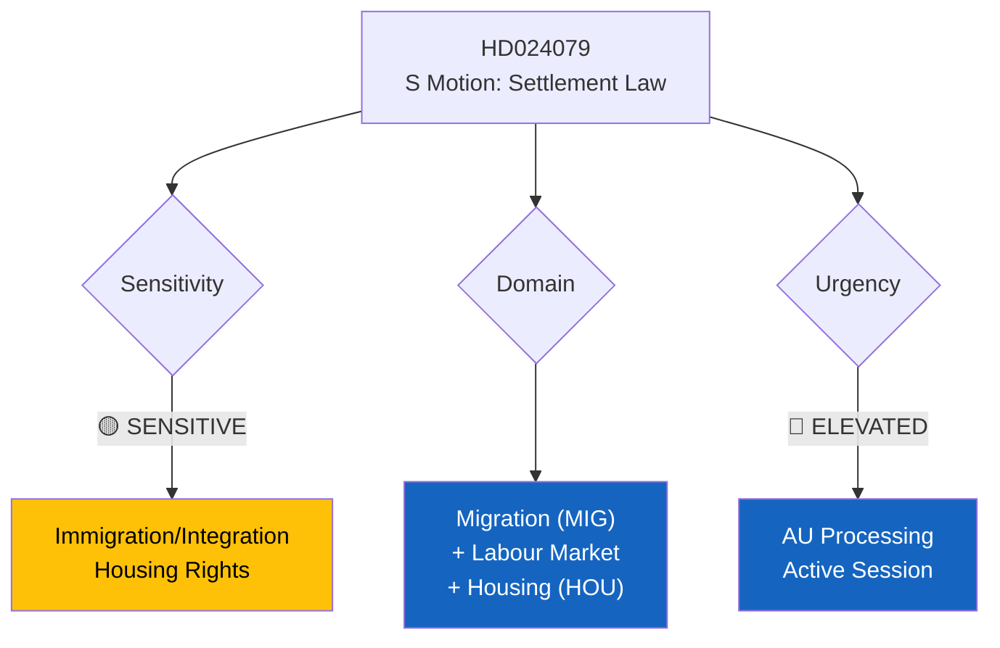

# Document Analysis: S Motion Against Immigrant Settlement Law (Prop. 2025/26:215)

**Generated**: 2026-04-15 09:55 UTC
**dok_id**: HD024079
**Document Type**: Kommittémotion (Committee Motion)
**Committee**: AU (Arbetsmarknadsutskottet)
**Date**: 2026-04-15
**Author**: Ardalan Shekarabi m.fl. (S)
**Party**: S (Socialdemokraterna)
**Riksmöte**: 2025/26
**Source MCP Tool**: search_dokument
**Significance**: 🟡 Medium (5/10)
**Confidence**: HIGH (85%)
**Analyst**: news-realtime-monitor

---

## 🎯 Executive Summary

Ardalan Shekarabi leads S opposition to the government's proposed law on time-limited housing for newly arrived immigrants (Prop. 2025/26:215). S demands the government return to the Riksdag with revised legislation, signaling fundamental objections to the settlement model. This motion targets a core Tidö Agreement migration deliverable and tests whether SD-backed policies can survive opposition scrutiny. Filed as part of S coordinated 4-motion opposition strategy on April 15. **[HIGH confidence]**

---

## 📊 Political Classification

| Field | Assessment |
|-------|-----------|
| **Sensitivity Level** | SENSITIVE — migration + housing intersection |
| **Primary Domain** | Migration (MIG) + Labour Market + Housing |
| **Urgency** | ELEVATED — active committee processing |
| **Significance Score** | 5/10 |
| **Confidence** | HIGH |

---

## 💪 SWOT Impact Assessment

### Strengths (Government Perspective)
| Evidence | dok_id | Confidence | Impact |
|----------|--------|------------|--------|
| Policy aligns with Tidö Agreement — SD core priority | N/A | HIGH | Coalition solidarity |
| Public opinion supports stricter integration requirements | N/A | MEDIUM | Electoral base |

### Weaknesses (Government Perspective)
| Evidence | dok_id | Confidence | Impact |
|----------|--------|------------|--------|
| Time-limited housing may cause homelessness post-expiry | HD024079 | MEDIUM | Social consequences |
| Shekarabi (former Minister for Public Administration) brings policy credibility | HD024079 | HIGH | Effective opposition voice |

### Opportunities (Opposition Perspective)
| Evidence | dok_id | Confidence | Impact |
|----------|--------|------------|--------|
| S frames as "responsible integration" vs. "punitive approach" | HD024079 | HIGH | Electoral differentiation |
| Links housing policy to labour market outcomes — broader narrative | HD024079 | MEDIUM | Policy coherence |

### Threats (Political System)
| Evidence | dok_id | Confidence | Impact |
|----------|--------|------------|--------|
| Risk of forced relocations creating social tensions | N/A | MEDIUM | Social cohesion risk |
| Municipal capacity to implement settlement controls may be insufficient | N/A | MEDIUM | Implementation risk |

---

## 👥 Stakeholder Perspectives

| Stakeholder | Position | Evidence | Impact |
|-------------|----------|----------|--------|
| **Newly arrived immigrants** | Directly affected by housing restrictions | Prop. 2025/26:215 | CRITICAL |
| **Government Coalition** | Supports as Tidö Agreement deliverable | HD03215 | HIGH |
| **Opposition (S)** | Demands revision — inadequate legislation | HD024079, Shekarabi | HIGH |
| **Municipalities** | Mixed — capacity concerns vs. integration burden | N/A | HIGH |
| **Business/Industry** | Labour market integration impact | N/A | MEDIUM |
| **International/EU** | Human rights scrutiny on housing restrictions | N/A | MEDIUM |

---

## 🔗 Cross-Document References

- **HD024080** (S motion on reception law) — Same S migration policy opposition strategy
- **HD01SfU31** (New rules for supervision and detention) — Related migration enforcement committee report
- **HD01SfU36** (Stricter character requirements for residence permits) — Migration policy tightening context
- **HD01SfU16** (Migration issues debate today) — Today's plenary debate context

## 📈 Forward Indicators

1. **Watch**: AU committee vote — potential for C to break with opposition consensus
2. **Watch**: Municipal reactions to implementation requirements
3. **Trigger**: Reports of housing difficulties for settled immigrants

## Data Quality Notes

- **Analysis confidence**: HIGH (85%)
- **Full-text content**: Metadata + summary; full text at riksdagen.se
- **Analysis method**: 6-lens stakeholder, SWOT, cross-reference analysis
