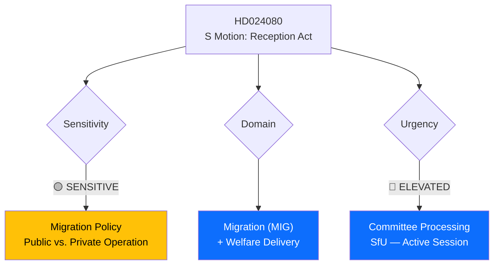

# Document Analysis: S Motion Against New Reception Act (Prop. 2025/26:229)

**Generated**: 2026-04-15 09:55 UTC
**dok_id**: HD024080
**Document Type**: Kommittémotion (Committee Motion)
**Committee**: SfU (Socialförsäkringsutskottet)
**Date**: 2026-04-15
**Author**: Ida Karkiainen m.fl. (S)
**Party**: S (Socialdemokraterna)
**Riksmöte**: 2025/26
**Source MCP Tool**: search_dokument
**Significance**: 🟡 Medium (5/10)
**Confidence**: HIGH (85%)
**Analyst**: news-realtime-monitor

---

## 🎯 Executive Summary

The Social Democrats challenge a core government migration policy by demanding asylum reception centers remain publicly operated, opposing privatization of asylum housing under the proposed new Reception Act (Prop. 2025/26:229). This motion signals S positioning on a key ideological dividing line — public vs. private welfare delivery — in the migration policy domain. Filed alongside three other S counter-motions on the same day, this represents a **coordinated opposition strategy** across migration, criminal justice, housing, and healthcare. **[HIGH confidence]**

---

## 📊 Political Classification

| Field | Assessment |
|-------|-----------|
| **Sensitivity Level** | SENSITIVE — touches privatization of asylum services |
| **Primary Domain** | Migration (MIG) + Welfare Delivery |
| **Urgency** | ELEVATED — active committee processing this session |
| **Significance Score** | 5/10 |
| **Confidence** | HIGH |

---

## 💪 SWOT Impact Assessment

### Strengths (Government Perspective)
| Evidence | dok_id | Confidence | Impact |
|----------|--------|------------|--------|
| Government holds majority for Prop. 229 with SD support on migration | HD03229 | HIGH | Coalition can pass reception reform |
| Aligns with Tidö Agreement migration framework | N/A | MEDIUM | Policy consistency signal |

### Weaknesses (Government Perspective)
| Evidence | dok_id | Confidence | Impact |
|----------|--------|------------|--------|
| Privatization of asylum centers risks quality control scandals | HD024080 | MEDIUM | Reputational vulnerability |
| SD may demand even stricter terms, pulling policy rightward | N/A | MEDIUM | Coalition tension |

### Opportunities (Opposition Perspective)
| Evidence | dok_id | Confidence | Impact |
|----------|--------|------------|--------|
| S frames debate as public welfare vs. profit — resonates with voters | HD024080 | HIGH | Electoral positioning |
| Links to broader S narrative on welfare state protection | HD024081 | MEDIUM | Cross-issue coherence |

### Threats (Political System)
| Evidence | dok_id | Confidence | Impact |
|----------|--------|------------|--------|
| Risk of deteriorating asylum reception quality under private operators | HD024080 | MEDIUM | Service delivery risk |
| Policy may face legal challenges on human rights grounds | N/A | LOW | Constitutional scrutiny |

---

## 👥 Stakeholder Perspectives

| Stakeholder | Position | Evidence | Impact |
|-------------|----------|----------|--------|
| **Citizens** | Mixed — concerns about asylum costs vs. care quality | Public debate on migration | MEDIUM |
| **Government Coalition (M+KD+L+SD)** | Support privatization as efficiency measure | Prop. 2025/26:229 | HIGH |
| **Opposition (S)** | Oppose — asylum housing must remain public | HD024080, Ida Karkiainen | HIGH |
| **Business/Industry** | Private operators seek market access | N/A | MEDIUM |
| **Civil Society** | NGOs concerned about vulnerable asylum seekers | N/A | HIGH |
| **International/EU** | EU reception conditions directive compliance | N/A | MEDIUM |
| **Judiciary** | May review compatibility with asylum rights | N/A | LOW |
| **Media** | Potential for investigative reporting on private asylum centers | N/A | MEDIUM |

---

## 🔗 Cross-Document References

- **HD024079** (S motion on immigrant settlement law) — Same-day filing, shared migration policy domain
- **HD024081** (S motion on healthcare) — Pattern of S opposing government public service reforms
- **HD024078** (S motion on crime victims) — Part of coordinated 4-motion S strategy on April 15

## 📈 Forward Indicators

1. **Watch**: SfU committee processing of Prop. 229 — vote timing and potential hearings
2. **Watch**: SD stance on private asylum operators — may diverge from M+KD+L
3. **Trigger**: If asylum center quality issues emerge, S motion gains traction

## Data Quality Notes

- **Analysis confidence**: HIGH (85%)
- **Full-text content**: Metadata + summary available; full text via riksdagen.se
- **Analysis method**: 6-lens stakeholder analysis, SWOT framework, cross-document pattern detection
