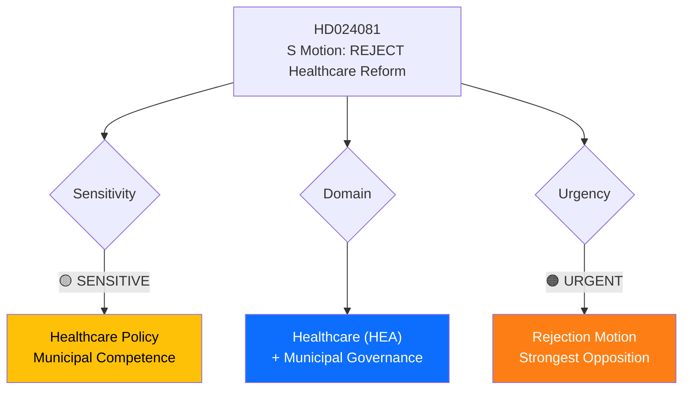

# Document Analysis: S Motion to Reject Municipal Healthcare Competence Reform (Prop. 2025/26:216)

**Generated**: 2026-04-15 09:55 UTC
**dok_id**: HD024081
**Document Type**: Kommittémotion (Committee Motion)
**Committee**: SoU (Socialutskottet)
**Date**: 2026-04-15
**Author**: Fredrik Lundh Sammeli m.fl. (S)
**Party**: S (Socialdemokraterna)
**Riksmöte**: 2025/26
**Source MCP Tool**: search_dokument
**Significance**: 🟡 Medium (5/10)
**Confidence**: HIGH (85%)
**Analyst**: news-realtime-monitor

---

## 🎯 Executive Summary

S takes the strongest stance of the day by moving to **reject** the government's proposition on strengthened medical competence in municipal healthcare (Prop. 2025/26:216). Unlike the other three S motions which propose amendments, this motion calls for outright rejection — a rare and significant parliamentary action. Led by Fredrik Lundh Sammeli, this signals S views the government's approach as fundamentally flawed. This is the sharpest of the four coordinated S motions filed April 15. **[HIGH confidence]**

---

## 📊 Political Classification

| Field | Assessment |
|-------|-----------|
| **Sensitivity Level** | SENSITIVE — healthcare reform with direct citizen impact |
| **Primary Domain** | Healthcare (HEA) + Municipal Governance |
| **Urgency** | URGENT — rejection motion is strongest parliamentary tool |
| **Significance Score** | 5/10 |
| **Confidence** | HIGH |

---

## 💪 SWOT Impact Assessment

### Strengths (Government Perspective)
| Evidence | dok_id | Confidence | Impact |
|----------|--------|------------|--------|
| Proposition addresses real municipal healthcare staffing gaps | HD03216 | HIGH | Policy need is genuine |
| Government press release on healthcare staffing support (April 14) | N/A | MEDIUM | Narrative backing |

### Weaknesses (Government Perspective)
| Evidence | dok_id | Confidence | Impact |
|----------|--------|------------|--------|
| S seeks full rejection — suggests fundamental design flaws | HD024081 | HIGH | Legitimacy challenge |
| Municipal implementation capacity may be inadequate | N/A | MEDIUM | Delivery risk |

### Opportunities (Opposition Perspective)
| Evidence | dok_id | Confidence | Impact |
|----------|--------|------------|--------|
| Healthcare is top voter concern — S can claim protector role | HD024081 | HIGH | Electoral leverage |
| Rejection creates stark choice: S plan vs. government plan | HD024081 | MEDIUM | Clear differentiation |

### Threats (Political System)
| Evidence | dok_id | Confidence | Impact |
|----------|--------|------------|--------|
| Healthcare staffing crisis worsens without legislative action | N/A | HIGH | Patient safety risk |
| Partisan healthcare debate may delay needed reforms | HD024081 | MEDIUM | Policy stagnation |

---

## 👥 Stakeholder Perspectives

| Stakeholder | Position | Evidence | Impact |
|-------------|----------|----------|--------|
| **Citizens/Patients** | Need improved municipal healthcare quality | Healthcare statistics | CRITICAL |
| **Healthcare Workers** | Support competence requirements but concerned about implementation | N/A | HIGH |
| **Government Coalition** | Defends reform as necessary modernization | Prop. 2025/26:216 | HIGH |
| **Opposition (S)** | Rejects entirely — demands different approach | HD024081, Lundh Sammeli | HIGH |
| **Municipalities** | Capacity and funding concerns | N/A | HIGH |
| **Media** | Healthcare stories consistently high-interest | N/A | MEDIUM |

---

## 🔗 Cross-Document References

- **Government press release**: "Socialstyrelsen ska se över stöd till vårdgivare" (April 14) — government parallel action
- **HD024080, HD024078, HD024079** — Coordinated S 4-motion opposition strategy
- **Question HD12687** (quality registers in healthcare) — same-day S question on healthcare quality

## 📈 Forward Indicators

1. **Watch**: SoU committee vote — will V and MP support S rejection?
2. **Watch**: Municipal healthcare staffing data — evidence for/against reform
3. **Trigger**: Healthcare quality incidents that validate S criticism

## Data Quality Notes

- **Analysis confidence**: HIGH (85%)
- **Full-text content**: Metadata + summary; full text at riksdagen.se
- **Analysis method**: 6-lens stakeholder, SWOT, cross-reference analysis
