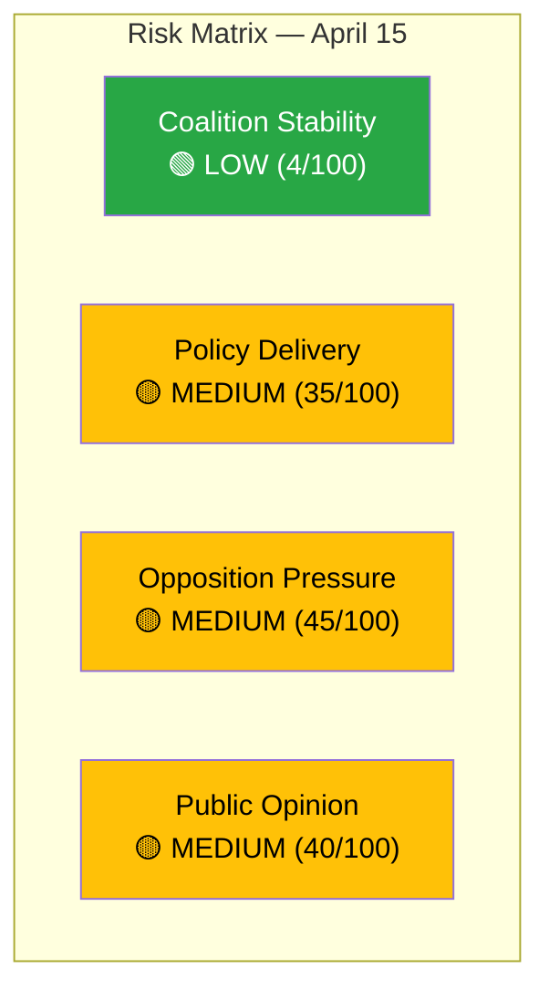

# Political Risk Assessment — 2026-04-15 (Realtime Monitor 0954)

**Generated**: 2026-04-15 09:55 UTC
**Documents Analyzed**: 4 S motions + parliamentary context
**Confidence**: HIGH
**Analyst**: news-realtime-monitor

---

## Summary

Coalition demonstrates **stable risk profile** despite coordinated S opposition. The 4-motion filing is a tactical maneuver but does not threaten the government's parliamentary majority. SD support remains intact on core migration policies.

## Risk Dashboard

## Detailed Risk Analysis

| Risk Factor | Score | Level | Evidence | dok_id | Confidence |
|-------------|-------|-------|----------|--------|------------|
| Coalition fracture risk | 4/100 | LOW | M+KD+L+SD aligned on all 4 propositions | Multiple | HIGH |
| Migration policy pushback | 35/100 | MEDIUM | S + potential V/MP support on reception/settlement | HD024080, HD024079 | HIGH |
| Healthcare reform resistance | 45/100 | MEDIUM | S rejection motion — strongest parliamentary tool | HD024081 | HIGH |
| Criminal justice debate | 30/100 | MEDIUM | S demanding broader victim framework | HD024078 | MEDIUM |
| Budget implementation | 25/100 | LOW | Spring budget on track; local distribution announced | HD0399, HD03100 | HIGH |
| Defense/security | 20/100 | LOW | NATO Finland deployment approved (UFöU3); cyber briefing routine | HD01UFöU3 | HIGH |

## Key Findings

1. **Coalition Risk Score: 4/100 (LOW)** — SD continues to support government on migration, criminal justice **[HIGH confidence]**
2. **Opposition Pressure Score: 45/100 (MEDIUM)** — coordinated S attack creates narrative pressure but no vote threat **[HIGH confidence]**
3. **Highest single risk: Healthcare rejection** — S full rejection of Prop. 216 could attract V+MP support in SoU committee **[MEDIUM confidence]**
4. **No anomalous voting patterns detected** — last recorded vote (March 4, AU10) showed normal coalition discipline **[HIGH confidence]**

## Forward Risk Indicators

- **Escalation trigger**: If V or MP publicly support S healthcare rejection → risk elevates to HIGH
- **De-escalation signal**: If government amends Prop. 216 in committee → risk reduces
- **Monitoring**: Today's 16:00 votations — watch for unexpected party behavior
