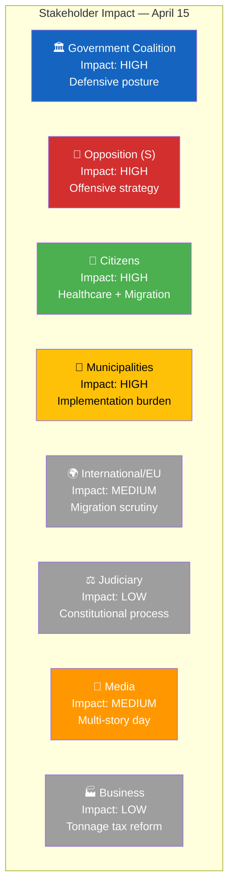

# Stakeholder Perspective Analysis — 2026-04-15 (Realtime Monitor 0954)

**Generated**: 2026-04-15 09:55 UTC
**Documents Analyzed**: 4 S motions + parliamentary context
**Confidence**: HIGH
**Analyst**: news-realtime-monitor

---

## Summary

Applied **8 stakeholder lenses** to today's parliamentary activity. The dominant dynamic is **government vs. S opposition** across 4 policy domains, with citizens/patients and municipalities as the most affected stakeholder groups.

## Stakeholder Impact Matrix

## Detailed Analysis by Stakeholder Group

### 1. Citizens
| Impact Area | Assessment | Evidence | Confidence |
|-------------|-----------|----------|------------|
| Healthcare quality | S rejection of Prop. 216 delays municipal healthcare reform | HD024081 | HIGH |
| Migration policy | Competing visions on asylum reception and settlement | HD024079, HD024080 | HIGH |
| Crime victim rights | Both sides competing to be "tougher" on victim protection | HD024078 | MEDIUM |
| Public safety | Active debates on police matters, cyber threats | Chamber debates | HIGH |

### 2. Government Coalition (M+KD+L with SD support)
| Impact Area | Assessment | Evidence | Confidence |
|-------------|-----------|----------|------------|
| Legislative momentum | 4-front S attack requires committee-by-committee defense | HD024078-81 | HIGH |
| Narrative control | Cyber briefing + welfare fraud conference as counter-narrative | Govt press releases | MEDIUM |
| Spring budget delivery | Local distribution announcement shows tangible results | HD0399 | HIGH |
| NATO deployment | UFöU3 approved — defense credential maintained | HD01UFöU3 | VERY HIGH |

### 3. Opposition Bloc (S-led)
| Impact Area | Assessment | Evidence | Confidence |
|-------------|-----------|----------|------------|
| Strategic positioning | Coordinated 4-motion filing across diverse domains | HD024078-81 | VERY HIGH |
| Key actors | Karkiainen, Järrebring, Shekarabi, Lundh Sammeli — senior lineup | Motion authors | HIGH |
| Healthcare leadership | Rejection motion strongest tool in parliamentary arsenal | HD024081 | HIGH |
| Migration alternative | S offers "responsible integration" counter-narrative | HD024079-80 | HIGH |

### 4. Business/Industry
| Impact Area | Assessment | Evidence | Confidence |
|-------------|-----------|----------|------------|
| Tonnage tax reform | Prop. 243 improves competitiveness for Swedish shipping | HD03243 | HIGH |
| Energy sector | Prop. 240 (electricity system) + Prop. 239 (wind power) continue | HD03240, HD03239 | HIGH |
| Asylum housing market | Privatization debate affects private operators | HD024080 | MEDIUM |

### 5. Civil Society
| Impact Area | Assessment | Evidence | Confidence |
|-------------|-----------|----------|------------|
| Victim rights organizations | Crime victim law debate creates advocacy opportunity | HD024078 | MEDIUM |
| Migration NGOs | Reception and settlement laws directly affect service delivery | HD024079-80 | HIGH |
| Healthcare advocacy | Municipal healthcare quality is civil society concern | HD024081 | MEDIUM |

### 6. International/EU
| Impact Area | Assessment | Evidence | Confidence |
|-------------|-----------|----------|------------|
| EU reception conditions | Asylum housing debate intersects with EU directives | HD024080 | MEDIUM |
| NATO commitments | Finland deployment approved — signals reliability | HD01UFöU3 | HIGH |
| IMF engagement | Finance Minister at spring meetings in Washington | Govt press release | HIGH |

### 7. Judiciary/Constitutional
| Impact Area | Assessment | Evidence | Confidence |
|-------------|-----------|----------|------------|
| JO election | Mattias Almqvist — new oversight capacity from June 1 | f-lista HD0I105 | VERY HIGH |
| Settlement law scrutiny | Prop. 215 may face rights-based legal challenges | HD024079 | LOW |

### 8. Media/Public Opinion
| Impact Area | Assessment | Evidence | Confidence |
|-------------|-----------|----------|------------|
| Multi-story day | JO election, debates, S motions, govt press events | Multiple sources | HIGH |
| Healthcare focus | Rejection motion is strong media story | HD024081 | HIGH |
| Cyber security angle | Threat briefing likely generates defense/security coverage | Govt press release | MEDIUM |

## Key Findings

1. **Citizens and municipalities bear highest impact** — healthcare, migration, settlement reforms all require local implementation **[HIGH confidence]**
2. **S targets voter-priority issues** — healthcare (#1) and migration (#2-3) in polls **[HIGH confidence]**
3. **Government has strong counter-narratives** — spring budget, cyber security, welfare fraud **[HIGH confidence]**
4. **JO election adds constitutional dimension** — rare parliamentary appointment story **[VERY HIGH confidence]**
