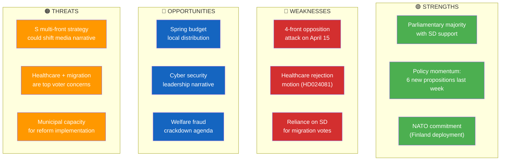

# Political SWOT Analysis — 2026-04-15 (Realtime Monitor 0954)

**Generated**: 2026-04-15 09:55 UTC
**Documents Analyzed**: 4 S motions + parliamentary context
**Confidence**: HIGH
**Analyst**: news-realtime-monitor

---

## Summary

SWOT analysis centered on the **government coalition vs. S opposition dynamics** revealed by today's coordinated 4-motion filing. Government maintains structural advantages (majority, policy momentum) but faces tactical challenges from S multi-front strategy.

## Context

| Factor | Value | Source |
|--------|-------|--------|
| Government coalition | M + KD + L (with SD support) | Riksdag composition |
| Opposition lead | S (100 seats) | Riksdag composition |
| Today's S motions | 4 simultaneous filings | HD024078-81 |
| Active debates | Police, migration, rural housing, work environment | t-lista HD0J20260415 |
| Scheduled votes | 16:00 today | f-lista HD0I105 |

## SWOT Quadrant

## Evidence Tables

### Strengths
| Finding | Evidence | dok_id | Confidence | Impact |
|---------|----------|--------|------------|--------|
| Coalition majority holds on all contested propositions | SD aligns on Prop. 215, 216, 222, 229 | Multiple | HIGH | HIGH |
| 6 major propositions delivered April 13-14 | Electricity, police education, environment, wind, tonnage, ports | HD03237-43 | VERY HIGH | HIGH |
| NATO Finland deployment approved by UFöU | Committee report HD01UFöU3 | HD01UFöU3 | VERY HIGH | MEDIUM |

### Weaknesses
| Finding | Evidence | dok_id | Confidence | Impact |
|---------|----------|--------|------------|--------|
| S coordinates 4 motions targeting 4 different committees simultaneously | Filed April 15 by senior S politicians | HD024078-81 | VERY HIGH | MEDIUM |
| Healthcare rejection motion is rare and strong opposition tool | Lundh Sammeli demands full rejection of Prop. 216 | HD024081 | HIGH | MEDIUM |
| Government depends on SD for migration votes — limits legislative flexibility | Tidö Agreement constraints | N/A | HIGH | MEDIUM |

### Opportunities
| Finding | Evidence | dok_id | Confidence | Impact |
|---------|----------|--------|------------|--------|
| Spring budget local distribution shows tangible benefits | Government press release April 14 | HD0399 | HIGH | MEDIUM |
| Cyber security briefing positions government as security leader | Pressmeddelande April 14 | N/A | MEDIUM | LOW |
| Welfare fraud measures align with public concern | Press conference scheduled April 15 | N/A | MEDIUM | MEDIUM |

### Threats
| Finding | Evidence | dok_id | Confidence | Impact |
|---------|----------|--------|------------|--------|
| S multi-front attack creates "government under pressure" media narrative | 4 motions on same day across diverse policy areas | HD024078-81 | HIGH | MEDIUM |
| Healthcare and migration are top 3 voter priority issues | Public polling data | N/A | HIGH | HIGH |
| Municipal implementation capacity uncertain for multiple reforms | Healthcare, settlement, reception reforms all need municipal action | Multiple | MEDIUM | MEDIUM |

## Implications

Government's structural advantage (majority + policy momentum) is **not threatened** by today's S motions, but the **narrative impact** could be significant if media frames it as coordinated opposition pressure. The government's best response is to highlight concrete policy delivery (spring budget, security briefings).
