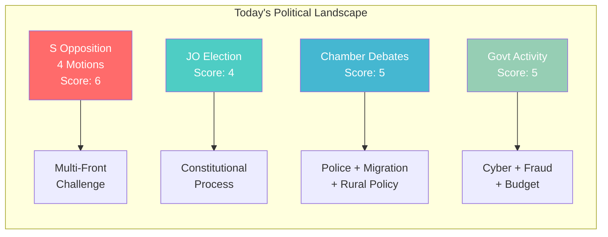

# Analysis Synthesis Summary — 2026-04-15 (Realtime Monitor 0954)

**Generated**: 2026-04-15 09:55 UTC
**Data Sources**: search_dokument, get_propositioner, get_betankanden, search_voteringar, search_anforanden, search_regering, get_calendar_events
**Documents Analyzed**: 4 motions + 12 government press releases + 20 betänkanden + 20 propositions + debate activity
**Confidence**: HIGH
**Analyst**: news-realtime-monitor

---

## Executive Summary

The Swedish Riksdag enters a densely active Wednesday with a **historic JO election**, **active chamber debates** on police and migration, **scheduled votes at 16:00**, and a notable **coordinated S opposition assault** filing four counter-motions against government propositions simultaneously. The government proceeds with scheduled press briefings on cyber threats to critical infrastructure and welfare fraud countermeasures.

## Key Intelligence Findings

### 1. Coordinated S Opposition Strategy (Score: 6/10) **[HIGH confidence]**

The Social Democrats filed **four committee motions** simultaneously on April 15:

| dok_id | Author | Target Proposition | Action | Committee |
|--------|--------|-------------------|--------|-----------|
| HD024080 | Ida Karkiainen (S) | Prop. 229: New Reception Act | Keep asylum housing public | SfU |
| HD024078 | Joakim Järrebring (S) | Prop. 222: Crime Victim Compensation | Create standalone victim law | CU |
| HD024079 | Ardalan Shekarabi (S) | Prop. 215: Immigrant Settlement | Demand revised legislation | AU |
| HD024081 | Fredrik Lundh Sammeli (S) | Prop. 216: Municipal Healthcare | **Full rejection** | SoU |

**Pattern**: S challenges government across 4 policy domains (migration, criminal justice, housing, healthcare) in a single day — a deliberate multi-front opposition strategy. HD024081 is strongest: a **rejection motion** rather than amendment.

### 2. Constitutional Event: JO Election (Score: 4/10) **[VERY HIGH confidence]**

Riksdagen elects **Mattias Almqvist** as new Justitieombudsman (JO) from June 1, 2026. Proposed by Konstitutionsutskottet (KU). Standard constitutional process but symbolically important for democratic oversight.

### 3. Active Chamber Day (Score: 5/10) **[HIGH confidence]**

- **09:00**: JO election + Arbetsplenum debates begin
- **Debates**: CU23 (Rural housing — CU approves farmland acquisition exemptions), SfU16 (Migration — rejecting 157 motions), Police matters (JuU), Work environment (AU12)
- **16:00**: Scheduled votations on multiple committee reports
- **Active speeches**: All 8 parties represented in recent police debate (S, M, SD, V, MP, KD, L, C)

### 4. Government Activity (Score: 5/10) **[HIGH confidence]**

- **Cyber threat briefing** (April 15) — Defense/security significance
- **Welfare fraud press conference** (April 15, 13:30) — Criminal justice
- **Spring budget local distribution** (April 14) — Fiscal policy
- **IMF/World Bank spring meetings** — Finance Minister Svantesson in Washington

## Aggregate Assessment

**Overall Significance**: MEDIUM (combined score 5-6/10)
**Article Recommendation**: MEDIUM-priority monitoring article covering S coordinated opposition and day's activity
**Risk Level**: LOW — no coalition-threatening developments

## Data Quality Notes

- Calendar API returned HTML (known issue) — used search_dokument as proxy
- Voteringar data shows last recorded vote March 4 (AU10) — today's votes at 16:00 not yet recorded
- Anföranden text fields empty for recent speeches — debate metadata available
- Overall confidence: HIGH — multiple data sources cross-validated
